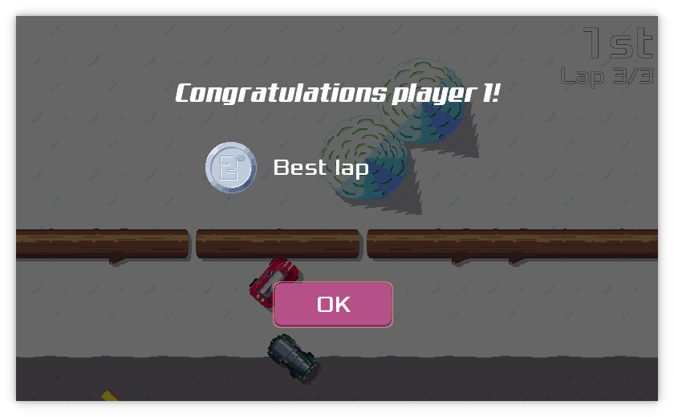

pub_date: 2018-12-16 20:30:24 +01:00
public: true
tags: [pixelwheels, release-month, pko, gamedev]
title: Release month, Pixel Wheels 0.11.0

Here is another release for the release month! This time it's a new release of
[Pixel Wheels][pw]. This one has been a long time coming: version 0.10.0 got
released in September.

[pw]: /projects/pixelwheels

<!-- break -->

So, what's new in this release? These changes:

- Pixel Wheels now remembers the best lap and best total time for each track
  and shows you a congratulation message when you reach the top 3 in either
  categories (This one is for you, Benjamin!)

- Sounds have been added to the start up countdown.

- The faster the vehicle is driving the more zoomed out the view is, giving you
  more time to anticipate the track.

- The game now shows a blocking message if there aren't enough gamepads to
  start a game, or if a gamepad is disconnected while playing.

- The focus indicator in the game menu has been reimplemented: now each menu
  item has its own, fading, focus indicator. This fixes the focus indicator
  glitches when a screen appeared or when switching between tabs in the
  configuration screen.

- The screens to select vehicles, tracks and championships now show the name of
  the selected element. Furthermore, the track selection screen shows the
  track records.

- Fixed glitches when changing tabs in the configuration screen.

- Added secret key shortcut to save a screenshot ('S' for now).

- Switched desktop version to LWJGL3.

- Updated libgdx to 1.9.8.

- Make Google Play happy: bump `targetSdkVersion` to 26.

The addition of the best lap and total time records for each track took longer
than I expected, but I am happy with the end results: I think it improves the
game replay value.
