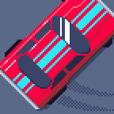
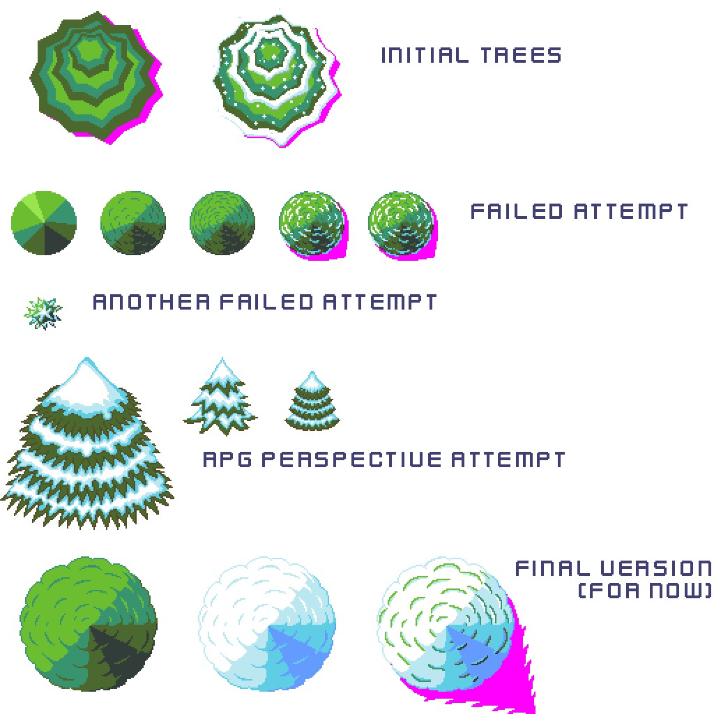

pub_date: 2018-04-02 22:18:42 +01:00
public: true
tags: [pixelwheels, gamedev]
title: Pixel Wheels 0.7.0 is out!

Due to holidays and not having much ready to publish, I did not make a release of Pixel Wheels for February, but here is 0.7.0, March release!

What's new in this one? A bunch of things:

- A new snow race. It's full of icy patches, be careful!

- The rescue helicopter now has a sound, but if you don't like Pixel Wheels sounds, you can now mute them from the Settings screen.

- Bots have finally learned how to use the reverse gear to unblock themselves, you won't be able to score easy wins because they got stuck against a wall.

- I made the vehicles a bit slower, they should be easier to handle now, especially on Android.

- The Android icon was a bit crude, so I drew another one:

I also fixed a bunch of bugs:

- Sometimes skid marks would be kept from one race to another, this is no longer the case.

- There was a few holes around bridges on the "Tiny sur Mer" map. They have been closed.

There were also a few internal changes:

- libgdx has been updated to 1.7.2.

- Code is now grouped into packages, making it a little less messy!

- The update to libgdx 1.7.2 required an update of my fork of MapPacker, but instead I decided to use the maps directly instead of pre-processing them to load them through AtlasTmxMapLoader. This means there is no more MapPacker fork in the code and no need to run it before testing a map, just save from Tiled and run the game.

One of the reasons this release took so long is I struggled a lot with drawing the icy patches, but even more with the pine trees, which I did not like, so I started to redo them, but could not achieve something pleasing, it was starting to be depressing.

<!-- break -->

At one point I almost gave up on the true top-down view and tried an RPG-like perspective. But it looked very odd when the screen rotated, and this is one of the aspects of the game which takes a while to get used to but which I really like, so I did not want to fall back to the classic fixed view by default.

At one point I decided to stop pursuing perfection so I stopped with what I had, as it was good enough to move on to other topics. Here are some of the trees I drew (pink appears as shadow in the game):

That's it for this version, go and [get Pixel Wheels 0.7.0](/projects/pixelwheels/), I hope you like it!
