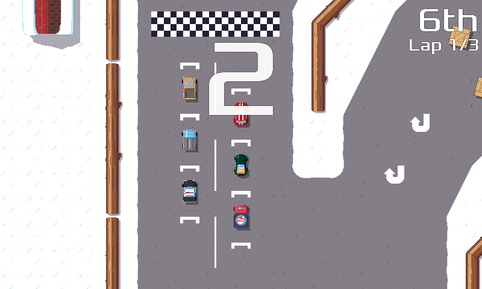

public: false
tags: [pixelwheels]
title: Pixel Wheels 0.8.0, featuring championships!

Time for a new release of Pixel Wheels!

Version 0.8.0 brings an important change: Championships! A championship is defined as a set of races, and you accumulate points through the races. This is still pretty rough: since there are 4 tracks in the game at the moment, they have been grouped in 2 championships of 2 tracks each.

In the not-so-distant future, I plan to require completing a championship with a rank of at least 3 to unlock the other one(s). Kind of like a certain plumber karting game...

Also, I added a 3 second countdown at the start of each race, so you can prepare for the race.

The internals of the game have been updated to libgdx 1.8.0, which seems to have stabilized its screen API, so it felt like a good time to finally implement a fullscreen mode. Together with the fact that the mouse cursor is now hidden, Pixel Wheels feels more like a real game now.

A few other minor changes landed as well:

- Volume of the sound effects have been adjusted to avoid cacophony, especially on Android.
- The config file moved from `~/.prefs/com.agateau.tinywheels` to `~/.config/agateau.com/pixelwheels.conf`.
- In score tables, player rows now use different colors.

That's it for this release, in the next one I plan to work on gamepad support, among other topics. I'd love to play Pixel Wheels with a gamepad, especially in split mode, but I am a bit worried about the implementation as I understand gamepad support is a landmine field... we'll see!

As usual, you can get it from the [game page](/projects/pixelwheels) or, if you are an Android user, from [Google Play](https://play.google.com/apps/testing/com.agateau.tinywheels.android).
