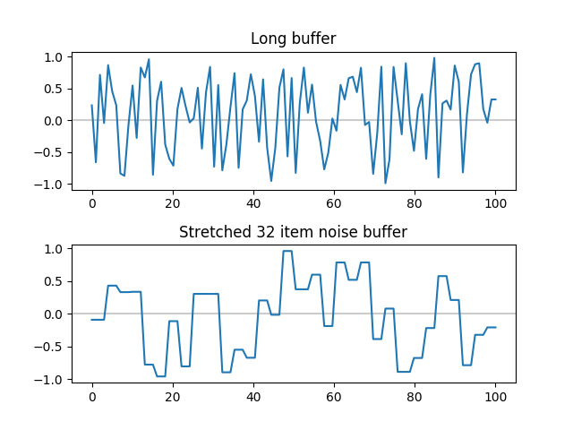

pub_date: 2018-02-16 23:11:52 +01:00
public: true
tags: [sfxr-qt, sound, pko]
title: SFXR Qt noise buffer
summary: |
    Making SFXR Qt noisy sounds reproducible was trickier than expected.

I was working on adding sounds to [Pixel Wheels][] rescue helicopter, so I started [SFXR Qt][] and after a few experiments I came up with a decent sound. Unfortunately it did not sound that good in the game. It was much more dull than in the app. Listening again to the sound in SFXR Qt I realized there were subtle variations between each plays, which made the sound more interesting.

[Pixel Wheels]: /projects/pixelwheels/
[SFXR Qt]: https://github.com/agateau/sfxr-qt

## Initial investigation

At first I was puzzled, how could the sound differ from play to play? After a more thorough code inspection I found the culprit: the noise buffer. When you select a noise wave form, the app generates a 32 item long array of random floats between -1 and 1, and go through it in a "segment" (a sound can be made of multiple segments). When a new segment starts, the buffer is regenerated, causing the sound to be subtly different each time it is repeated.

## Let's make it sound dull

I want SFXR Qt sounds to sound like they are going to sound in the game, so I set out to get rid of those variations.

I picked the sound created the first time you click on the "Explosion" generator button as my guinea pig. It sounds like this:

<audio controls>
  <source src="reference.wav">
</audio>

My first fix attempt was to create a long buffer with as many items as there are samples in the sound, and reuse it as the sound was being replayed. That failed: the noise was much more high pitched.

<audio controls>
  <source src="high-pitched.wav">
</audio>

Debugging random noise buffers is hard, or at least, I am not used to working on this kind of topics. One change I made to make behaviors more deterministic was to make the noise buffer generators of both the master branch and my work branch use their own, fixed random seed, separated from the seed used by the generator buttons. This made it possible to compare the sounds generated by running both versions side by side.

I could hear the difference but I was getting nowhere, why did my noise buffer sound differently than the original implementation? And then I had a revelation: the original buffer contains 32 items, and the code using it looks like this:

.. sourcecode:: c++

    sample = noise_buffer[phase * 32 / period];

Where `period` is the duration of the current segment, and `phase` is the sample index in the segment.

As you can see, there is no modulo: the noise buffer is *stretched* to fill the segment. This means that each value in the buffer is used `period / 32` times consecutively before the next value is used. Using the same noise values longer means less variations, which translate into lower pitched noises.

Armed with this revelation, I reworked the code to use a fixed 32 item buffer and reuse it between segments. The result was less high pitched, but it was also a lot less noisy:

<audio controls>
  <source src="low-waves.wav">
</audio>

More head scratching led to the second revelation: reusing the same noise buffer across segments caused the creation of regular waves with a frequency of `1 / period`. The buffer needs to contain different values for each segments to avoid creating those low frequency waves.

My third implementation fixed this by creating a list of 32 item noise buffers, one for each segment, and reusing the same list each time the sound is replayed. This finally produced the same result as the original. Victory!

## Simplifying

Using a list of buffers worked, but it felt over-complicated. My first simplification attempt was to use one long buffer again, but go through it by slices of 32 items. That worked, but the code was not much simpler.

I eventually came up with a simpler approach: what I needed was a random value generator which returned the same value for `period / 32` calls, and which could be reset to produce the same pseudo-random sequence each time the sound restarts. This can be implemented by keeping the last value returned and changing it at the right time. Reproducibility can be achieved by resetting the random seed each time the sound restarts. I implemented this in a NoiseGenerator class:

.. sourcecode:: c++

    // Header
    class NoiseGenerator {
    public:
        explicit NoiseGenerator(int sampleCount);
        void reset();
        float get(float alpha);
    private:
        const int mSampleCount;
        unsigned int mRandomSeed = 0;
        int mLastIndex = -1;
        float mLastValue = 0;

        float randomRange(float range);
    };

    // Implementation
    NoiseGenerator::NoiseGenerator(int sampleCount)
        : mSampleCount(sampleCount) {
    }

    void NoiseGenerator::reset() {
        mRandomSeed = 0;
        mLastIndex = -1;
    }

    float NoiseGenerator::get(float alpha) {
        int index = mSampleCount * alpha;
        if (index != mLastIndex) {
            mLastIndex = index;
            mLastValue = randomRange(2.0f) - 1.0f;
        }
        return mLastValue;
    }

    float NoiseGenerator::randomRange(float range) {
        return rand_r(&mRandomSeed) / float(RAND_MAX) * range;
    }

## Back to this helicopter sound

Now that I can trust SFXR Qt to play sounds faithfully, the next step is ironically to make it capable of producing the sound it produced before by accident, but this time in a way which can be used in Pixel Wheels. To do so I plan to add an option to set a number of repeats so that it can generate N times the same sound with noise variations. But that's a story for another week...
