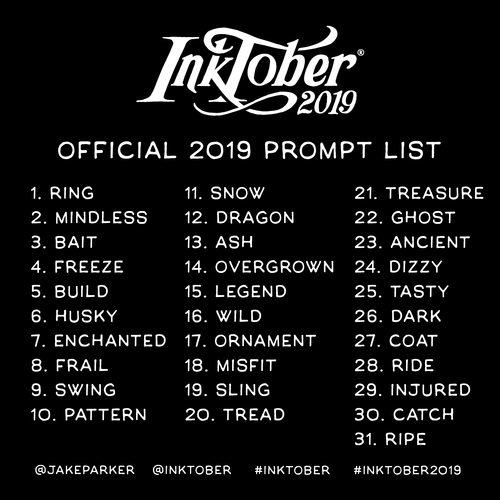

pub_date: 2019-11-03 16:22:23 +01:00
public: true
tags: [inktober, drawing]
title: Inktober 2019, cats!

I participated again to [Inktober][], the yearly challenge where you draw and ink one drawing a day each day of October. The Inktober web site provides a "prompt list": a list of words for each day, which you can (but are not forced to) follow.

I followed it as it helps me come up with drawing ideas, and I also picked "cats" as a recurring theme, so all my drawings are filled with kittens. This makes them very Internet friendly, since as we all know, the Internet was created to share cat pictures, right?

[Inktober]: https://inktober.com
<!-- break -->

I went full color this year, since I now have a decent set of markers:

![Markers][]

[Markers]: markers.jpg

I am not sure I will do it this way next year though: making full colored drawings everyday takes a lot of time. I am proud that I did it this year, but I am also relieved October is over :)

Here are my drawings of this year:

.. gallery::
    :square:

    - full: 01-ring.jpg
      alt: Ring. One cat to rule them all.
    - full: 02-mindless.jpg
      alt: Mindless. This is not going to end well...
    - full: 03-bait.jpg
      alt: Bait.
    - full: 04-freeze.jpg
      alt: Freeze.
    - full: 05-build.jpg
      alt: Build.
    - full: 06-husky.jpg
      alt: Husky. Nothing like wearing a Husky mask to scare your cat friends!
    - full: 07-enchanted.jpg
      alt: Enchanted. Sorcery is handy when you are hungry!
    - full: 08-frail.jpg
      alt: Frail.
    - full: 09-swing.jpg
      alt: Swing. Beware of Catzan, swinging from vine to vine!
    - full: 10-pattern.jpg
      alt: Pattern. A distant cousin from Alice cat.
    - full: 11-snow.jpg
      alt: Snow.
    - full: 12-dragon.jpg
      alt: It was not a good idea to defy the mighty dragon cat!
    - full: 13-ash.jpg
      alt: Ash. When the moon is full, kittens can resurrect from ashes.
    - full: 14-overgrown.jpg
      alt: Overgrown. Carnivorous plants have overgrown their sunhouse!
    - full: 15-legend.jpg
      alt: Legend. A reference to a famous cat...
    - full: 16-wild.jpg
      alt: Wild. Another reference, this time to a 80s cartoon.
    - full: 17-ornament.jpg
      alt: Ornament.
    - full: 18-misfit.jpg
      alt: Misfit. Poor Browny does not fit well with his siblings. He has no idea why.
    - full: 19-sling.jpg
      alt: Sling. Lazy cat prefers hunting with a slingshot, Bird is not too worried.
    - full: 20-tread.jpg
      alt: Tread. A tank from the orange cat army.
    - full: 21-treasure.jpg
      alt: Treasure. Pirate cat discovered some hidden treasure.
    - full: 22-ghost.jpg
      alt: Ghost. Pac-cat better hurries! Reference to a well known 80s arcade game.
    - full: 23-ancient.jpg
      alt: Ancient.
    - full: 24-dizzy.jpg
      alt: Dizzy. This posh kitty really wanted an impressive selfie... Another reference.
    - full: 25-tasty.jpg
      alt: Tasty. Yummy fish!
    - full: 26-dark.jpg
      alt: Dark.
    - full: 27-coat.jpg
      alt: Coat. When it's raining, some cats put on their raincoat!
    - full: 28-ride.jpg
      alt: Ride. It's not a well known fact, but cats enjoy riding the snow just as humans do!
    - full: 29-injured.jpg
      alt: Injured. A reference to a strange 80s French TV show for kids.
    - full: 30-catch.jpg
      alt: Catch. A brown mouse annoying a grey cat. Another reference to a 80s cartoon.
    - full: 31-ripe.jpg
      alt: Ripe. Lazy cat prefers waiting for the apple to ripe and fall. Reference to a comic book cat.
    - full: all.jpg
      alt: All the drawings for this year!

Which one do you prefer?
