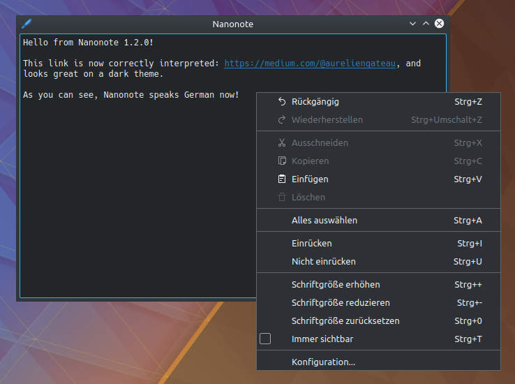

pub_date: 2019-05-12 16:09:11 +01:00
public: true
tags: [nanonote, qt, pko]
title: Nanonote 1.2.0

Time for a new Nanonote release!

This new version comes with several changes from Daniel Laidig: you can now use Ctrl+mouse wheel to make the text bigger or smaller and Ctrl+0 to reset the font to its default size.

He also fixed the way links are displayed: they now use the theme color instead of being hard-coded to blue. If you use a dark theme, this should make Nanonote more usable for you.

Nanonote now speaks German, thanks to Vinzenz Vietzke.

<!-- break -->

I made a few minor changes on my side, the most visible being that `@` is now allowed in URLs, which is handy for sites like Medium.

A more complete changelog as well as deb and rpm packages are available on the [release page][1].

[1]: https://github.com/agateau/nanonote/releases/tag/1.2.0