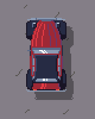
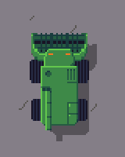
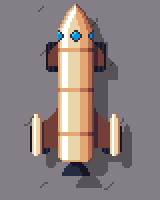
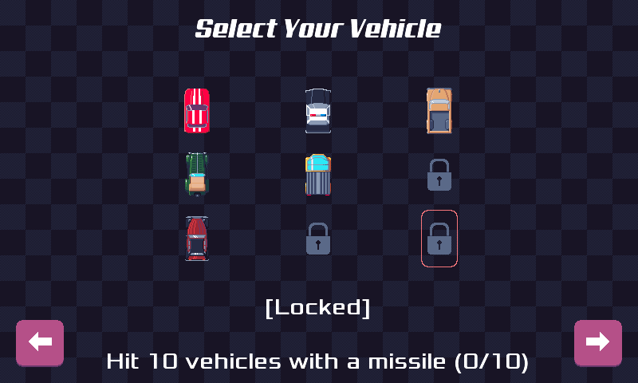

pub_date: 2019-06-20 18:54:40 +01:00
public: true
tags: [pixelwheels]
title: Pixel Wheels 0.12.0

I knew it had been a long time since the last Pixel Wheels release but I was surprised when I opened the changelog and realized version 0.11.0 was released in 2018... It's high time to get 0.12.0 out!

So what are the main changes in 0.12.0?

**3 new vehicles**

The 2-Deuch:

It is inspired from an car which was very popular in France in the second part of the 20th century.

The Harvester:

It comes from the country side, as you may have guessed. If you have ever watched or drove an harvester, you know the steering wheels are on the back. This makes this vehicle a bit special to handle, give it a try...

The Rocket:

A joint production from my son and me. This one is faaast!

<!-- break -->

**Locking system**

These new vehicles are not all directly available, and one of the previous vehicles is gone! 

Don't worry, they are not too far away: Pixel Wheels now features a reward system, so you have to unlock them. And since the game is really nice with you (maybe too nice?) selecting one of the locked vehicles will tell you what you have to do to unlock it:

Same thing with championships: the second championship must be unlocked by ranking 3 or better on the first championship.

Speaking of championships, they have nicer names now: the first one is called "Blocky Mountains" and the second one is "Pix Cities". I also renamed the tracks.

**Multiplayer**

Another important change concerns multiplayer. The feedback I received from players was the split screen was hard to read, so I made the decision to use only one screen. The camera now zooms out to make sure all vehicles controlled by human players are visible.

This required reducing the size of the "Tiny sur Mer" track so that everything does not become ridiculously small when two players are in opposite corners. It also required removing the "rotate camera" option, but nobody really liked it anyway, so it won't be missed :)

**Get it**

That's it for this version, desktop gamers can get it from [Pixel Wheels page](/projects/pixelwheels) and Android gamers should head for [Google Play][gplay] for now, but thanks to the work of [Pierre Rudloff][] and other contributors, Pixel Wheels should appear on [F-Droid][] soon! I'll update the game page when it's there.

[gplay]: https://play.google.com/apps/testing/com.agateau.tinywheels.android
[Pierre Rudloff]: https://rudloff.pro/
[F-Droid]: https://f-droid.org
