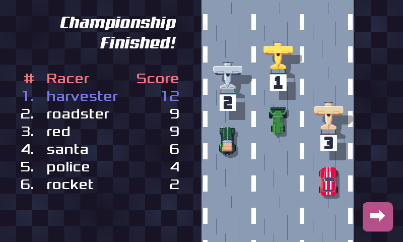
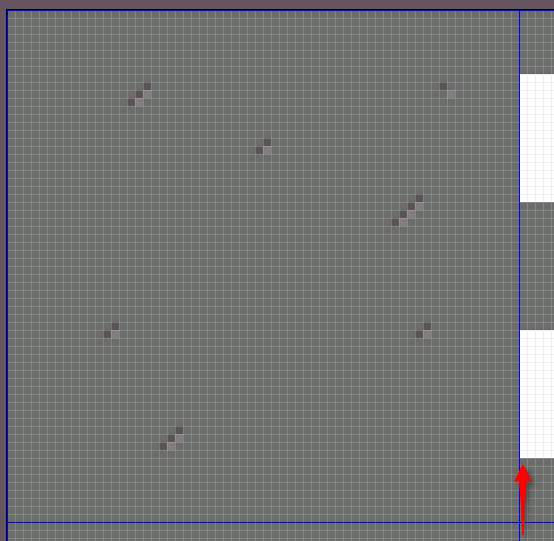

pub_date: 2019-08-12 23:31:41 +01:00
public: true
tags: [pixelwheels]
title: Pixel Wheels 0.13.0

## Fixes, fixes, fixes

I just released Pixel Wheels 0.13.0. This new release contains mostly fixes, small improvements and polishing. One of the most visible of these changes is the new "Championship finished" screen which appears if you finish a championship in the top 3:

I am also happy to report that an annoying bug causing white vertical lines to randomly appear on the road has finally been fixed. It turned out to be a "classic" case of texture bleeding. The white vertical lines were caused by the first column of the "crossroad" tile sometimes being drawn next to the "road" tile...

libGDX provides a tool called [TiledMapPacker][] to repack tilesets and add padding around individual tiles to avoid tile bleeding. Unfortunately this tool uses some libGDX classes, so it requires an OpenGL display to run. This is a blocker for automated builds, so I wrote a simple script: [pad-map-tiles][]. It only does tileset padding, but for Pixel Wheels I don't need the other features provided by TiledMapPacker.

[TiledMapPacker]: https://github.com/libgdx/libgdx/blob/gdx-parent-1.9.10/extensions/gdx-tools/src/com/badlogic/gdx/tiledmappacker/TiledMapPacker.java#L63

[pad-map-tiles]: https://github.com/agateau/pixelwheels/blob/0.13.0/tools/pad-map-tiles

Some behind the scene changes happened too: the code base now uses Java 1.8 (was about time!), a more recent version of Gradle and the APK contains 64 bit binaries, as required by Google Play nowadays.

<!-- break -->

## F-Droid

In the post announcing [Pixel Wheels 0.12.0](../pixelwheels-0-12-0) I mentioned Pixel Wheels would soon be available on F-Droid. It is now available, and it has been a really good thing for the game: I received much more feedback than for the previous releases.

I think this can be explained by two differences compared to Google Play: First, even if F-Droid audience is a lot smaller than Google Play's, its catalog is also smaller, so a new app or game has a higher chance of being noticed. Second, since F-Droid users tend to be more technical, they are more likely to file bug reports than Google Play users. For these reasons, if you are a free software Android app or game developer, I highly recommend getting your product on F-Droid!

## Links

You can find the links to download this new version on [Pixel Wheels page](/projects/pixelwheels). Let me know what you think of it!