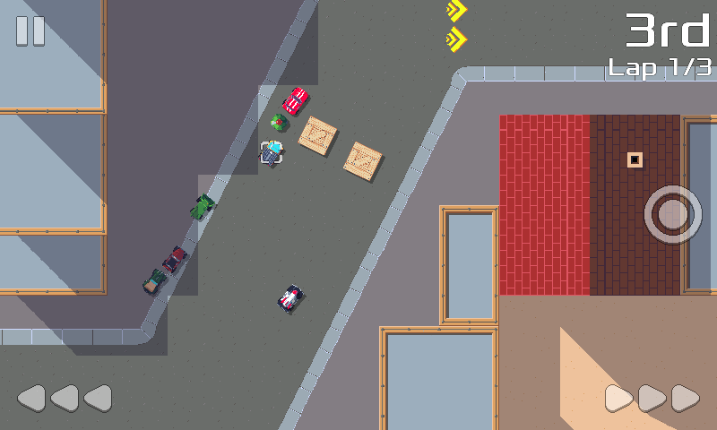

pub_date: 2019-11-18 08:21:44 +01:00
public: true
tags: [pixelwheels, gamedev]
title: Pixel Wheels 0.14.1

Last week I released version 0.14.1 of Pixel Wheels (I am a bit late with the announcement, it has been a busy week).

I am happy to say this is the first release to include changes from other contributors, thanks to Tim Schumacher and Julien Bolard!

Here are the most important changes:

<!-- break -->

- [Mobile] A new touch input mode has been added: "Side buttons". It shows left and right steering buttons in the bottom corners of the screen and a trigger bonus button in the middle right of the screen. Hold left and right simultaneously to go backward.

- There is now a sound when driving in water.

- Tiny-sur-mer track: Several holes have been plugged and missing fences have been added (#48).

- Adjusted the probabilities of bonuses so that all bonuses have a chance to be selected. You still have more chance to get a mine than a gun or missile when your rank is high (#46, by Tim Schumacher).

- Touching or clicking a selected image validates the user choice (By Julien Bolard).

- [Desktop] UI elements now gets focus when hovering over them with the mouse (By Tim Schumacher).

- Fixed sound not coming back after pressing restart (#22).

- Use the vehicle name instead of the vehicle id in the championship finished screen (#51).

- Activating a bonus requires a button press instead of holding the button (#56, by Tim Schumacher).

- The back button in the game mode selection screen is now clickable (by Tim Schumacher).

- Fixed crash when pressing up/down in the keyboard config screen (by Tim Schumacher).

- Fixed Continue buttons in track and vehicle selection screens not working (by Tim Schumacher).

The complete list of changes is available in the [changelog][].

Interestingly, this release is 0.14.1 and not 0.14.0 because when I uploaded the apk for 0.14.0 to Google Play, its automated touch monkey detected a crash in the menu system. I fixed it and uploaded 0.14.1. I am not happy that bug slipped in, but I am glad Google Play caught it before it hit players!

As usual, this release is available from [Pixel Wheels project page](/projects/pixelwheels).

[changelog]: https://github.com/agateau/pixelwheels/blob/0.14.1/CHANGELOG.md
