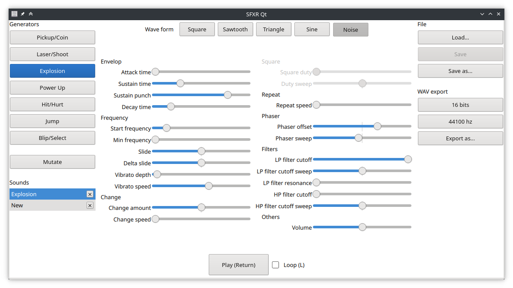

pub_date: 2019-09-16 19:32:12 +01:00
public: true
tags: [sfxr-qt, gamedev, qt, pko]
title: SFXR Qt 1.3.0

I just released version 1.3.0 of [SFXR Qt][], my Qt port of the SFXR sound effect generator.

There aren't that many new features for end users:

- A new wave form: Triangle.
- A new file format: [SFXJ][].

The new file format opens the road to adding new features. I have a few ideas in mind, will see how it goes.

Nevertheless, this release brings several under the hood changes:

<!-- break -->
- Improved error handling so that you get a message dialog when the app cannot load or save a file.
- Unit-tests using [Catch2][], which I really like.
- Continuous Integration through Travis CI.

Finally, I borrowed [Nanonote][] CMake code for packaging, so deb and rpm packages are available on the [release page][]. Let me know if they work for you.

That's it, hope you enjoy generating fun sound effects!

[SFXR Qt]: https://github.com/agateau/sfxr-qt
[SFXJ]: https://github.com/agateau/sfxr-qt/blob/1.3.0/docs/file-formats.md
[Catch2]: https://github.com/catchorg/catch2
[Nanonote]: https://github.com/agateau/nanonote
[release page]: https://github.com/agateau/sfxr-qt/releases/tag/1.3.0
