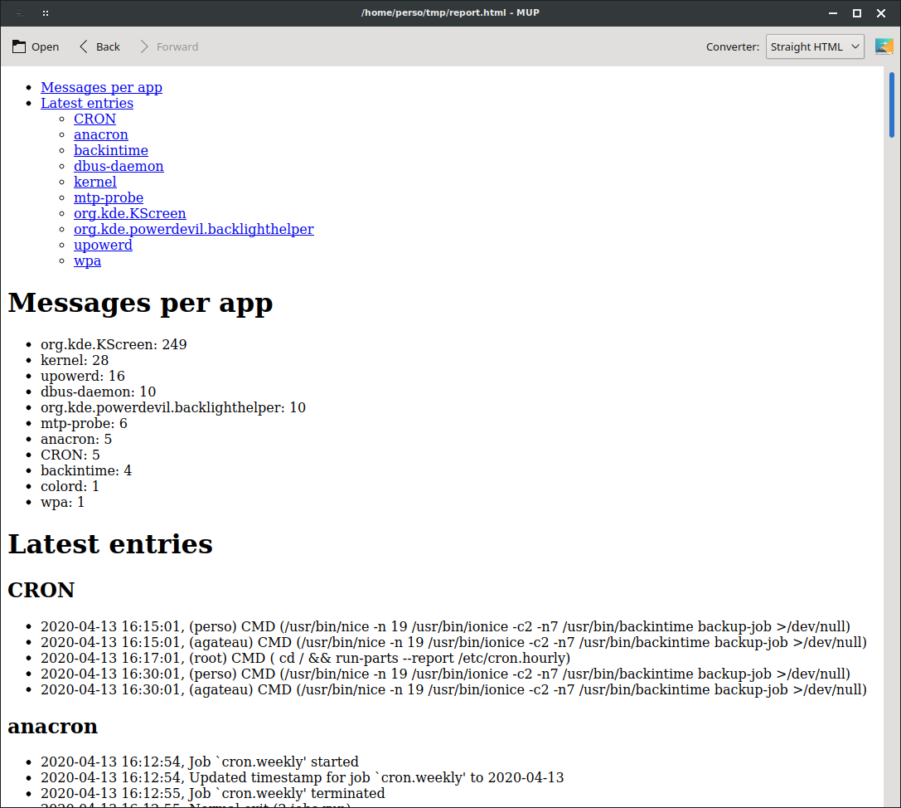

pub_date: 2020-04-13 17:59:31 +01:00
public: true
tags: [tips, python, markdown, entr, mup, pko]
title: Generating reports with Python, Markdown and entr

Let's say you need to parse and analyse some raw data, for example a log file, to generate a report.

An easy way to get started with this is to write some Python, Perl, Ruby or shell code to work on your file and print meaningful information about it.

To illustrate this article I am going to write a Python script to "analyze" the `var/log/syslog` log file, whose entries look like this:

```
Apr 12 11:53:42 dozer org.kde.KScreen[6995]: kscreen.xrandr: #011Primary: false
Apr 12 11:53:42 dozer org.kde.KScreen[6995]: kscreen.xrandr: Output 68 : connected = false , enabled = false
Apr 12 11:53:43 dozer org.kde.KScreen[6995]: kscreen.xrandr: Emitting configChanged()
Apr 12 11:53:47 dozer dbus-daemon[991]: [system] Activating service name='org.kde.powerdevil.backlighthelper' requested by ':1.416652' (uid=1001 pid=7186 comm="/usr/lib/x86_64-linux-gnu/libexec/org_kde_powerdev" label="unconfined") (usi
Apr 12 11:53:47 dozer org.kde.powerdevil.backlighthelper: QDBusArgument: read from a write-only object
Apr 12 11:53:47 dozer org.kde.powerdevil.backlighthelper: message repeated 2 times: [ QDBusArgument: read from a write-only object]
Apr 12 11:53:47 dozer dbus-daemon[991]: [system] Successfully activated service 'org.kde.powerdevil.backlighthelper'
Apr 12 11:54:04 dozer kernel: [716525.975149] usb 3-2: USB disconnect, device number 64
Apr 12 11:54:04 dozer kernel: [716525.975156] usb 3-2.1: USB disconnect, device number 65
Apr 12 11:54:04 dozer kernel: [716526.040164] usb 3-2.3: USB disconnect, device number 66
Apr 12 11:54:04 dozer upowerd[1672]: unhandled action 'unbind' on /sys/devices/pci0000:00/0000:00:14.0/usb3/3-2/3-2.1/3-2.1:1.0/0003:046D:C046.0025
Apr 12 11:54:04 dozer upowerd[1672]: unhandled action 'unbind' on /sys/devices/pci0000:00/0000:00:14.0/usb3/3-2/3-2.1/3-2.1:1.0
Apr 12 11:54:04 dozer upowerd[1672]: unhandled action 'unbind' on /sys/devices/pci0000:00/0000:00:14.0/usb3/3-2/3-2.1
Apr 12 11:54:04 dozer acpid: input device has been disconnected, fd 6
```

The script is going to take the log entries from stdin, iterate on the lines and produce a report on stdout.

## Parsing the log file

The first thing to do is to parse the log file. Since we read the log from stdin, we can start with something like this:

```python
import sys

def parse_line(line):
    # TODO

def parse_log():
    for line in sys.stdin.readlines():
        entry = parse_line(line)
        if entry:
            yield entry

def main():
    for entry in parse_log():
        print(entry)

if __name__ == "__main__":
    main()
```

<!-- break -->

We are going to use regular expressions to parse the log lines, and store the fields in a [named tuple][]:

[named tuple]: https://docs.python.org/3/library/collections.html?highlight=namedtuple#collections.namedtuple

```python
#!/usr/bin/env python3
import re

from collections import namedtuple

LOG_RE = re.compile(r"(?P<date>\w+ \d+ \d+:\d+:\d+)"
                    r" \w+"  # the hostname, we ignore it
                    r" (?P<app>[-a-zA-Z.]+)"
                    r" *[^:]*:"  # ignore any process identifier
                    r" (?P<message>.*)")

Entry = namedtuple("Entry", ("date", "app", "message"))

def parse_line(line):
    match = LOG_RE.match(line)
    if not match:
        return None
    return Entry(date=match.group("date"),
                 app=match.group("app"),
                 message=match.group("message"))
```

(Complete script: [sysloganalyzer1.py](sysloganalyzer1.py))

I like to split the regular expression in multiple lines so that it's easy to comment, and to use named groups (the `?P<foo>` things) to make the code extracting the group text from the matches easier to read.

We can run this script with:

```
$ ./sysloganalyzer1.py < /var/log/syslog
```

And get this output:

```
Entry(date='Apr 13 11:33:45', app='org.kde.powerdevil.backlighthelper', message='message repeated 2 times: [ QDBusArgument: read from a write-only object]')
Entry(date='Apr 13 11:33:45', app='dbus-daemon', message="[system] Successfully activated service 'org.kde.powerdevil.backlighthelper'")
Entry(date='Apr 13 11:35:13', app='wpa', message='wlp1s0: WPA: Group rekeying completed with 00:0f:66:84:2a:da [GTK=CCMP]')
Entry(date='Apr 13 11:35:20', app='wpa', message='wlp1s0: WPA: Group rekeying completed with 00:0f:66:84:2a:da [GTK=CCMP]')
Entry(date='Apr 13 11:35:28', app='rtkit-daemon', message='Supervising 5 threads of 3 processes of 1 users.')
Entry(date='Apr 13 11:35:28', app='rtkit-daemon', message='Supervising 5 threads of 3 processes of 1 users.')
Entry(date='Apr 13 11:35:28', app='systemd-resolved', message='Using degraded feature set (UDP) for DNS server 192.168.8.1.')
Entry(date='Apr 13 11:43:05', app='systemd-timesyncd', message='Synchronized to time server 91.189.91.157:123 (ntp.ubuntu.com).')
Entry(date='Apr 13 11:45:01', app='CRON', message='(perso) CMD (/usr/bin/nice -n 19 /usr/bin/ionice -c2 -n7 /usr/bin/backintime backup-job >/dev/null)')
```

To iterate quickly on these kind of scripts, it's more efficient to use the [entr][] tool to automatically rerun the script when either the data or the script itself changes. This is how I actually ran the script:

```
$ ls /var/log/syslog sysloganalyzer1.py | entr -c -s './sysloganalyzer1.py < /var/log/syslog'
```

Entr expects a list of files on stdin, and automatically reruns the command passed as argument if any of these files change. The `-c` option makes it clear the screen before running the command and the `-s` option makes it run the command through a shell. We need the shell here because our script expects data from stdin.

[entr]: https://eradman.com/entrproject/

Note: be careful if you use `ls` to feed Entr: if you have aliased `ls` to be `ls --color`, Entr is going to fail, because it does not understand the ANSI escape codes used by `ls`to colorize the output! You can fix that by changing your alias to `ls --color=auto`.

## Parsing the date

Having the date as a raw string makes it hard to work with it, so we are going to create a `datetime` object from it by changing `parse_line()` like this:

```python
from datetime import datetime
# ...
YEAR = datetime.now().year
# ...
def parse_line(line):
    match = LOG_RE.match(line)
    if not match:
        return None
    date_str = match.group("date")
    date = datetime.strptime(date_str, "%b %d %H:%M:%S")
    date = date.replace(year=YEAR)
    return Entry(date=date,
                 app=match.group("app"),
                 message=match.group("message"))
```

Note that we had to set the year manually, because the date format used by the log file does not set it...

The output of our script now looks like this:

```
Entry(date=datetime.datetime(2020, 4, 13, 13, 59, 50), app='dhclient', message='bound to 10.0.0.108 -- renewal in 36583 seconds.')
Entry(date=datetime.datetime(2020, 4, 13, 13, 59, 50), app='systemd', message='Starting resolvconf-pull-resolved.service...')
```

(Complete script: [sysloganalyzer2.py](sysloganalyzer2.py))

## Reporting

We are now ready to work with this data to extract meaningful information.

In this example we are going to create a report to show:

- a list of the apps writing to the log file, sorted by the number of messages they logged
- messages for the last 30 minutes, grouped by apps

First lets modify the `main()` function to store all log entries in an `entries` list:

```python
# ...
def main():
    entries = list(parse_log())
# ...
```

### Reporting message count per app

To implement the app message counter we can use the [Counter][] class from the `collections` module. A basic version, without sorting the results, requires only this:

[Counter]: https://docs.python.org/3/library/collections.html?highlight=counter#collections.Counter

```python
from collections import namedtuple, Counter
# ...
def main():
    entries = list(parse_log())

    app_message_count = Counter(x.app for x in entries)

    print("Messages per app")
    for app, count in app_message_count.items():
        print(f"- {app}: {count}")
```

Running this script, we get the following result:

```
Messages per app
- colord: 1
- anacron: 12
- dbus-daemon: 83
- org.kde.powerdevil.backlighthelper: 66
- CRON: 43
- backintime: 136
- wpa: 116
- systemd-resolved: 60
- systemd: 147
- org.kde.KScreen: 763
- kernel: 406
- upowerd: 88
- acpid: 6
- NetworkManager: 358
- whoopsie: 48
- avahi-daemon: 106
- nm-dispatcher: 56
- systemd-sleep: 8
- bluetoothd: 16
- systemd-rfkill: 4
- ModemManager: 4
- dhclient: 25
- mtp-probe: 6
- rtkit-daemon: 54
- systemd-timesyncd: 4
- pulseaudio: 1
- org.kde.ActivityManager: 31
- org.kde.kpasswdserver: 39
- backintime-qt: 11
- crontab: 6
- snapd: 1
- fstrim: 2
- cron: 1
```

Let's sort by message count by changing our `for` loop to this:

```python
    for app, count in sorted(app_message_count.items(), key=lambda x: -x[1]):
```

`app_message_count.items()` returns a list of tuples, where the first element is the app name and the second element is the message count. The `sorted()` function lets us sort our list and we can pass it a `key` argument so it knows how to sort. By passing it `lambda x: -x[1]` we tell it to use the second item of the tuple (the message count) and sort in descending order.

Now the output looks like this:

```
Messages per app
- org.kde.KScreen: 763
- kernel: 406
- NetworkManager: 358
- systemd: 147
- backintime: 136
- wpa: 116
- avahi-daemon: 106
- upowerd: 88
- dbus-daemon: 83
- org.kde.powerdevil.backlighthelper: 66
- systemd-resolved: 60
- nm-dispatcher: 56
- rtkit-daemon: 54
- whoopsie: 48
- CRON: 43
- org.kde.kpasswdserver: 39
- org.kde.ActivityManager: 31
- dhclient: 25
- bluetoothd: 16
- anacron: 12
- backintime-qt: 11
- systemd-sleep: 8
- acpid: 6
- mtp-probe: 6
- crontab: 6
- systemd-rfkill: 4
- ModemManager: 4
- systemd-timesyncd: 4
- fstrim: 2
- colord: 1
- pulseaudio: 1
- snapd: 1
- cron: 1
```

(Looks like KScreen is quite verbose...)

### Reporting messages logged for the last 30 minutes, grouped by apps

This second part is a pretext to show you the [groupby()][] function from the `itertools` module.

[groupby()]: https://docs.python.org/3/library/itertools.html?highlight=groupby#itertools.groupby

But first let's keep only the entries from the last 30 minutes:

```python
from datetime import datetime, timedelta
#...
def main():
    #...
    print("Latest entries")
    min_date = datetime.now() - timedelta(minutes=30)
    latest_entries = (x for x in entries if x.date > min_date)
```

`groupby()` groups elements from an iterable according to a certain criteria. It expects the elements to be sorted by the criteria, so before calling `groupby()`, we must sort the entries by app. It's also a good idea to sort the list by date as a second criteria so that our entries are nicely ordered within their group. We do so by adding this line:

```python
    latest_entries = sorted(latest_entries,
                            key=lambda x: (x.app, x.date))
```

Now we are ready to call `groupby()`:

```python
    for app, entries in groupby(latest_entries, lambda x: x.app):
        print(f"- {app}")
        for entry in entries:
            print(f"    {entry.date}, {entry.message}")
```

If we run this script, the output looks like this:

```
Messages per app
- org.kde.KScreen: 763
- kernel: 406
- NetworkManager: 358
- systemd: 147
- backintime: 142
- wpa: 117
- avahi-daemon: 106
- upowerd: 88
- dbus-daemon: 85
- org.kde.powerdevil.backlighthelper: 68
- systemd-resolved: 60
- nm-dispatcher: 56
- rtkit-daemon: 54
- CRON: 48
- whoopsie: 48
- org.kde.kpasswdserver: 39
- org.kde.ActivityManager: 31
- dhclient: 25
- bluetoothd: 16
- anacron: 12
- backintime-qt: 11
- systemd-sleep: 8
- acpid: 6
- mtp-probe: 6
- crontab: 6
- systemd-rfkill: 4
- ModemManager: 4
- systemd-timesyncd: 4
- fstrim: 2
- colord: 1
- pulseaudio: 1
- snapd: 1
- cron: 1
Latest entries
- CRON
    2020-04-13 15:00:01, (perso) CMD (/usr/bin/nice -n 19 /usr/bin/ionice -c2 -n7 /usr/bin/backintime backup-job >/dev/null)
    2020-04-13 15:00:01, (agateau) CMD (/usr/bin/nice -n 19 /usr/bin/ionice -c2 -n7 /usr/bin/backintime backup-job >/dev/null)
    2020-04-13 15:15:01, (perso) CMD (/usr/bin/nice -n 19 /usr/bin/ionice -c2 -n7 /usr/bin/backintime backup-job >/dev/null)
    2020-04-13 15:15:01, (agateau) CMD (/usr/bin/nice -n 19 /usr/bin/ionice -c2 -n7 /usr/bin/backintime backup-job >/dev/null)
    2020-04-13 15:17:01, (root) CMD (   cd / && run-parts --report /etc/cron.hourly)
- backintime
    2020-04-13 15:00:01, INFO: Profile "Profil principal" is not scheduled to run now.
    2020-04-13 15:00:01, INFO: Deferring backup while on battery
    2020-04-13 15:00:01, WARNING: Backup not performed
    2020-04-13 15:15:01, INFO: Profile "Profil principal" is not scheduled to run now.
    2020-04-13 15:15:02, INFO: Deferring backup while on battery
    2020-04-13 15:15:02, WARNING: Backup not performed
- dbus-daemon
    2020-04-13 15:00:50, [system] Activating service name='org.kde.powerdevil.backlighthelper' requested by ':1.416652' (uid=1001 pid=7186 comm="/usr/lib/x86_64-linux-gnu/libexec/org_kde_powerdev" label="unconfined") (using servicehelper)
    2020-04-13 15:00:50, [system] Successfully activated service 'org.kde.powerdevil.backlighthelper'
- org.kde.powerdevil.backlighthelper
    2020-04-13 15:00:50, QDBusArgument: read from a write-only object
    2020-04-13 15:00:50, message repeated 2 times: [ QDBusArgument: read from a write-only object]
- wpa
    2020-04-13 15:04:52, wlp1s0: CTRL-EVENT-SIGNAL-CHANGE above=1 signal=-6 noise=-83 txrate=48000
```

(Complete script: [sysloganalyzer3.py](sysloganalyzer3.py))

## Formatting the report

Raw text is not super nice to read. A common alternative is to generate HTML, but generating HTML is painful: you need to wrap everything in tags. This is no fun, especially if you want to produce bullet lists. You also need to think about escaping characters. Python makes this less error-prone, but attempting to generate HTML from a shell script does not sound like a good idea...

I find generating Markdown easier. Being line-based, Markdown is easy to generate from a script. The raw output is still readable, and once you are happy with it you can get a decent-looking report by piping the results to a Markdown formatter such as [Pandoc][] or [CMark][].

Let's revisit our script to make it generate Markdown. There is actually not much to change. First we can prefix the string of our titles with `#` to turn them into sections headers:

- `print("Messages per app")` becomes `print("# Messages per app")`
- `print("Latest entries")` becomes `print("# Latest entries")`

We also need to add an empty line between sections. A simple `print()` will do.

Next, we can turn the app titles in the "Latest entries" section into sub-sections by changing the `print(f"- {app}")` into `print(f"## {app}")`.

Finally we can turn the log entries into bullet list elements by replacing the indent with `-`.

Our new `main()` function looks like this:

```python
def main():
    entries = list(parse_log())

    app_message_count = Counter(x.app for x in entries)

    print("# Messages per app")
    for app, count in sorted(app_message_count.items(), key=lambda x: -x[1]):
        print(f"- {app}: {count}")
    print()

    print("# Latest entries")
    min_date = datetime.now() - timedelta(minutes=30)
    latest_entries = (x for x in entries if x.date > min_date)
    latest_entries = sorted(latest_entries,
                            key=lambda x: (x.app, x.date))
    for app, entries in groupby(latest_entries, lambda x: x.app):
        print()
        print(f"## {app}")
        for entry in entries:
            print(f"- {entry.date}, {entry.message}")
```

(Complete script: [sysloganalyzer4.py](sysloganalyzer4.py))

If we pipe our script through `pandoc` (still using `entr`) like this:

```
ls /var/log/syslog sysloganalyzer4.py | entr -c -s \
    './sysloganalyzer4.py < /var/log/syslog | pandoc --standalone -f markdown_github --toc > report.html'
```

Then we get a decent report like this:



Not the most beautiful report ever generated, but readable by everyone. And you can prettify it by providing Pandoc a nicer template or a CSS file if necessary.

A note about the Pandoc options used here:

`--standalone`: tells Pandoc to generate a complete HTML document. That is, a file starting with an `<html>` element, instead of just HTML elements.

`-f markdown_github`: tells Pandoc to use the "GitHub Flavored Markdown" Markdown dialect. I find this more appropriate for script output because it makes carriage-returns significant. If you use `-f markdown` instead, then the output of this code:

```python
print(f"foo")
print(f"bar")
```

Will appears as "foo bar" in the report, instead of being on two separate lines.

You can do the same with CMark using the `--hardbreaks` option.

`--toc`: generates a clickable table of content from the section headers.

## Quick preview (shameless plug)

This HTML output is nice, but having to reload the browser is annoying. The [entr][] page provides a script to reload the current tab of your browser, but what I like to do is to use my markup previewer, [Mup][], to display the HTML. This way I can have an editor opened on my script on the left side of the screen and Mup showing the report on the right side. Every time I change the script, `entr` regenerates the report, Mup notices the changes and reloads it.

<video width="1352" height="770" controls>
    <source src="mup-demo.mp4" type="video/mp4">
</video>

[Pandoc]: https://pandoc.org
[CMark]: https://github.com/commonmark/cmark
[Mup]: https://github.com/agateau/mup

## Takeaways

- Python comes with quite a few handy classes to massage data and extract meaningful information: the [collections][] and [itertools][] modules are worth studying;
- Use [entr][] for fast iterations while working on your script;
- Generating Markdown from a script is easy, and you can turn it into decent HTML using [Pandoc][], [CMark][] or any other Markdown formatter;
- Use an auto-updating tool like [Mup][] to display the report while working on it.

[collections]: https://docs.python.org/3/library/collections.html
[itertools]: https://docs.python.org/3/library/itertools.html
