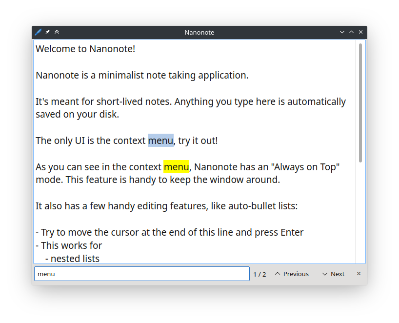

pub_date: 2020-10-04 17:35:00 +01:00
public: true
tags: [nanonote, qt, cookiecutter-qt-app, pko]
title: Nanonote 1.3.0 released

I just released [Nanonote][] 1.3.0, my minimalist note-taking application! This release comes with two new features:

[Nanonote]: https://github.com/agateau/nanonote

First a search bar, implemented by Pavol Oresky:

Second, the ability to reorder selected lines using Alt+Shift+Up and Alt+Shift+Down. This is very handy to order lists:

<video width="688" height="520" controls>
    <source src="movelines.mp4" type="video/mp4">
</video>

<!-- break -->

It also comes with support for macOS and Windows!

This the first time I release a macOS app and it's been a very long time since I last released a Windows app!

*Disclaimer: The macOS dmg is unsigned. Sorry for that, I just don't want to spend $100 a year on an Apple developer account to be able to sign and notarize Nanonote. Same thing for the Windows installer: it is unsigned.*

### Where do I get it?

You can get installers for version 1.3.0 from the [release page][].

[release page]: https://github.com/agateau/nanonote/releases/tag/1.3.0

### Nanonote is my guinea pig

I have been working for some time on a project to make it easier to create and distribute Qt apps: [cookiecutter-qt-app][]. This project is a [Cookiecutter][] template to create "real world" Qt app, meaning out-of-the-box support for translations, data files, multi-platform packaging and other niceties.

It is still very much a work-in-progress, but I regularly update Nanonote source tree to match what cookiecutter-qt-app generates as a way to validate the template. The macOS dmg and Windows installer are a result of this work.

[cookiecutter-qt-app]: https://github.com/agateau/cookiecutter-qt-app
[Cookiecutter]: https://github.com/cookiecutter/cookiecutter
