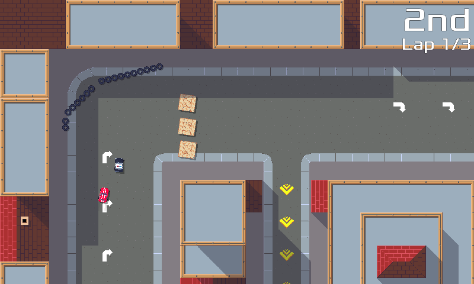
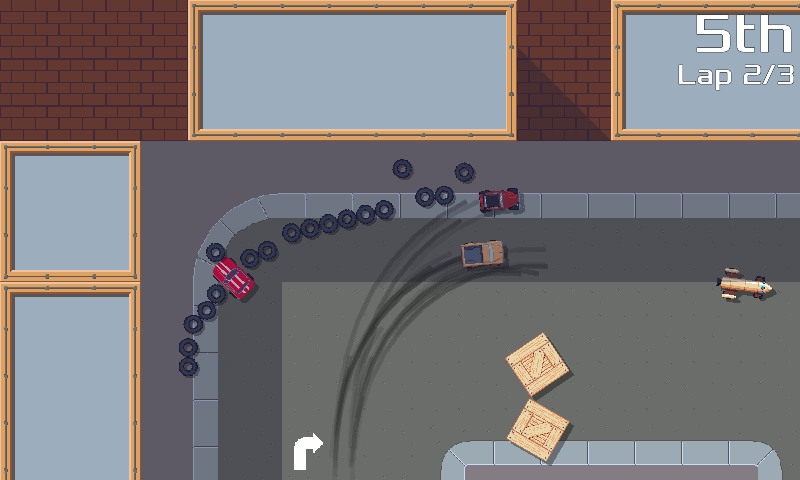
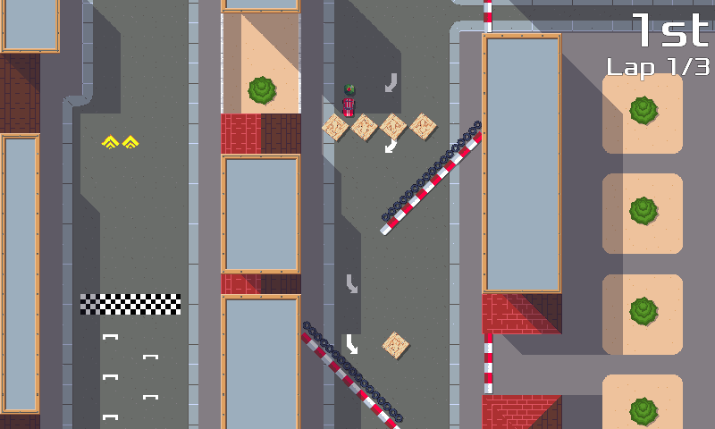

pub_date: 2020-02-09 18:06:05 +01:00
public: true
tags: [pixelwheels, gamedev]
title: Pixel Wheels 0.15.0

I am happy to announce the release of Pixel Wheels 0.15.0, the first version of year 2020! This version could almost have been called 0.14.2 as it's mostly made of bug fixes. Take this as an hint that the game is almost feature complete... at least that is how I analyze it :)

What's in this new version, you ask?

<!-- break -->

The main new feature is the addition of moving and still obstacles to the tracks. There are two of them for now: tires and concrete blocks.

Tires can be assembled into walls like this:

When you hit them with your vehicle they can move, scattering on the road:

Concrete blocks do not really change anything for the player: they just replace the existing tile-based blocks. You can see them on the following screenshot: the blocks below the tires and the vertical blocks between buildings are those new obstacles.

The main difference between these new blocks and the old ones is that they are not defined as tiles in the track, so they do not have to be aligned to the tile grid and can be oriented in any direction. Blocks are not widely used yet, but I plan to make more use of them in future tracks.

Another important change in this release is the work done on AI. Computer pilots are a bit smarter now: they get stuck less often and gained a limited ability to avoid mines. This might make the game harder! Missiles also  got smarter: they learned they should not lock on a target if there is a wall in between.

Other than that, many bugs have been fixed, have a look at the [changelog][] for the list.

That's it for this version! As usual, it is available from [Pixel Wheels project page](/projects/pixelwheels).

[changelog]: https://github.com/agateau/pixelwheels/blob/0.15.0/CHANGELOG.md
