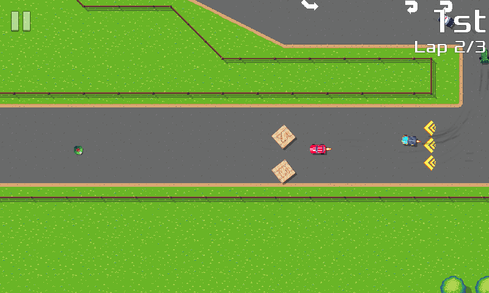
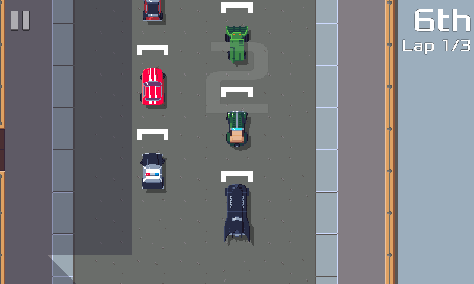

pub_date: 2020-04-19 20:16:07 +01:00
public: true
tags: [pixelwheels]
title: Pixel Wheels 0.16.0

I finally found the time and motivation to get a new version of Pixel Wheels out, so here comes 0.16.0.

Not many engine changes in this new version, mostly new content: first a new track: "Welcome". This track takes place in the countryside, so you'll race among fields and should spot an old tractor. As its name imply it's a simple track, designed to be the track new players begin with.

It is part of a new championship called "Country Life", which for now contains only this track, so it's very short... I plan to add a new track to it in the next version.

The other content addition is a new car: the Dark M.

It's a bit longer than the others. Maybe I should shorten it a bit, what do you think?

<!-- break -->

Other changes include a "Restart" button in quick race mode, quite handy when practicing a race, and the ability to move the game to the SD card on Android.

That's it for this version, I must confess it's hard to find motivation to work on the game these days, I am in the "I want to be done with it, but to do so I must finish it" phase :) Hopefully I manage to motivate myself enough in the next weeks to continue working on it.

As usual, you can find the latest version on [Pixel Wheels page](/projects/pixelwheels). Let me know what you think of this new track and of the new car (that is, once you have unlocked it ;))!
