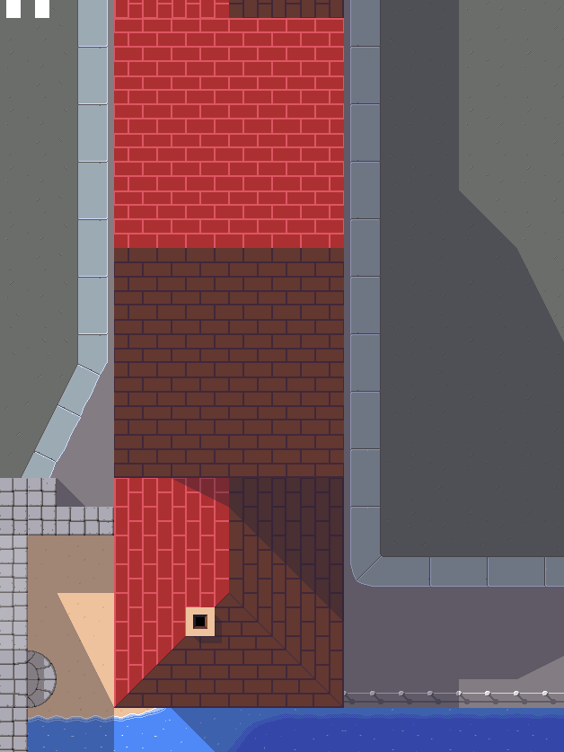
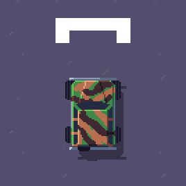

pub_date: 2020-08-30 12:28:52 +01:00
public: true
tags: [pixelwheels]
title: Pixel Wheels 0.17.0!

I just released Pixel Wheels 0.17.0. The main focus on this version has been the graphics, lot of work has been done on the various background tiles: roof, roads, trees, sidewalks, bridge, sand have been improved.

I spent way too long time working on the roof tiles in particular, to the point where I was starring at roofs every time I went outside, looking for inspiration. You can see the evolution of the tiles in this short time-lapse:

<!-- break -->

That's not all, Pixel Wheels 0.17.0 comes with a new car: a camouflaged jeep.

In other news, I created an [itch.io page][itch] for Pixel Wheels. I hope this helps reaching new players.

There are other minor changes, such as an "About" tab in the configuration screen and various UI cleanups in the game menus.

## Get it!

That's it for this version, get it from [itch.io][itch] or the [game page](/projects/pixelwheels/)!

[itch]: https://agateau.itch.io/pixelwheels/
