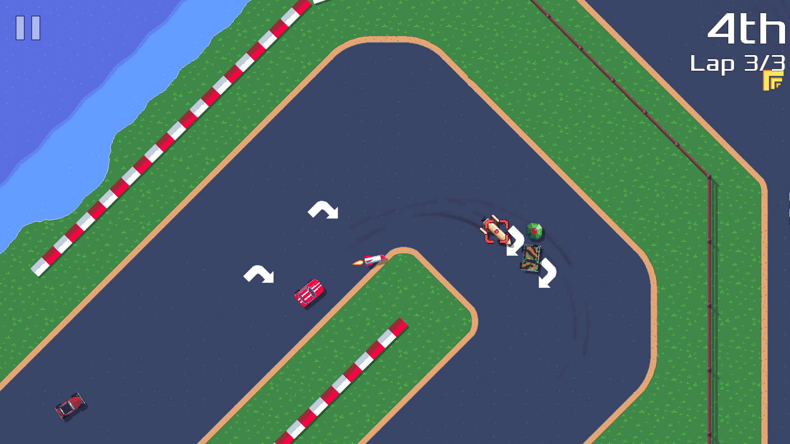

pub_date: 2020-12-27 09:02:26 +01:00
public: true
tags: [pixelwheels]
title: Pixel Wheels 0.18.0

Hey, [Pixel Wheels][game page] 0.18.0 is out! This version brings a new track to the game: "River". This track completes the "Country Life" championship: now all championships have two tracks. It's not much, but I think we can agree it's better than a one track championship, right?

0.18.0 also comes with Android TV support, making it easier for you to play the game in your living room.

<!-- break -->

I fixed a few bugs, most importantly the one which allowed you to select all vehicles even if they were locked (how embarrassing) and the one which caused the lap records to be invisible in the track selection screen.

For a complete list of changes, have a look at the [changelog][].

As usual, all download links can be found on the [game page][].

[changelog]: https://github.com/agateau/pixelwheels/blob/9665f9c857dbef1bb40a742ae0388947e2a8c463/CHANGELOG.md
[game page]: /projects/pixelwheels/
