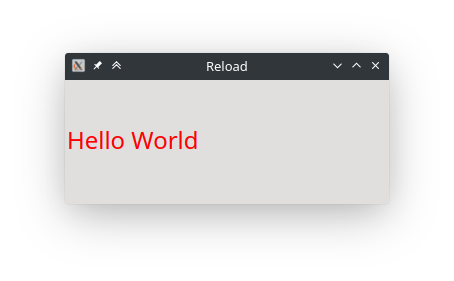
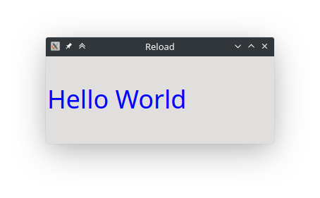

pub_date: 2020-12-13 16:29:15 +01:00
public: true
tags: [qt, tips, qwidgets, qml, pko]
title: Speeding up the compilation-startup cycle when fine-tuning your code

Our computers are getting faster and faster, but compilation and startup times are still something we want to avoid.

One situation where waiting for compilation and startup to finish feels like a waste is when you are fine-tuning an aspect of your application. For example when you are adjusting spacing or colors in a user interface. Having to wait between each iteration not only costs us time, it also makes us less likely to do more experiments.

In this article I am going to show a few tricks to reduce these pains.

<!-- break -->

## Setting up the scene

For the sake of the article, I am creating an "Hello World" application: a plain window with an "Hello World" `QLabel`.

Our code looks like this:

```c++
int main(int argc, char* argv[]) {
    QApplication: app(argc, argv);

    QLabel label("Hello World");
    label.resize(320, 120);
    label.show();

    return app.exec();
}
```

Nothing too fancy for now.

Let's say we want to configure the color and size of the label. In a real app this code would be in a method of some object, but here I am just going to declare a static `configureLabel()` function:

```c++
static void configureLabel(QLabel* label) {
    QFont font;
    font.setPixelSize(24);
    label->setFont(font);

    QPalette palette;
    palette.setColor(QPalette::WindowText, Qt::red);
    label->setPalette(palette);
}
```

and call it in my `main()` function:

```c++
    (...)
    QLabel label("Hello World");
    configureLabel(&label);
    label.resize(320, 120);
    (...)
```

So far so good, we have a big red "Hello World".



The color and the font size are hard-coded, though, so we need to rebuild the app and restart it every time we want to change them. That's annoying.

## Level 1: environment variables

A first improvement would be to read the values from environment variables. This requires very little modifications to our code. I am going to change `configureLabel()` to read the color from the `$COLOR` environment variable and the font size from the `$FONT_SIZE` variable:

```
:::c++ hl_lines="2 3 6 10"
static void configureLabel(QLabel* label) {
    int fontSize = qEnvironmentVariableIntValue("FONT_SIZE");
    QColor color = qEnvironmentVariable("COLOR");

    QFont font;
    font.setPixelSize(fontSize);
    label->setFont(font);

    QPalette palette;
    palette.setColor(QPalette::WindowText, color);
    label->setPalette(palette);
}
```

With these changes, we recompile one final time and then we can start our app from the terminal like this:

```
COLOR=blue FONT_SIZE=36 ./hello-world
```

And get a bigger, bluer, "Hello World":



## Level 2: configuration file

Environment variables are handy, but they are tedious to edit if you have more than two or three, and you have to be careful with escaping. An alternative which requires a bit more code is to use a configuration file.

Using the `QSettings` class, it is very simple to parse a key/value file. You can also use `QJsonDocument` to use a JSON file if you want, but I prefer key/value files because it's easier to experiment variants by commenting out lines (JSON does not support comments :/)

Reading the configuration file can be done by changing again our `configureLabel()` function to this:

```
:::c++ hl_lines="2 3 4"
static void configureLabel(QLabel* label) {
    QSettings settings("config.ini", QSettings::IniFormat);
    int fontSize = settings.value("fontSize").toInt();
    QColor color = settings.value("color").toString();

    QFont font;
    font.setPixelSize(fontSize);
    label->setFont(font);

    QPalette palette;
    palette.setColor(QPalette::WindowText, color);
    label->setPalette(palette);
}
```

Then we create a `config.ini` configuration file with the following content:

```conf
color=magenta
fontSize=48
```

Note that we don't need a traditional `[section]` header, `QSettings` is happy to read values without any header.

Now we can start the app from the folder containing our configuration file and enjoy our magenta Hello World.

## Level 3: live reload

Using a configuration file brings another possibility: live reload! Wouldn't it be great if our app could reload its configuration file as soon as we saved the file? This is actually quite easy to do, but there is a minor caveat.

Qt comes with the `QFileSystemWatcher` class to monitor file changes. We can use it to make our app call `configureLabel()` every time the configuration file changes.

Before we do this, I am going to refactor our code a bit to introduce a `TempConfig` class to hold our variables and our `QFileSystemWatcher` instance (I named it `TempConfig` and not `Config` to reduce the chances of naming conflicts when using it in a real-world code base).

Here is `TempConfig.h`:

```c++
class TempConfig : public QObject {
public:
    explicit TempConfig(const QString& path, QObject* parent = nullptr);

    void load();

    QString color;
    int fontSize;

private:
    QString mPath;
};
```

To minimize the boilerplate required to add a new value, The configuration values are public member variables.

Here is `TempConfig.cpp`:

```c++
TempConfig::TempConfig(const QString& path, QObject* parent)
    : QObject(parent), mPath(path) {
    load();
}

void TempConfig::load() {
    QSettings settings(mPath, QSettings::IniFormat);
    color = settings.value("color").toString();
    fontSize = settings.value("fontSize").toInt();
}
```

`TempConfig::load()` is basically the code we added to `configureLabel()` in the previous section.

At this point, `main.cpp` looks like this:

```
:::c++ hl_lines="1 3 7 14 17"
static void configureLabel(QLabel* label, TempConfig* config) {
    QFont font;
    font.setPixelSize(config->fontSize);
    label->setFont(font);

    QPalette palette;
    palette.setColor(QPalette::WindowText, config->color);
    label->setPalette(palette);
}

int main(int argc, char* argv[]) {
    QApplication: app(argc, argv);

    TempConfig config("config.ini");

    QLabel label("Hello World");
    configureLabel(&label, &config);
    label.resize(320, 120);
    label.show();

    return app.exec();
}
```

`main()` creates an instance of our new `TempConfig` class and passes it as an argument to the modified `configureLabel()` function. No behavior change for now.

Time to introduce our file watcher, I am going to create a `QFileSystemWatcher` instance in `TempConfig` constructor to call `TempConfig::load()` when our configuration file changes:

```
:::c++ hl_lines="3 4 5"
TempConfig::TempConfig(const QString& path, QObject* parent)
    : QObject(parent), mPath(path) {
    auto watcher = new QFileSystemWatcher(this);
    watcher->addPath(path);
    connect(watcher, &QFileSystemWatcher::fileChanged, this, &TempConfig::load);
    load();
}
```

We also need to tell the rest of the app when the configuration has changed, so lets add a `changed()` signal to `TempConfig` and emit it in `load()`:

```
:::c++ hl_lines="5"
void TempConfig::load() {
    QSettings settings(mPath, QSettings::IniFormat);
    color = settings.value("color").toString();
    fontSize = settings.value("fontSize").toInt();
    changed();
}
```

Now in our `main.cpp`, we need to call `configureLabel()` when `TempConfig::changed()` is emitted:

```
:::c++ hl_lines="4 5 6"
(...)
configureLabel(&label, &config);

QObject::connect(&config, &TempConfig::changed, &label, [&label, &config] {
    configureLabel(&label, &config);
});

label.resize(320, 120);
(...)
```

And... it works!

Oh wait... it does not, changes are not automatically applied...

What's going on?

The answer is: it depends on your text editor. Many text editors do not just save the file in place: they save it to a temporary hidden file in the same folder then atomically rename the hidden file to the original file when they are done saving it.

`QFileSystemWatcher` is not smart enough to follow this. Since the code in `TempConfig` is not supposed to be final production code, a quick workaround is to watch the folder of the configuration file in addition to the file itself. This can be done by modifying `TempConfig` constructor like this:

```
:::c++ hl_lines="5 7"
TempConfig::TempConfig(const QString& path, QObject* parent)
    : QObject(parent), mPath(path) {
    auto watcher = new QFileSystemWatcher(this);
    watcher->addPath(path);
    watcher->addPath(QFileInfo(path).absolutePath());
    connect(watcher, &QFileSystemWatcher::fileChanged, this, &TempConfig::load);
    connect(watcher, &QFileSystemWatcher::directoryChanged, this, &TempConfig::load);
    load();
}
```

And... it works this time!

<video width="800" height="340" controls>
    <source src="tempconfig-demo.mp4" type="video/mp4">
</video>

Now fine tune your app, and enjoy the instant feedback :). I find it super fun to work this way!

When you are happy with your settings, replace the code reading from the `TempConfig` class with hard-coded constants. Or, if you plan to revisit this later, leave the code hidden behind a build option.

## That's a lot of code for some one-time fine tuning!

This is true, but you don't have to start from scratch every time. I recommend keeping `TempConfig.h` and `TempConfig.cpp` in your snippet library. Next time you need to fine-tune a set of parameters in your application, you just have to copy `TempConfig` files to your project, add the fields you need, then instantiate the class at the right place.

## What about QML apps?

It is fairly easy to adapt this code to work with a QML app. First we need  to declare a `Q_PROPERTY` for each field. Lets do this for our `TempConfig` class:

```
:::c++ hl_lines="3 4"
class TempConfig : public QObject {
    Q_OBJECT
    Q_PROPERTY(QColor color MEMBER color NOTIFY changed)
    Q_PROPERTY(int fontSize MEMBER fontSize NOTIFY changed)
public:
    explicit TempConfig(const QString& path, QObject* parent = nullptr);
    (...)
```

Since we use public members and the same notify signal for all properties, writing the `Q_PROPERTY` lines does not take too long.

Now we  have to give access to our class to our QML code. We can either go the long way and make our class instantiatable from QML, or take a shortcut (which is appropriate in my opinion in this situation), and add our `TempConfig` instance to the root context. Here is a QML version of this example code, where `TempConfig` instance is made available via the root context.

Here is `main.qml`:

```qml
import QtQuick 2.12
import QtQuick.Controls 2.12
import QtQuick.Window 2.12

Window {
    width: 320
    height: 120
    visible: true
    title: "Reload (QML)"

    Label {
        text: "Hello World"
        anchors.centerIn: parent
        color: config.color
        font.pixelSize: config.fontSize
    }
}
```

And here is `main-qml.cpp`:

```c++
int main(int argc, char* argv[]) {
    QGuiApplication app(argc, argv);

    TempConfig config("config.ini");

    QQmlApplicationEngine engine;
    engine.rootContext()->setContextProperty("config", &config);
    engine.load("qrc:/main.qml");

    return app.exec();
}
```

## Final words

When fine-tuning an application, consider adding temporary code to reduce the time spent waiting between each adjustment.

Environment variables is a super quick way to do this, but a configuration file scales better, is more comfortable and makes it possible to setup auto reload.

Keep a skeleton of the `TempConfig` class around for quick integration in your code.

The code for this article is [available here](https://github.com/agateau/livereload).
