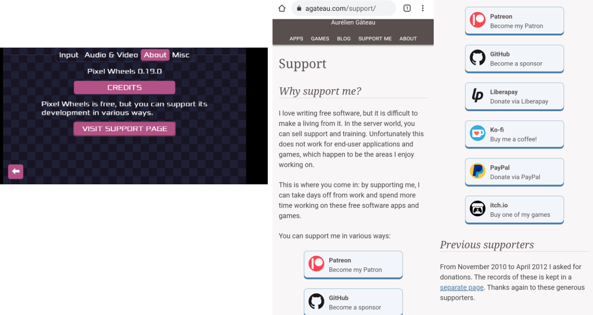

public: true
pub_date: 2021-04-10 15:48:21 +01:00
tags: [pixelwheels, pko, android, rant]
title: Google does not want you to tell your players about your donation page

I recently updated Pixel Wheels banner image on Google Play. That triggered a review of the game: shortly after the update I received a message telling me Pixel Wheels was "not compliant with Google Play Policies". What nefarious activity does the game engage in? Sneak on users? Mine bitcoins?

Nope.

<!-- break -->

Something much more terrible, as evidenced by this screenshot they sent me:

_The Horror_

Yes. I confess it. I added a link to my [donation page](/support) within the game, depriving Google of some precious money it totally cannot survive without! How dare I?!? I am such a bad person.

Since there is no point arguing with them, I am going to have to build a Google Play flavor of the game, where this link is replaced with a link to the game page. Hopefully the Great Algorithm will accept that. We'll see.

Meanwhile you can still get the game from [F-Droid](https://f-droid.org/fr/packages/com.agateau.tinywheels.android/) or [itch.io](https://agateau.itch.io/pixelwheels), since they do not have a problem with a link to a donation page.
