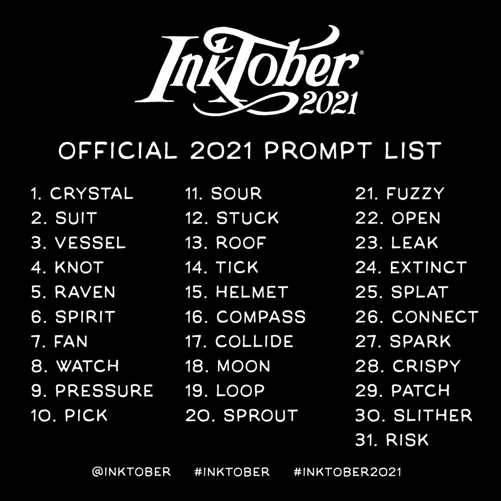

pub_date: 2021-11-04 19:10:11 +01:00
public: true
tags: [inktober, drawing]
title: Inktober 2021, StarCraft!

This year I once again participated to [Inktober][], the yearly challenge where you draw and ink one drawing a day each day of October. The Inktober web site provides a "prompt list": a list of words for each day, which you can (but are not forced to) follow.

_Inktober 2021 prompt list_

I have been playing StarCraft II in the last few months so the first word: "crystal" made me think of a Protoss pylon... this ended defining my theme for this year: 31 StarCraft II drawings! Some words required a bit of creativity to find a StarCraft link for them, but I somehow managed to find an idea for all of them.

[Inktober]: https://inktober.com
<!-- break -->

Some of them are reproductions of existing art found on [StarCraft II fandom wiki][wiki]. Those were not super creative but I think they were a good exercise. I learned a lot, especially on the topic of filling empty areas. It was hard though, some drawings took a lot of time.

This year I limited myself to 2 colors in addition to the black pens. Unsurprisingly, by October 18th my two markers were dying, and I had to replace them :)

[wiki]: https://starcraft.fandom.com

Here are my drawings of this year:

.. gallery::
    :square:
    :images: images.yaml

Which one do you prefer?
