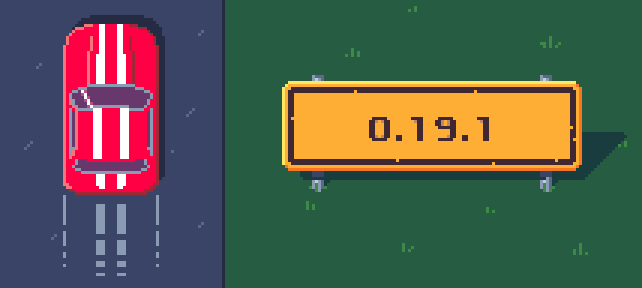

public: true
pub_date: 2021-04-19 21:09:57 +01:00
tags: [pixelwheels]
title: Pixel Wheels 0.19.1

When I announced [previous Pixel Wheels release][pw019], I said I expected the next one to be 1.0.0. But that was before Google Play rejected the game for not complying with their terms of service. I wrote a [snarky article][sarcasm] on that topic, but sarcams aren't going to fix the problem, so here is version 0.19.1. This version comes with two flavors for Android: the Google Play flavor links to the project home page and does not mention support. The Itch.io flavor links directly to the [support page]. The Google Play flavor has been accepted by Google Play, so I think we are good there.

[pw019]: https://agateau.com/2021/pixelwheels-0-19-0
[sarcasm]: /2021/google-does-not-want-you-to-tell-your-players-about-your-donation-page

<!-- break -->

Beside this not-so-interesting-for-players change this version brings a few other things:

- The desktop version no longer requires installing a JRE (Java Runtime Environment) yourself: a reduced JRE is now bundled with the archives, making them standalone. This means there is now one archive per OS, instead of a single multi-OS one.

- The bug which let you select a locked vehicle/track/championship was not completely gone, I am confident it now is.

- The Android TV launcher icon is more readable.

That's all for this new version, as expected the changelog is short. The good thing about this unplanned release: the standalone desktop archives are going to be given more testing before 1.0.0. So if you want to play some top-down pixelart racing game on your Linux, Windows or macOS machine, head over to [Pixel Wheels itch.io page][itchio] and get your copy!

I am especially interested if the game is too fast on Windows ([#109][bug109]) because I hit that bug last week but cannot reproduce it anymore.

[itchio]: https://agateau.itch.io/pixelwheels
[bug109]: https://github.com/agateau/pixelwheels/issues/109
