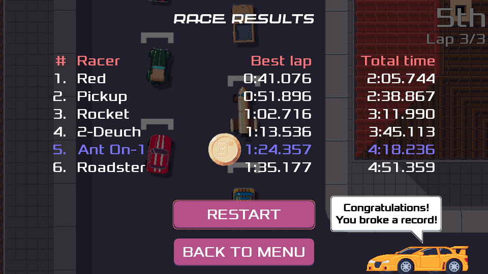

public: true
pub_date: 2021-06-28 23:17:51 +01:00
tags: [pixelwheels]
title: Pixel Wheels 0.20.0

So 0.19.0 was supposed to be the [last version before 1.0.0](/2021/pixelwheels-0-19-0), then [it was 0.19.1](/2021/pixelwheels-0-19-1), but here comes 0.20.0! You might be wondering what's wrong with me...

What happened is I started piling in bug fixes and small improvements, and I felt it would be better to release them sooner instead of keeping them and release all fixes at once in this 1.0.0 version I announced. So... here is version 0.20.0.

## Notable changes

### Revamped Antonin (now called Ant On-1) car

The car now looks like a surf minibus:

### A new menu music

The menu music is now Lightspeed, by Thomas Tripon.

<audio controls>
  <source src="lightspeed.mp3">
</audio>

### Refreshed "new personal record" screen

I reworked the way the game tells the player when they broke a personal record. In the race time table screen, a car drives in congratulating the player, then record indicators arrive next to the matching time in the time table.

<!-- break -->

## Notable fixes

- Do not record scores when developer settings affecting gameplay are changed ([#35][]).
- Fixed gamepad support on Android ([#117][]).
- Fixed crash when saving screenshot on Windows ([#120][]).
- Fixed crash when trying to skip the "championship finished" animation ([#118][]).

[#35]: https://github.com/agateau/pixelwheels/issues/35
[#117]: https://github.com/agateau/pixelwheels/issues/117
[#118]: https://github.com/agateau/pixelwheels/issues/118
[#120]: https://github.com/agateau/pixelwheels/issues/120

## More changes

The complete list of changes is available in the [changelog][].

[changelog]: https://github.com/agateau/pixelwheels/blob/0.20.0/CHANGELOG.md

## Get it!

As usual, you can get the game for Linux, macOS, Windows or Android from [Pixel Wheels page][game page].

[game page]: /projects/pixelwheels/
