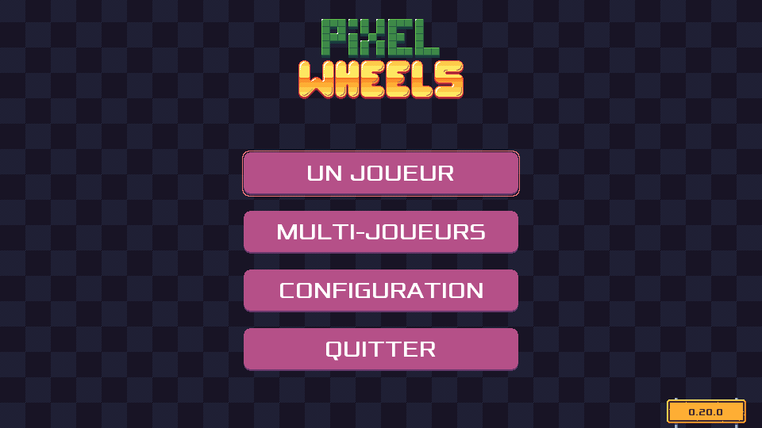

public: true
pub_date: 2021-10-08 19:22:23 +01:00
tags: [pixelwheels]
title: Pixel Wheels 0.21.0

I can't believe it's been 3 months since Pixel Wheels 0.20.0 release! I am going to blame, in no particular order, holidays, changing job, and some hard-to-track bugs :)

## "Parlez-vous Français?" (Pixel Wheels gets translation support)

Pixel Wheels 0.21.0 now speaks multiple languages! Actually it only speaks French in addition to English for now, but 2 counts as multiple, right? Others languages are in the queue: Spanish should be in 0.22.0 and hopefully Bengali too (but this one requires more work on the code base to be correctly supported) If you are interested in translating Pixel Wheels to another language, head over to the [translation doc][trdoc].

[trdoc]: https://github.com/agateau/pixelwheels/blob/6cb696cbf1f7f1134fc5b256e4a32a821a3ac415/docs/translations.md

<!-- break -->

## Long standing bugs

In addition to translation support, this release fixes some long standing Android bugs:

- bug [#119][]: on the "Championship finished" screen, the "→" button to go to the next screen would not work if your screen ratio was not exactly 16:9. I had to add some extra logging and a [bug reporting facility][logexporter] to Pixel Wheels to track that one down.
- bug [#130][]: on Android 10, the game was surprisingly slow, even on beefy devices. That one was actually Google fault: [Android 10 broke the way libgdx plays asynchronous sound effects][a10libgdx]. I had to move all sound playing code to another thread to workaround that.

[#119]: https://github.com/agateau/pixelwheels/issues/119
[#130]: https://github.com/agateau/pixelwheels/issues/130
[logexporter]: ../pixelwheels-log-exporter/
[a10libgdx]: https://github.com/libgdx/libgdx/issues/5786

## What else

Apart from these, this release brings a bunch of performance improvements, done while blindly trying to understand what was causing bug #130. Those improvements are not Android specific, so every platform is going to benefit from it. Learning to use [RenderDoc][] was instrumental in discovering these performance issue. It really is a wonderful tool.

That's it for this release, the [changelog] contains a few more entries if you are curious.

[RenderDoc]: https://renderdoc.org
[changelog]: https://github.com/agateau/pixelwheels/blob/0.21.0/CHANGELOG.md

## Get it!

As usual, you can get the game for Linux, macOS, Windows or Android from [Pixel Wheels page][game page].

[game page]: /projects/pixelwheels/
