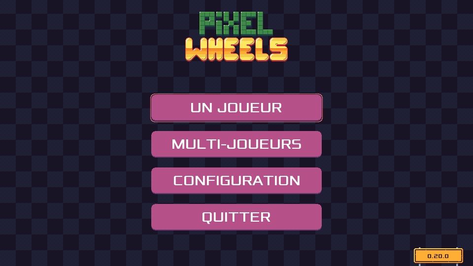

public: true
pub_date: 2021-08-22 12:28:17 +01:00
tags: [pixelwheels, gettext]
title: Pixel Wheels is now translatable



When I started limiting the scope of Pixel Wheels 1.0.0 (so that I can release it before hitting retirement age 😉) I initially moved translation support out. After all, many games are English only. But after thinking about it some more I realized it was wrong: just like apps, games should be accessible to as much people as possible, so I moved translation support in the 1.0.0 milestone.

<!-- break -->

## Implementation

I decided to use [gettext][] for translation support. It's mature, reliable and I am familiar with it, having used it in [Burger Party][] and other projects.

[gettext]: https://www.gnu.org/software/gettext/
[Burger Party]: /projects/burgerparty/

When I added translation support for Burger Party, I created a reusable Java library called [Linguaj][], with the idea of reusing it for future games.

[Linguaj]: https://github.com/agateau/linguaj

I did reuse Linguaj for Pixel Wheels, but not as nicely as I expected. I originally wanted to include it as a submodule, like I did with Burger Party, but Gradle kept getting in the way, so I just crudely copied and pasted Linguaj code in 🙈. I could have spent more time getting it right, but I have no interest in mastering Gradle because I expect Pixel Wheels to be my last Gradle-based game, so I went this way to get things done (I am not too proud of that, though, so pull requests to fix that are welcome).

While adding proper translation support to Pixel Wheels I had to overcome a few hurdles related to file formats. But before diving into that, I need to briefly explain how gettext works (skip the next section if you are already familiar with it).

### gettext, the 10,000 ft overview

gettext works by having developers write translatable messages using a reference language (usually US English), and wrapping these strings in a function responsible for returning the translated message for the reference message. For example a C function like this:

```c
void say_hello(void) {
    printf("Hello, World!\n");
}
```

Can be made translatable by changing the `printf()` call to:

```c
void say_hello(void) {
    printf(gettext("Hello, World!\n"));
}
```

where `char* gettext(const char*)` is a C function provided by gettext.

Translations are stored in .po files. There is one .po file per supported language. Those are text files containing, for each string, its "message id" (the message in the reference language) and its translation.

Creating and maintaining these .po files is done using two tools: `xgettext` and `msgmerge`.

`xgettext` scans the code for known translation functions, such as the `gettext()` call we introduced and creates a `messages.pot` file: a .po file template containing all the latest message strings, with empty translations.

`msgmerge` is used to merge the updated `messages.pot` file into the existing .po files, thus adding new message strings or removing obsolete ones.

### Translating XML files

Pixel Wheels is written in Java, using LibGDX. `xgettext` knows how to parse Java code, but most of Pixel Wheels user interface is defined in [.gdxui files][gdxui], an XML-based file format I created to define LibGDX-based user interfaces and be able to live-edit them without restarting the game. As an example, here is the .gdxui file for the screen in the screenshot of this article:

```xml
<?xml version="1.0"?>
<gdxui>
    <AnchorGroup id="root" gridSize="20">
        <Image topCenter="root.topCenter 0 -1" name="title">
            <Action>
                alpha 0
                moveBy 20g -0
                parallel
                    alpha 1 0.5
                    moveBy -20g 0 0.5 pow2In
                end
            </Action>
        </Image>

        <Menu id="menu" width="350" center="root.center 0 -3">
            <Action>
                alpha 0
                moveBy -20g 0
                parallel
                    alpha 1 0.5
                    moveBy 20g 0 0.5 pow2In
                end
            </Action>
            <Items>
                <Ifdef var="desktop">
                    <ButtonMenuItem id="onePlayerButton" text="ONE PLAYER"/>
                    <ButtonMenuItem id="multiPlayerButton" text="MULTI PLAYER"/>
                </Ifdef>
                <Else>
                    <ButtonMenuItem id="quickRaceButton" text="QUICK RACE"/>
                    <ButtonMenuItem id="championshipButton" text="CHAMPIONSHIP"/>
                </Else>
                <ButtonMenuItem id="settingsButton" text="SETTINGS"/>
                <Ifdef var="desktop">
                    <ButtonMenuItem id="quitButton" text="QUIT"/>
                </Ifdef>
            </Items>
        </Menu>

        <Image id="road-sign" bottomRight="root.bottomRight -1 0" name="version-number-road-sign"/>

        <Label id="version" topCenter="road-sign.topCenter 0 -10px" style="version" align="center"/>
    </AnchorGroup>
</gdxui>
```

[gdxui]: https://github.com/agateau/pixelwheels/blob/67183906dace5089c33050c535034d36a3d41d4c/docs/gdxui.md

This is a problem for `xgettext`: it does not know how to parse this home-made file format. Luckily, it can be taught how to extract strings from XML files, by defining [ITS rules][]. ITS rules lets you mark which attributes or text elements `xgettext` should extract. Here is what my `gdxui.its` file looks like:

```xml
<?xml version="1.0"?>
<its:rules xmlns:its="http://www.w3.org/2005/11/its" version="1.0">
  <its:translateRule selector="/gdxui" translate="no"/>
  <its:translateRule selector="//Label" translate="yes"/>
  <its:translateRule selector="//Action" translate="no"/>
  <its:translateRule selector="//@text" translate="yes"/>
  <its:translateRule selector="//@label" translate="yes"/>
</its:rules>
```

The .its file also needs a .loc file telling gettext which .its file to use for a given file extension. Here is `gdxui.loc`:

```xml
<?xml version="1.0"?>
<locatingRules>
  <locatingRule name="gdxui" pattern="*.gdxui" target="gdxui.its"/>
</locatingRules>
```

Final trap: .loc files are supposed to be installed system-wide, so `xgettext` does not look for them in the current directory. This is a problem: I can't expect contributors to install .loc files on their system just to build Pixel Wheels. Luckily some inspection of gettext source code revealed that if the `$GETTEXTDATADIR` environment variable is set to an existing directory, `xgettext` will look for .loc and .its files in `$GETTEXTDATADIR/its`.

I wrote a shell script called [`po-update`][po-update] to take care of running `xgettext` and `msgmerge` with the right arguments. It was a bit tricky to get right but it works now 😅. If you are interested in the `xgettext` invocation, have a look at the [`extract_message()`][extract_msg] function.

[ITS rules]: https://www.gnu.org/software/gettext/manual/html_node/Preparing-ITS-Rules.html#Preparing-ITS-Rules
[po-update]: https://github.com/agateau/pixelwheels/blob/67183906dace5089c33050c535034d36a3d41d4c/tools/po-compile/po-update
[extract_msg]: https://github.com/agateau/pixelwheels/blob/67183906dace5089c33050c535034d36a3d41d4c/tools/po-compile/po-update#L76

### Markdown? Not this time...

Another wall I hit: being a Markdown aficionado, the content of the credits screen was defined in a Markdown file which Pixel Wheels turned into a LibGDX screen using a a (very) limited Markdown parser. For this one I picked a more brute-force approach: I replaced the credits Markdown file with a plain .gdxui file. Not super elegant, but it's simple and it works. And since I deleted my limited Markdown parser, I think I ended up with a diff which removed more lines than it added 😁.

## Pixel Wheels need more translations!

The master branch of Pixel Wheels is currently translated in French.

Now it needs more translations! If you want to translate Pixel Wheels to a new language, you can have a look at the [translation documentation][trdoc] explaining how to add or update translations.

[trdoc]: https://github.com/agateau/pixelwheels/blob/master/docs/translations.md

Translation support will be part of Pixel Wheels 0.21.0, which I plan to release next month.
