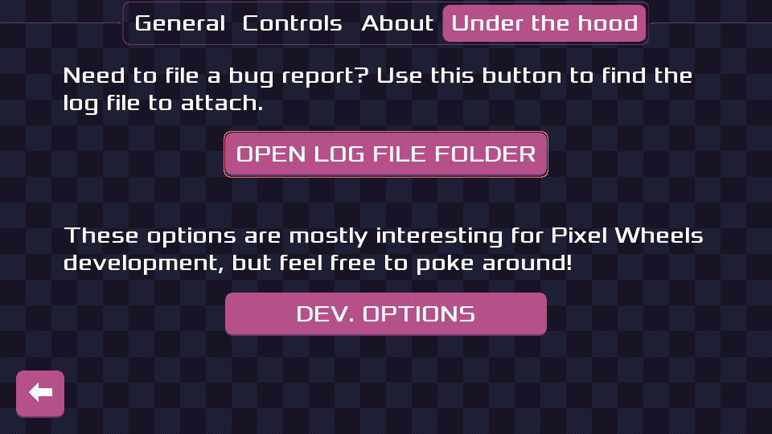

public: true
pub_date: 2021-09-06 19:33:14 +01:00
tags: [pixelwheels, android, logs]
title: Pixel Wheels log exporter

## The problem

You may have heard me complaining about it, but I struggled for a long time to understand and fix Pixel Wheels bug [#119](https://github.com/agateau/pixelwheels/issues/119).

In the end what really helped me understand that bug was providing a way for affected players to report detailed logs when the problem was happening.

Many apps do this by collecting data and sending it to a log server. I find this a bit creepy, so I did not want to go down that way. Another approach is to log into a log file accessible to other applications and ask players to attach the log file to their bug report. That is not really convenient though: especially on Android, users are not familiar with the file system hierarchy.

<!-- break -->

## Solution

The solution I came up with was the following:

- Write the log file to the app internal storage area. Files in this area are only accessible by the app itself (unless the device is rooted) and so do not require any permission.
- Use Android share system to make Android compose a new mail, with the log file attached, and prefilled recipient and subject fields.

This solution does not require requesting any Android permission and let the user review what gets sent.

It probably does not scale to a large app with a huge audience, but that is not the situation I am in now. I'd be delighted to revisit this if it ever becomes an issue ;)

## Implementation

To create the log file, I use my own NIH logging package: [NLog][], but you can use anything that can write to a log file.

[NLog]: https://github.com/agateau/pixelwheels/blob/master/core/src/com/agateau/utils/log/NLog.java

### Share via email

To be able to share the log file via email, 3 changes must be made to the source code.

First, edit the manifest to add a `provider` element to the `application` element. Replace "com.agateau.tinywheels.android" with your app package name (Pixel Wheels package name should be "com.agateau.pixelwheels", but it is not because of [historical reasons][tinywheels])

```xml
<application>
    ...
    <provider android:name="androidx.core.content.FileProvider"
        android:authorities="com.agateau.tinywheels.android.fileprovider"
        android:exported="false"
        android:grantUriPermissions="true">
        <meta-data android:name="android.support.FILE_PROVIDER_PATHS"
            android:resource="@xml/file_paths" />
    </provider>
</application>
```

[tinywheels]: https://github.com/agateau/pixelwheels/#why-is-the-java-package-called-tinywheels

Second, add a `file_paths.xml` file to the `android/res/` folder, with the following content:

```xml
<?xml version="1.0" encoding="utf-8"?>
<paths xmlns:android="http://schemas.android.com/apk/res/android">
    <files-path name="/" path="/"/>
</paths>
```

This tells Android you want to share files located in the app internal storage area.

And third: actually implement the sharing:

```java
public void exportLogs() {
    File file = ... // Code to get a File instance pointing on your log file
    Uri contentUri =
            FileProvider.getUriForFile(
                    mContext, "com.agateau.tinywheels.android.fileprovider", file);

    Intent intent = new Intent(Intent.ACTION_SEND);
    intent.setType("message/rfc822");
    intent.putExtra(Intent.EXTRA_EMAIL, new String[] {EMAIL_RECIPIENT});
    intent.putExtra(Intent.EXTRA_SUBJECT, "Pixel Wheels bug report");
    intent.putExtra(Intent.EXTRA_STREAM, contentUri);
    intent.addFlags(Intent.FLAG_GRANT_READ_URI_PERMISSION);

    mContext.startActivity(Intent.createChooser(intent, tr("Share via")));
}
```

(More info on this topic is available in Android [FileProvider doc][fileprovider])

[fileprovider]: https://developer.android.com/reference/androidx/core/content/FileProvider

### Putting it all together

The code to share a log file by email only works on Android, but Pixel Wheels also runs on Linux, macOS and Windows, so I created a small interface to abstract this away: [LogExporter][]. Unfortunately there is no standard cross-platform way to prepare an email on Linux, macOS and Windows, so the Desktop implementation does something different: it opens the default file browser in the folder where the log file is stored. Hopefully this makes it easier for Desktop players to attach the bug report.

[LogExporter]: https://github.com/agateau/pixelwheels/blob/0082566e15cc90ada324cdf79484b76bff80bf81/core/src/com/agateau/pixelwheels/LogExporter.java

LogExporter API consists of an `exportLogs()` method to do the work and two methods for the user interface: `getDescription()` returns a description of the feature and `getActionText()` returns the text for the export button. The user interface methods are required because the behavior differs greatly between Android and Desktop, so the user interface has to be adapted.

With this in place, I modified the configuration screen to make use of the LogExporter interface: I added a label and a button initialized from LogExporter information, clicking on the button calls the `exportLogs()` methods.




## Wrapping up

That's all I have about this home-made bug-report system. It will be in Pixel Wheels 0.21.0, which should be released this month. Until then you can play with [version 0.20.0][itchio] or use the [CI builds][ci] (which feature this bug export system) to report bugs ;)

[itchio]: https://agateau.itch.io/pixelwheels
[ci]: https://builds.agateau.com/pixelwheels/
