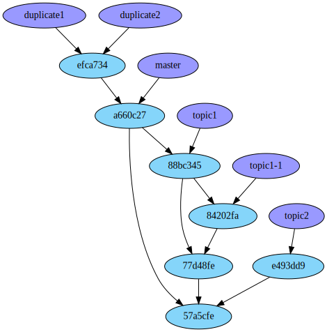
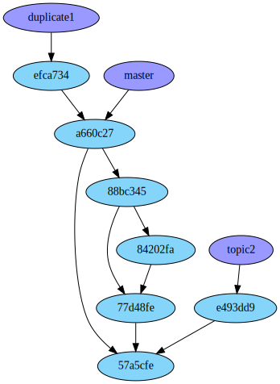

public: true
pub_date: 2021-03-30 08:30:48 +01:00
tags: [git, pko]
title: Tend your Git garden with Git Bonsai

If you are like me, your git repository checkouts have a tendency to accumulate lots of branches over time.

[Git Bonsai][project] is a command line tool to help you clean this bush.

## What does it do?

Git Bonsai can perform the following tasks for you:

- Fetch remote changes, then loop over all your tracking branches and update them to their remote counterparts.

- List merged branches and let you select which ones to delete.

- Do the same for duplicated branches (when you have multiple branches pointing to the same commit).

<!-- break -->

## Git Bonsai in action

Here is an example repository:



`topic1` and `topic1-1` branches can be safely deleted. `topic2` cannot. One of `duplicate1` and `duplicate2` can also be deleted, but not both.

Let's run Git Bonsai:

```
$ git bonsai

Info: Fetching changes
These branches point to the same commit, but no other branch contains this
commit, so you can delete all of them but one.

Select branches to delete:
> [x] duplicate1
  [x] duplicate2
```

I press `Space` to uncheck `duplicate1`, then `Enter` to continue.

```
Info: Deleting duplicate2
```

```
Select branches to delete:
> [x] topic1, contained in:
      - master
      - duplicate1

  [x] topic1-1, contained in:
      - topic1
      - duplicate1
      - master
```

Looks good to me, so I press `Enter`.

```
Info: Deleting topic1
Info: Deleting topic1-1
```

Let's look at the repository now:



## Get it

Binaries for Linux, macOS and Windows are available on the [release page][rp].

Git Bonsai is written in Rust, so if you have `cargo` installed, you can install Git Bonsai with `cargo install git-bonsai`.

[project]: https://github.com/agateau/git-bonsai
[rp]: https://github.com/agateau/git-bonsai/releases
