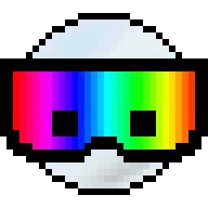
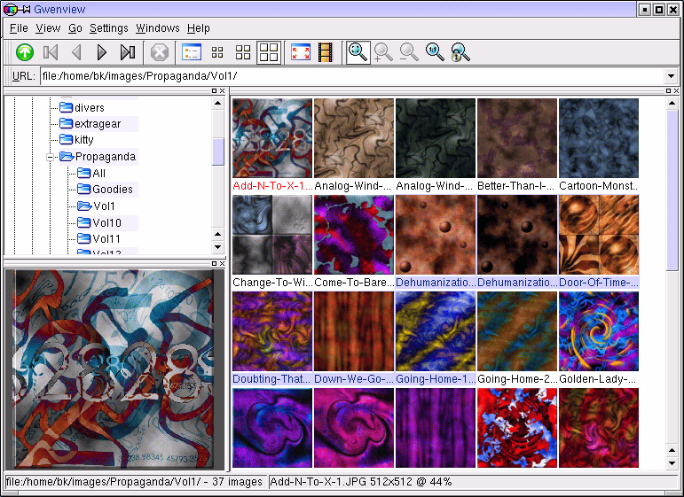

public: true
pub_date: 2021-10-03 00:29:34 +01:00
tags: [kde, pko, gwenview, tips, qt, gtk+]
title: The story behind Gwenview name

## Intro

The other day I was thinking about how I came to create Gwenview and realized the story of its genesis and the reason behind its unusual (for a KDE application) name is not widely known. Time to write an article on this topic. At least one long-hidden secret is going to be revealed in this article… so let's get started!

_This odd character was Gwenview 0.1.0 icon_

<!-- break -->

## The genesis

In the late 90s I was getting started with Linux, running Mandrake with GNOME on my PC. I probably tried KDE at that time, but either it did not work for me or I didn't like it back then. I was using GQview to browse images, but was not super happy with it, so I decided to write my own image viewer. At that time my experience with UI development was on Windows, using Borland C++ Builder and its VCL toolkit. I looked at what was available to create graphical application using C++ on Linux. I found Qt, but quickly dismissed because of the infamous MOC. Heresy, that was not pure C++! Having been burned by the numerous extensions added by C++ builder to the language, I was not going to accept impurity again! I was young and foolish back then (Now I am less young, and hopefully a bit less foolish).

The alternative was GTK+. I had a special affinity for GTK+ because I came to Linux via the GIMP (started running it on Windows, loved it but it was stabler on Linux, so I started dual-boot more often). Unfortunately, I didn't like GTK+ API much. Trying to write object-oriented code in C with many macros felt clumsy. For this reason, I quickly switched to gtkmm, the C++ bindings for GTK+.

Yes, you read this right! Gwenview started its life as a GTK+ application!

At this point I needed a name starting with a "G". Because that was the tradition back then: GNOME and GTK+ app names started with "G", and KDE app names started with "K". I remember discussing with my then-girlfriend (now wife), Gwenaëlle. We couldn't find an idea for a name. At some point I jokingly said "You know, I could just call it Gwenview". And as I couldn't come up with anything better, it stayed :)

## Becoming a KDE application

As I was learning more about gtkmm while writing what was now called Gwenview, I found out that one of the maintainers, Guillaume Laurent, had recently left and switched to Qt. I thought about this for a while. This guy must have had one of the most thorough knowledge of gtkmm, had invested time in it, yet decided to switch to Qt. The least I should do was to give Qt another chance, even if it was not "pure C++". So I did. The first thing that hit me was the documentation. Back then GTK+ documentation mostly consisted of a tutorial (it has since then improved a lot). In contrast Qt had a completely cross-referenced API doc and numerous examples. I was blown away. After reading a bit more, it became clear to me this was the toolkit I wanted to use. It just felt more efficient and intuitive. It was not perfect, but it was much easier for me to find my way and get started.

So I rewrote what I had using Qt. At that time I had already switched to KDE 2, so shortly after switching to Qt I started using KDELibs, and Gwenview became a KDE application. Gwenview was originally developed on SourceForge, you can still find [gwenview-0.1.0.tar.gz][gv010] there. By KDE 3 it moved closer to KDE: by becoming a part of KDE Extra Gear: a set of applications with their own release schedule, but using KDE infrastructure: CVS then SVN, Bugzilla, and most importantly, translators. Then during the development of KDE 4.0 (it was still not a cardinal sin to call it "KDE 4" by then ;) ) it moved to kdegraphics and became the default image viewer.

[gv010]: https://sourceforge.net/projects/gwenview/files/gwenview/0.1.0/gwenview-0.1.0.tar.gz/download

_Gwenview 0.something running on KDE 3_

## Why not rename the app?

It turns out I felt it would have been some kind of betrayal to my girlfriend to change the name of the application. Some emotional bond had been created by using part of her first name. I maintained Gwenview for 14 years. At the end I was getting tired of it, but this emotional bond made it difficult to let it go. I eventually managed to overcome that and let others take care of the application, but it was harder than it would have been if the name had another name. Nowadays I am very happy to see Gwenview has a life on its own, with several people taking care of it.

In retrospect, I do not recommend naming projects after your loved ones or people close to you. I think it can impact your judgment and makes it harder to move on. In the end, this is just code, and you are not your code. It would also probably have felt odd to continue working on Gwenview if Gwenaëlle and I had not stayed together. This actually happened to at least one, much larger, project: Debian. Debian was created by Ian Murdock, who is the "Ian" part of "Debian". The "Deb" part comes from Debra Lynn first name. Debra was Ian girlfriend at the time the distribution was created. They married each other but eventually got separated (See the ["Founding"][debhistory] section of Debian Wikipedia article).

So that's it, you now know the never-told-until-now early history of Gwenview name and the bit of wisdom I gained from the consequences of naming it like this.

[debhistory]: https://en.wikipedia.org/wiki/Debian#Founding_(1993%E2%80%931998)
