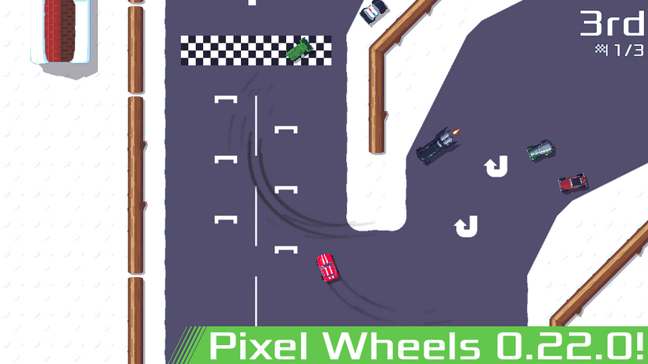
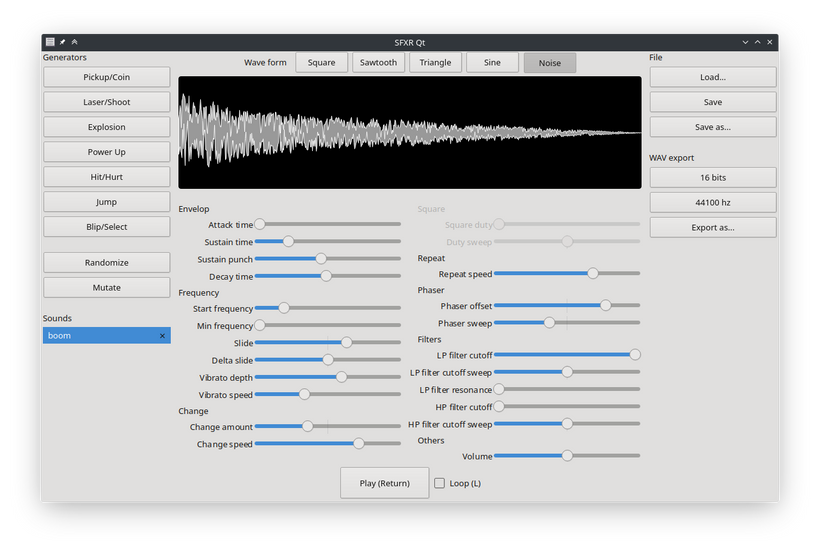

public: true
pub_date: 2022-02-04 09:47:20 +01:00
tags: [pixelwheels, sfxr-qt, monthlyupdate]
title: January 2022 monthly update

## Pixel Wheels

In January Pixel Wheels learned to speak Russian, thanks to Nickoriginal. I also fixed an annoying bug with the Rocket car: when hitting a thin wall at a certain angle, it was possible for a front wheel to go on one side of the wall and the body on the other side, resulting in the car getting stuck ([#174][]).

[#174]: https://github.com/agateau/pixelwheels/issues/174

With these latest changes in, I finally [released Pixel Wheels 0.22.0](https://agateau.com/2022/pixelwheels-0-22-0) 🎉.

<!-- break -->

## SFXR-Qt

January was also a busy work on SFXR-Qt front. First, after more than 2 years without a release, I [released version 1.4.0](https://agateau.com/2022/sfxr-qt-1-4-0) 🎉.

Shortly after, Huitsi contributed a fix to ensure the command-line export mode could be run without a graphical environment ([#11][]).

[#11]: https://github.com/agateau/sfxr-qt/issues/11

On my side I worked on a feature I have been wanting to add for a long time: a preview of the generated sound.

I am happy with this, as I found out it really helps me with understanding the generated sound and how to adjust it.

I also fixed another long-standing annoyance: the volume of the sound while working on it was always lower than the volume of the exported wav file.

## What's coming next?

For February, I plan to do another SFXR-Qt release. Yes, 2 releases in 2 months for a project that has been inactive for a looong time!

I also have some work planned for Pixel Wheels. First, I want to add a new track. Second I am going to create a FlatPak package, to make Pixel Wheels available on FlatHub. This game needs [more exposure](https://theoatmeal.com/comics/exposure) ☺.
