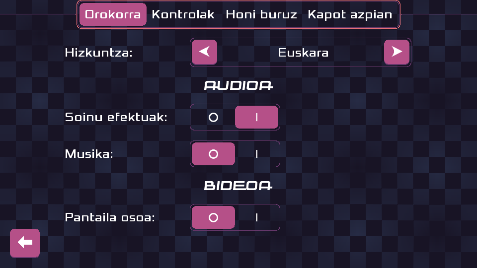

public: true
pub_date: 2022-03-08 09:47:20 +01:00
tags: [pixelwheels, sfxr-qt, monthlyupdate]
title: February 2022 monthly update

## Introduction

This month was not as productive as I planned because real life got involved.

First, I had to go to the hospital for an appendicitis. The operation went well, this was not complicated or dangerous surgery, but the week of the operation was not the most productive ever 🤕.

Then, Scaleway decided the server hosting my backups was a bit too reliable, so they destroyed it during an incident 😡. I had to go host shopping (no way I was staying with them after that), re-upload backups, and revisit some IT choices I made. My new setup is not completely done, but it's mostly back up (ahah), and I like it better than the previous one, so there is that.

<!-- break -->

## Pixel Wheels

Despite those unexpected interruptions, I managed to get some work done on Pixel Wheels.

First, Pixel Wheels is now [available on FlatHub][flathub]. Related to this, it is now possible to install Pixel Wheels on Linux with `make install`, hopefully simplifying the life of potential Linux packagers.

[flathub]: https://flathub.org/apps/details/com.agateau.PixelWheels

I received a new translation: Pixel Wheels learned to speak Basque!

Last month I said I planned to add a new track. The good news is I started to work on it, the bad news is it's not done yet. In addition to real-life interruptions I also had an idea on how to simplify one aspect of track creation: defining sections. I worked on it and... it turned out to be unreliable so I had to trash it 😕. I was able to keep some generic improvements made along the way, so all was not lost.

Here is a sneak-peek of what it currently looks like, using only blocky tiles for now until the layout solidifies (even with predefined blocks to copy-n-paste it takes a lot of time to draw road borders, so I only do it when the layout is close to final)

## SFXR-Qt

I planned to do a new release but that did not happen. Hopefully I will find time to do it in March 🤞.

## What's coming next?

I don't want to promise too much this time. On Pixel Wheels front, I plan to continue working on the new Pixel Wheels track. If I find time I'll look into adding a new vehicle, because there can never be too many vehicles in a race game 😉.

I should also be able to release a new version of SFXR-Qt.
