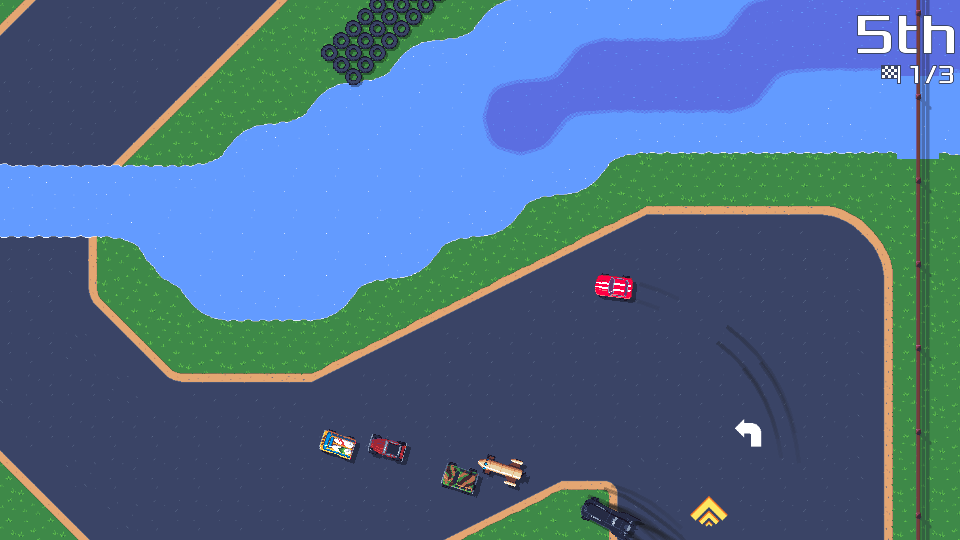
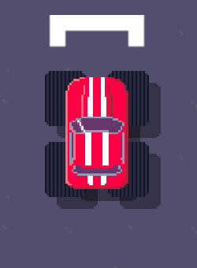
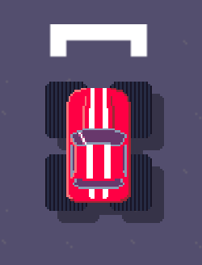
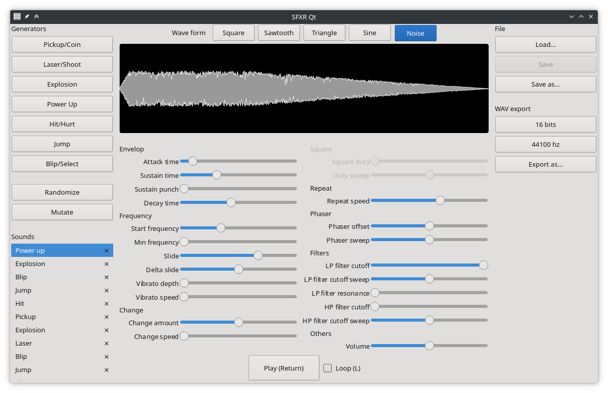

public: true
pub_date: 2022-03-31 09:47:20 +01:00
tags: [pixelwheels, sfxr-qt, git-uff, monthlyupdate]
title: March 2022 monthly update

## Introduction

March turned out to be more productive than February, turns out not going to hospital helps! (Who knew? 😄)

## Pixel Wheels

### Flood track

I merged in the first version of the Flood track, making the Country championship the first one to be composed of three tracks.

<!-- break -->

### New vehicle

In February report I said I wanted to add a new vehicle, so I started to work on it and decided to add a monster truck. But a monster truck requires huge tires, so I added the ability to define tire size per vehicle axle. Extending the vehicle definition was easy, but during the initial tests it did not look quite good because until now the game only drew the shadow for the vehicle body, not for the wheels. This was OK with small tires, but looked odd with huge ones. A first naive implementation made it look better, but caused overlapping shadows, like that:

_Note: I do not intend to fit Red with huge tires like this, this is just for testing purposes!_

After some rework of the engine to draw all vehicle shadows in a separate frame buffer, shadows look better:

### Language fixes

I moved the language selection to its own screen, instead of making it a switch. This has two advantages:

1. The slowness of language loading is less annoying because player can directly select the right language, without having to go through all of them.
2. The player can directly see all available languages.

I also fixed a bug which prevented the Polish translation from being loaded.

### Other fixes

I fixed a crash which could happen when there is only one racer ([#209](https://github.com/agateau/issues/209)). It's interesting because this can only happen if you use developer options, but maybe it would make sense as a beat-the-clock mode?

Some water improvements: skid marks are no longer drawn on top of water, and dropped mines no longer look like they are floating.

## SFXR-Qt

As promised in February, I released SFXR-Qt 1.5.0. This new version comes with a sound preview, mouse-wheel adjustable sliders and the ability to run in batch mode without a graphical environment on Linux.

## git-uff

Some time ago I added some handy command-line options to [git-uff](https://github.com/agateau/git-uff) but never released them, so I pushed version 0.3.0.

## What's coming next?

For April, I plan to mainly work on Pixel Wheels: finish the work on tire sizes and get the new vehicle in.

I also want to update libgdx as this is required to be able to make the game [run on M1 Macs](https://github.com/agateau/pixelwheels/issues/180). Unfortunately I don't have any M1 Mac, so that will be some blind update. If you own one and are willing to test builds (should be as simple as download a zip, unpack, try to run the .app) please get in touch!
