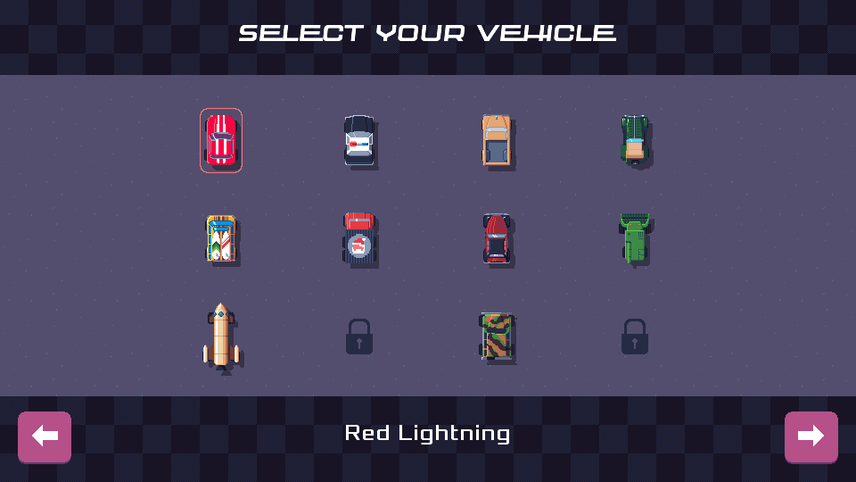
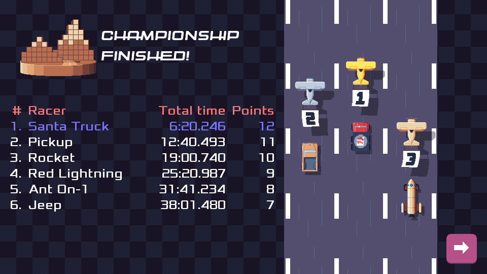

public: true
pub_date: 2022-06-07 09:47:20 +01:00
tags: [pixelwheels, monthlyupdate]
title: May 2022 monthly update

## Introduction

Last month I said I wanted to release Pixel Wheels 0.23.0, or at least make it "ready to release". The release did not happen, partly because May has been very hard for me on a personal level. Still, Pixel Wheels received some care and is mostly "ready to release".

## pixelwheels

### Vehicle selector improvements

I reworked the vehicle selector, giving it a lighter background to make the vehicles stand out more. This is a backport of part of the "big tires" work I started some time ago but which is shelved for now.

<!-- break -->

### Championship icons

This work started as a way to fix [#223](https://github.com/agateau/pixelwheels/issues/223), which asked for the name of the championship to appear on the "Championship finished" screen.

I couldn't find a nice way to fit the name on the screen, and I wanted to created dedicated championship icons anyway, so I decided to draw these icons and use them on the screen. I am happy with the final result:

### README update

Thanks to Nickoriginal, the README received some [needed improvements](https://github.com/agateau/pixelwheels/issues/232), more precise links and updating outdated information.

## What's next

0.23.0 should be released in June: string freeze is in effect, so I am waiting for translators to catch up with latest changes. Two bugs remain open for the 0.23.0 milestone:

- [#225 "Open log file folder" does not work on Windows](https://github.com/agateau/pixelwheels/issues/225)
- [#186 Police car is not animated in championship finished screen](https://github.com/agateau/pixelwheels/issues/186)

I am going to fix #225, but I am probably going to postpone #186: it's not super critical, and has potential to eat quite some time...
