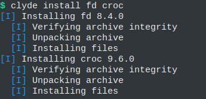

public: true
pub_date: 2022-08-01 09:47:20 +01:00
tags: [pixelwheels, clyde, git-bonsai, monthlyupdate]
title: July 2022 monthly update

## Pixel Wheels

This month I did not do much work on Pixel Wheels, except for releasing version 0.23.0. Translators on the other hand have been busy:

- The German translation has been updated (the update made it in 0.23.0).
- Thanks to Sanchez, Pixel Wheels is now available in Swedish.
- A refresh of the Spanish translation is in progress.

## Clyde

[Clyde][] is where I spent most of my time. It's the early days of this project so activity is quite frenetic: I made 3 releases in one month! Clyde is now at version 0.2.1. This month I added the `upgrade` command, the last missing piece to make it feature complete. It's still quite bare-bones in some aspects but it's getting there.

[Clyde]: https://github.com/agateau/clyde

The other important changes I made this month are the following:

- `clyde install` now implements downloads itself instead of using `curl`. It also supports resuming interrupted downloads.

- `clyde install` learned to update itself on Windows. This is tricky because one cannot overwrite the file of a running executable on Windows, but I found out it is OK to rename a running executable! That helps.

- `clyde setup` learned to create Windows Git Bash friendly activation scripts, using `cygpath`.
- The package file format evolved too, with the addition of variables to reduce duplications and risk of errors.

- I added a "nested" UI: commands can indent their steps, giving a better understanding of the progress. Here is how it looks when installing two packages at once:

- I also added a new command to `clydetools`: `gh-update`. It can be used to add the latest release of GitHub-hosted packages. This opens the way to having the CI automatically update packages.

<!-- break -->

Speaking of packages, the package collection is slowly growing. I added 18 new packages this month:

- bat
- croc
- gitea
- gron
- gum
- jless
- just
- lurk
- miniserve
- ncspot
- node16
- pandoc
- rclone
- sd
- skim
- sqlite
- syncthing
- xh

## git-bonsai

I released [Git Bonsai 0.2.2][gb]. This new version makes it possible to configure protected branches using `git config`.

You can install this new version with `clyde install git-bonsai` 😉

I noticed Git Bonsai is often confused when the main branch is not called `master`. I need to teach it how to properly discover the name of the main branch so that it switches to it reliably.

[gb]: https://github.com/agateau/git-bonsai

## What's next?

This month was a bit unusual as I spent most of my time on Clyde. It was nice to switch from Java to Rust for a while, I really enjoy this language.

For August I want to resume working on Pixel Wheels: the branch to add multiple tire sizes is waiting for me! I'd also like to make another Clyde release, and add more packages.

And... I am also off for two weeks of vacations, so we'll see if I find time and motivation to write some code :)
