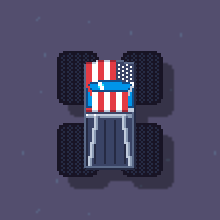

public: true
pub_date: 2022-09-06 09:47:20 +01:00
tags: [pixelwheels, clyde, monthlyupdate]
title: August 2022 monthly update

## Introduction

August was a bit slow, that's what happen when one takes vacations 🌅! I still got work done on Pixel Wheels and Clyde though.

## Pixel Wheels

I finally merged the work on custom tire sizes! This means the next vehicle is coming, it's called "Big Foot", and it looks like this:

I also worked on steering:

First I adjusted maximum steering: vehicles used to be able to steer more than 90° at low speed. I initially added this so that players could quickly resume the race after hitting a wall, without having to reverse. I later realized it actually was making it harder to resume the race for some vehicles. This was particularly visible with the Big Foot so I reduced the maximum steering angle and it feels better now.

Second: steering wheels now come back more smoothly to 0° when releasing the steering controls, making vehicles a bit easier to handle.

On the translation front, the refresh of the Spanish translation by Jorge Maldonado Ventura has been merged ([#258](https://github.com/agateau/pixelwheels/issues/258)).

<!-- break -->

## Clyde

I did quite some work on Clyde this month and released version 0.3.0. Here is its changelog:

### Added

- `clydetools add-assets` learned to recognize more architectures.

- Clyde can now unpack single-file archives ([#69](https://github.com/agateau/clyde/issues/69)).

### Changed

- `clyde install` and `clyde uninstall` can now install/uninstall multiple packages at once ([#2](https://github.com/agateau/clyde/issues/2)).

- `clyde install` now deletes downloaded assets after install has finished.

- Clyde output is nicer: command details are indented and `clyde list` prints packages as a table ([#12](https://github.com/agateau/clyde/issues/12)).

- `clydetools add-build` has been renamed to `clydetools add-assets`.

### Package format change

- It's now possible to refer to the asset name in the `files` entries, using the new `${asset_name}` variable ([#65](https://github.com/agateau/clyde/issues/65)).

- The `strip` field is now optional, and defaults to 0 ([#10](https://github.com/agateau/clyde/issues/10)).

- A new field has been added: `repository` ([#67](https://github.com/agateau/clyde/issues/67)).

In addition to releasing 0.3.0, I also recorded an [Asciinema-based demo](https://asciinema.org/a/bbNhN0xG779gAFvWjAJMlVeai).

### Clyde store

Clyde store gained a few new packages:

- checkmake
- devdash
- glab
- hexyl
- wtfutil

The store CI received some improvements too: until now each PR would check *all* packages. This led to long build times and some useless build failures when a package not affected by the change would time out on download. To reduce build times and improve reliability, when building from a PR the CI now only checks modified packages. If the PR also touches the CI code itself, it also checks a random selection of packages.

The nightly builds still check all packages for now.

The bulk of the CI is implemented in the `ci/check-packages` script, which until now was a shell script. Implementing this kind of behavior felt too complicated to write in shell, so I rewrote the script in Python.

Clyde is definitely usable now, I invite you to give it a try :)

## What's next?

In September I want to finish integrating the Big Foot for Pixel Wheels, I need to define its unlock criteria and it can go in. I also want to start creating the 3rd map of the "Square Mountains" championship. Hopefully it should take less time to create than the last one 🤞

I also plan to continue working on Clyde. I started the necessary changes to be able to ship extra files, making it possible to improve integration. One of my goals is to be able to install Firefox with it! This requires creating a launch script in the bin directory, and a desktop entry for the menu.
