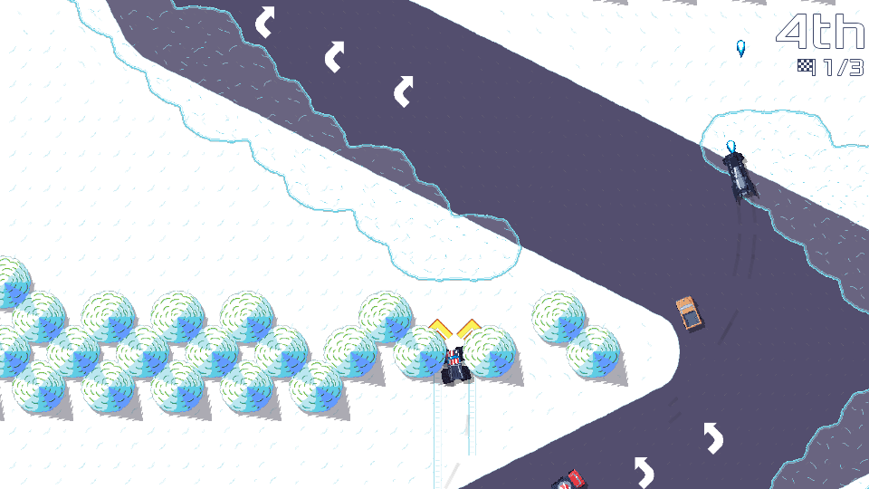

public: true
pub_date: 2022-10-05 09:47:20 +01:00
tags: [pixelwheels, clyde, monthlyupdate]
title: September 2022 monthly update

## Introduction

September was a productive month for a change. Let's dive in.

## Pixel Wheels

### New track

The "Square Mountains" championship got a new track. It's the first track where individual trees are directly reachable by vehicles, meaning you can cut corners by driving between trees... It's a high-risk high-reward choice though, because hitting a tree is quite punishing.

It's called "Up, up, up and down!" for now, but I am not happy with the name so it's probably going to change.

### The Broster Truck has landed!

I finally finished custom tire size support and was able to merge the Broster Truck, previously known as the Big Foot, in!

<!-- break -->

### Vehicle page

You may wonder where the Broster Truck name comes from... Good news: I created a new page on Pixel Wheels web site to present [all the game vehicles][vehicles] and the reason behind some of the surprising vehicle names. It was a lot of fun to write :)

[vehicles]: https://agateau.com/projects/pixelwheels/vehicles/

Since I needed screenshots of each vehicle, I also added a command-line tool to generate vehicle thumbnails: I did not feel like manually cropping screenshots (Let's hope it was not a case of [XKCD #1319][xkcd])

[xkcd]: https://xkcd.com/1319/

### Support for XDG Base Directory environment variables

On desktop, Pixel Wheels kind-of supported the [XDG Base Directory spec][xdg] in that it saved its config to `$HOME/.config`, data to `$HOME/.local/share/pixelwheels` and logs to `$HOME/.cache/pixelwheels`. But it did not support the XDG environment variables to override these directories. It does now.

[xdg]: https://specifications.freedesktop.org/basedir-spec/basedir-spec-latest.html

### Debug facilities

I added a debug option to automatically refresh assets on restart. This makes working on tracks more efficient: test the track, make a change in Tiled, bring the menu, select Restart to try the change.

I also fixed a bug which caused already unlocked tracks to be locked when a gameplay-altering option was activated. This behavior was here to prevent recording impossible records. It prevented saving records, which was good, but it also prevent loading previously saved records, which was wrong.

### Tile-based obstacles

I was able to make trees reachable on the new track thanks to a new feature in the engine: the ability to define individual obstacle shapes for each tiles. This means once all tiles have been properly annotated to know the shape of the obstacles they represent there is no more need to create and manually maintain obstacle rectangles on top of the tiles.

I hope this new feature makes it easier to create and iterate on tracks. It was already useful for this new track. We'll see how it goes for the next one.

## Clyde

Clyde got a bug fix release, [0.3.1](https://github.com/agateau/clyde/releases/0.3.1):

### Changed

- `clydetools add-assets` and `clydetools fetch` no longer download more than one URL per arch-os.

### Fixed

- `clyde show -l <package>` now works even for packages installed from outside the store.

- When `clydetools` writes package files, it no longer writes `strip: 0`.

- Unpacking of single-file executables compressed with xz now works as expected.

I also started to work on making it possible to ship extra files with packages, to improve desktop integration. It's not merged yet, but it's making good progress: I can now install Firefox with it.

## Clyde store

### New packages

New packages of the month:

- Antidot
- CTop
- Lychee
- Tiled

The last one is interesting: it's the first graphical tool supported by Clyde. And it's an AppImage, showing that Clyde can install and update AppImage-based applications.

Support for graphical applications need more work though: I want to be able to install .desktop and icons to improve integration: one should be able to find and start applications from their desktop launcher.

It's worth mentioning that since the Tiled package uses AppImage it only works on Linux.

### Infrastructure work

On the infrastructure side, updating packages is mostly automated now: I added a script to automatically fetch package updates and file PRs.

## What's next?

I expect October to be less productive, because like every year I am doing [Inktober][]! I hope I will have enough time to release the next version of Pixel Wheels nevertheless, and spend more time on Clyde.

[Inktober]: https://inktober.com
