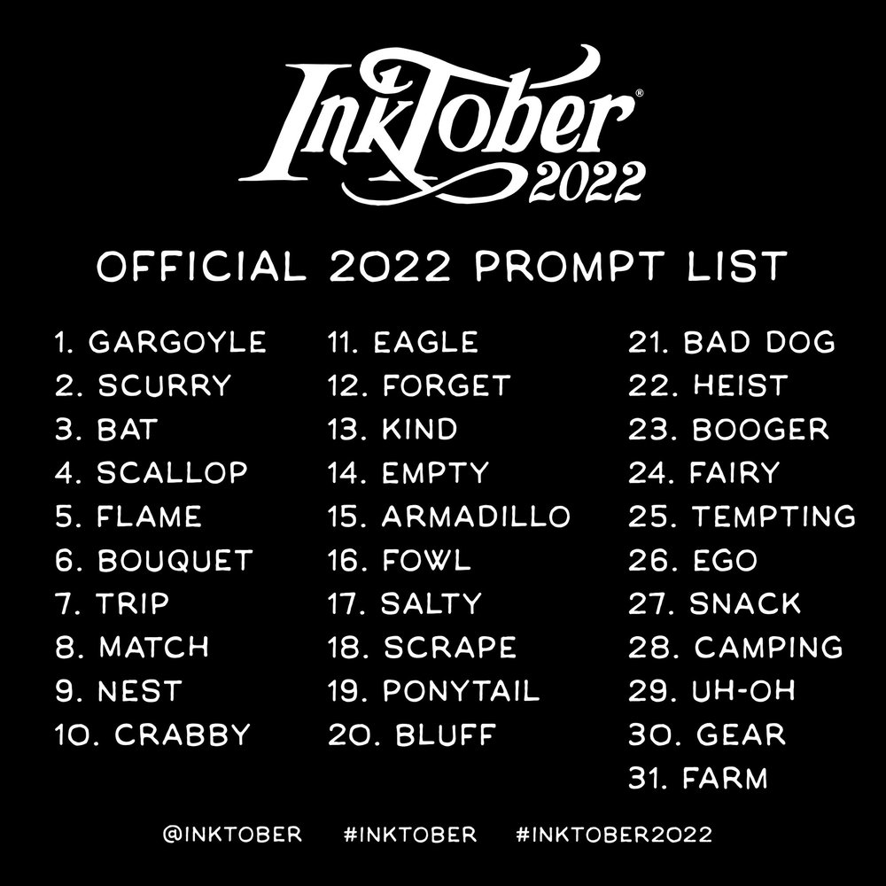

public: true
pub_date: 2022-11-05 18:50:05 +01:00
tags: [inktober, drawing, birds]
title: Inktober 2022, birds!

This year I once again participated to [Inktober][], the yearly challenge where you draw one drawing a day each day of October. The Inktober web site provides a "prompt list": a list of words for each day, which you can (but are not forced to) follow.

_Inktober 2022 prompt list_

I like to have an overall theme each year. This year I selected birds because... I love birds :)

I also decided to use a ballpoint pen this time, because I enjoy drawing with ballpoint pens, and also because I find it faster to draw with them. This is useful because at the end of the month I am often quite tired!

[Inktober]: https://inktober.com
<!-- break -->

Here are my drawings of this year.

.. gallery::
    :square:
    :images: images.yaml

Which one do you prefer?
