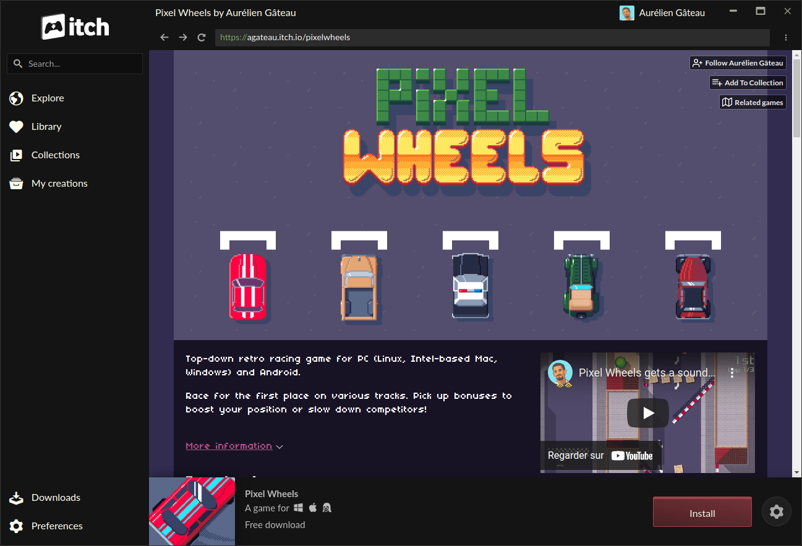
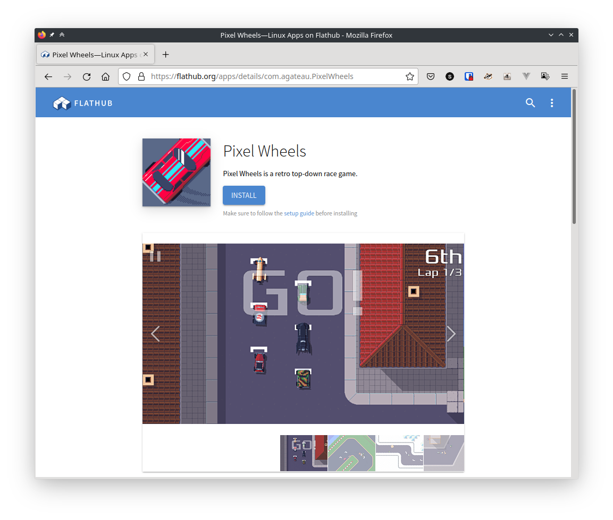

public: true
pub_date: 2022-02-20 00:10:52 +01:00
tags: [pixelwheels, flatpak, flathub]
title: Pixel Wheels is now available on Flathub

## Introduction

Writing games is a lot of fun, but it's even better when players can find your game, install it and play it.

This means it's part of the job to work on the game packaging and availability.

Pixel Wheels packaging and availability has improved over the years:

In version 0.16.0, Pixel Wheels got an [itch.io page](https://agateau.itch.io/pixelwheels):

Since version 0.19.1, the game no longer requires installing a JRE: it ships as a standalone executable with a bundled, trimmed-down version of the JRE, thanks to [Packr][].

[packr]: https://github.com/libgdx/packr

And now the latest version, 0.22.0, is available on [Flathub][Flathub] 🎉!

[][Flathub]

This is great because it makes the game easier to discover, and it makes it simpler for players to update to the latest version.

[Flathub]: https://flathub.org/apps/details/com.agateau.PixelWheels

<!-- break -->

## Freedesktop integration

(Note: with "freedesktop integration" I mean integration in desktop environment like KDE, GNOME, XFCE, LXDE...)

While setting up the Flatpak package, I realized it's not easy to properly "install" Pixel Wheels. By properly installing I mean having the game in your PATH and having an entry for it in your desktop launcher, with a correct icon.

To build the Flatpak package I had to create all the required files for a proper freedesktop installation. For version 0.22.0, these files are in [Pixel Wheels Flathub repository][flathub-gh], but the Flathub people rightfully recommend upstreaming any changes made, so I copied these files to Pixel Wheels repository. Once they were there I made the zip creation script include them in the Linux zip file, together with an [`install.sh`][install.sh] script.

This `install.sh` scripts does the following:

- Install the game files and its reduced JRE in `$install_dir/lib/pixelwheels`
- Install a `pixelwheels` symbolic link in `$install_dir/bin`
- Install the icons, .desktop file and appstream file in `$install_dir/share`

After running this script, the player is able to start the game from their desktop launcher, just like any other application. It's not required though: the game still runs fine when started from the unpacked zip.

[flathub-gh]: https://github.com/flathub/com.agateau.PixelWheels
[install.sh]: https://github.com/agateau/pixelwheels/blob/712dca2131d50eb8eb7bcfe2d1e04b8a71f64535/tools/packaging/linux/install.sh

## Native packages?

Flatpak is nice, but having native distribution packages would be great, too, as they tend to be much lighter.

Once I had the necessary files for installation on freedesktop environments, I added another way to install the game: the classic `make install`. This is interesting for players who build the game themselves, but I hope it also helps with building native packages. If you are a packager and wants to build a package for Pixel Wheels, I would love to hear from you!

## Next packaging and availability improvements?

Besides native packages, I should probably look into improving the story on Windows and macOS. Especially on Windows, where the .exe does not have an icon and I am pretty sure many users would prefer downloading an installer instead of a .zip file. It's not the most fun work in the world though, so I need to find the motivation to look into that :)

Ideally I would also like to have the game on Steam, but a) it costs $100 per game and b) it looks like a ton of work, so I don't plan to dive into that for now.
