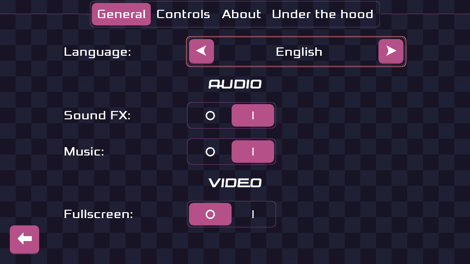
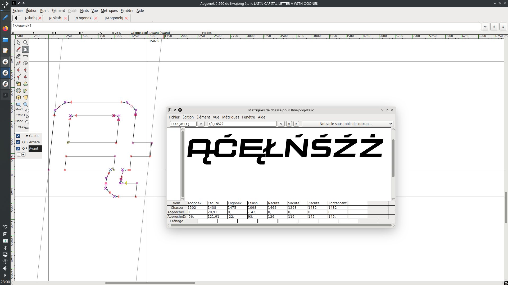
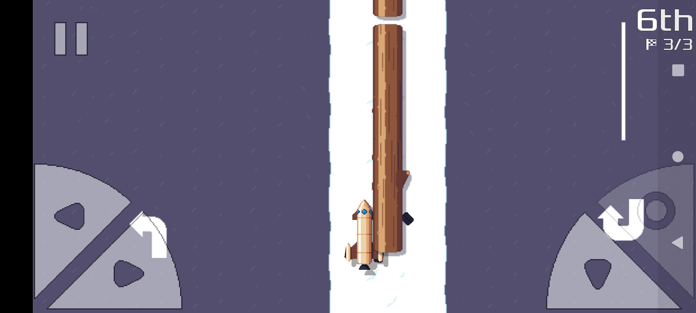

public: true
pub_date: 2022-01-29 20:22:57 +01:00
tags: [pixelwheels]
title: Pixel Wheels 0.22.0, translation galore!

## More translations!

First Pixel Wheels release of 2022 is out, and this one brings in some serious translation work! While 0.21.0 was available in 2 languages: English and French, version 0.22.0 bump this number to 7, adding the following supported languages:

- Bengali by Oymate,
- Chinese by Lu Xu,
- Polish by PandaCoderPL,
- Russian by Nickoriginal,
- Spanish by Clara Gâteau.

Thanks to the generous work of all translators!

_Translations!_

<!-- break -->

Some languages were trickier than others to support as the fonts used by Pixel Wheels did not support all the required characters. For languages like Chinese and Bengali, the game switches to the Google Noto font. For Russian, the main font (Xolonium) supports Cyrillic characters, but not the title font (Kwajong), so the game uses only Xolonium in this case. For Polish, Kwajong was almost there, but some accented characters were missing, so I ended up learning a bit of [FontForge](https://fontforge.org/) to add the missing bits.

_Adding missing characters_

These font changes are the reason why the text moves a bit up and down when switching languages.

## Fixes

As usual, this new version also brings a bunch of fixes.

If you drove the Rocket car fast enough to hit a thin obstacle, such as the trunks on "Let it snow" track, you could end up with a wheel on one side and the rest of the car on the other side. Not the best way to win the race, especially since there was no way to get unstuck! Reworking the definition of the car shape fixed this.

_This was not supposed to happen..._

On the Android front, Pixel Wheels now sports an [adaptive icon](https://developer.android.com/guide/practices/ui_guidelines/icon_design_adaptive), and fixes an annoying bug which caused the status bar to stay visible on Android 11.

## Get it!

That's it for this release. As usual, you can get the game for Linux, macOS, Windows or Android from [Pixel Wheels page][game page].

If you like the game and want to support my work, visit my [support page](/support)!

[game page]: /projects/pixelwheels/
