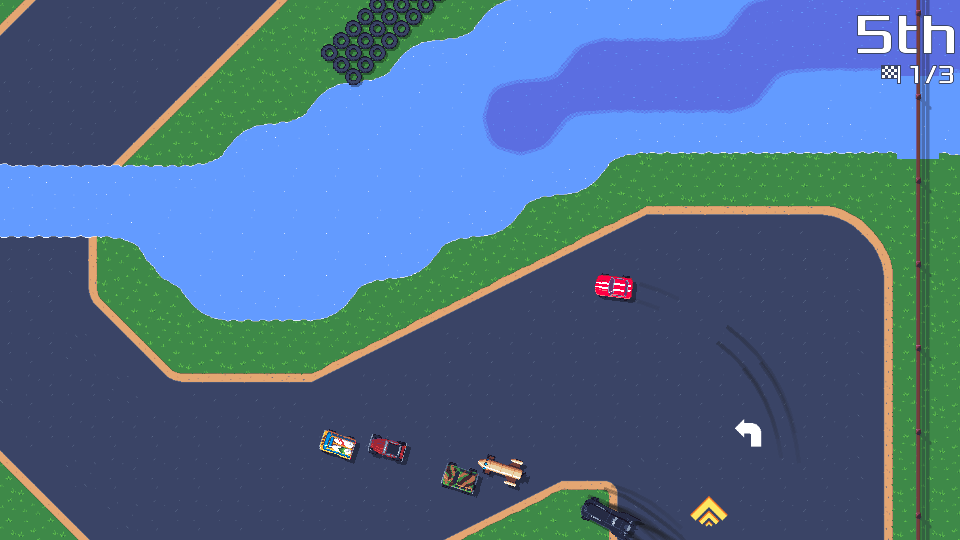
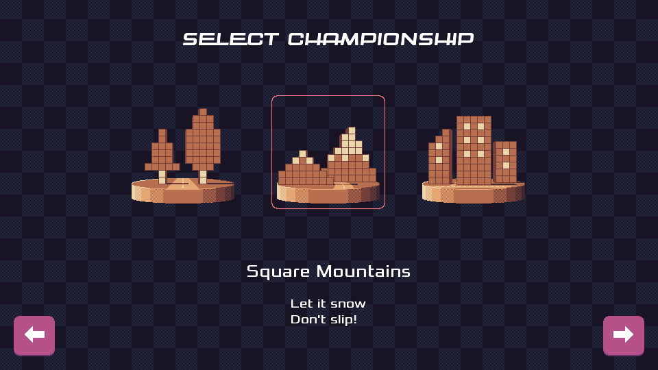
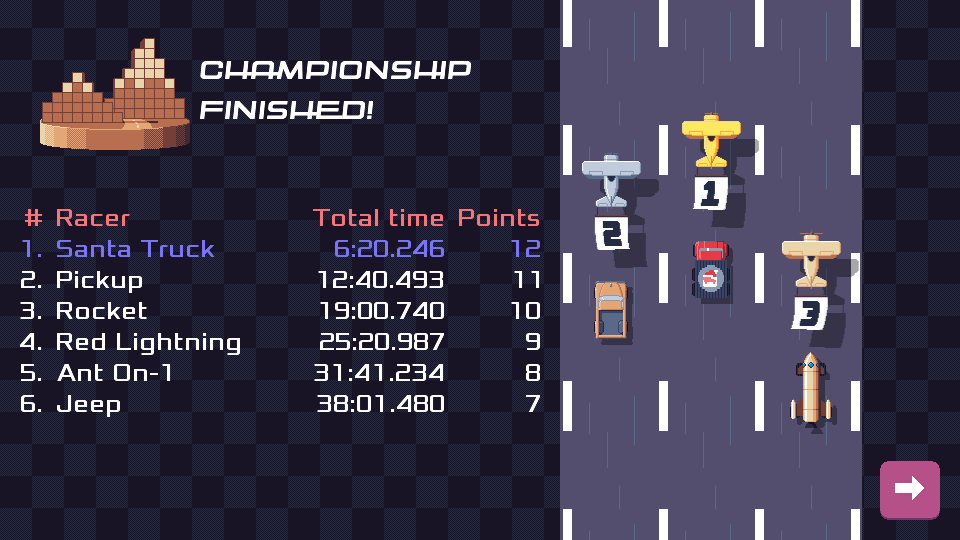
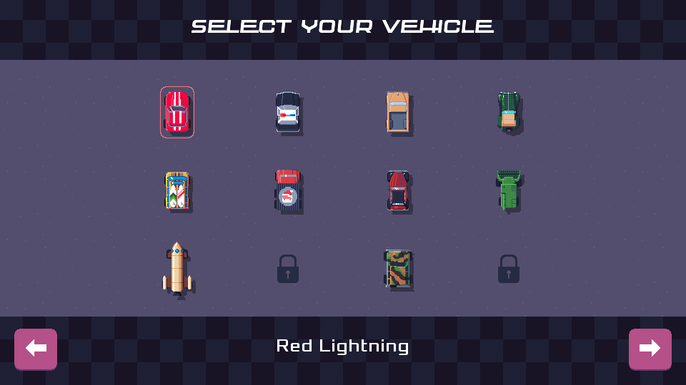

public: true
pub_date: 2022-07-07 08:27:02 +01:00
tags: [pixelwheels]
title: Pixel Wheels 0.23.0

[Pixel Wheels][pw] 0.23.0 is out! This version brings quite a few goodies. Let's have a look at the main changes.

[pw]: /projects/pixelwheels/

## New track

First, the "Country Life" championship got a new track: "Flood". As its name implies, there is quite a lot of water in it!

I plan to add a new track for each new version of Pixel Wheels. 0.24.0 should add a new track to the "Square Mountains" championship.

## New vehicle

This new version also features a new vehicle, the Miramar. It looks like this:

This car may look familiar to some of you :). Its name is a reference that nobody has found yet (as far as I know). Let me know if you have it!

<!-- break -->

## Revamped championship and vehicle selection screens

In the championship selection screen, championships used to be represented by the icon of their first track. This is no longer the case: I drew some trophy-looking icons for each championship. These icons are used in the championship selection and in the championship finished screens:

The vehicle selection screen also got a refresh to improve the contrast between the vehicles and the background:

## More translations!

Two new translations got added to the game:

- Basque, thanks to Josu Igoa.
- German, thanks to Christian Schrötter.

Also, an annoying bug in version 0.22.0 prevented the Polish translation from loading. It's fixed now, so this somehow add another translation, even if it was technically already there. Apologies to  PandaCoderPL, the author of the Polish translation, for that delay :/

## Get it!

These are the main highlights for this release. If you want more, have a look at the [changelog][]. But it's much more fun to actually play the game! Head over to [itch.io][] for 0.23.0 binaries. Version 0.23.0 should also soon be available on Flathub, F-Droid and Google Play!

Start your engines!

[itch.io]: https://agateau.itch.io/pixelwheels
[changelog]: https://github.com/agateau/pixelwheels/blob/26dd66b5ba92611e543685e4d2bdd414c10f9d48/CHANGELOG.md
