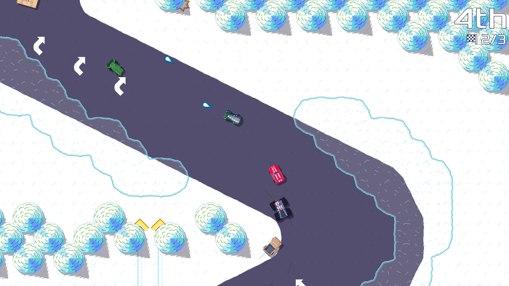
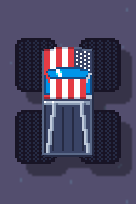

public: true
pub_date: 2022-11-26 19:01:48 +01:00
tags: [pixelwheels]
title: Pixel Wheels 0.24.0

[Pixel Wheels][pw] 0.24.0 is out! Just like 0.23.0, this version adds a new track and a new vehicle.

[pw]: /projects/pixelwheels/

## New track

This time, it's the "Square Mountains" championship which got a new track: "Up, up, up and down!". It's the first track where the trees are not behind barriers, so you can theoretically drive through them, but I am pretty sure it would not be a winning move because the chances of hitting a tree is too high. Having said so, there are two shortcuts to let you cut corners. They are quite tight though, so be careful!

## New vehicle

The new vehicle in 0.24.0 is a monster, let me introduce you to... The "Broster Truck"!

The name is a reference to the [Broforce][] game, I think some of the game characters would enjoy driving a Broster Truck!

[Broforce]: https://www.broforcegame.com/

Speaking of vehicles, they now have their [own page](/projects/pixelwheels/vehicles). On this page  you can see all of them and learn more about some trivia and references.

<!-- break -->

## Other changes

Beside the new track and vehicle, this version includes other changes, most notably:

- A Swedish translation, thanks to Sanchez.
- An improved driving behavior.
- Improvements to the way vehicles are drawn: vehicle shadows now include shadow for the tires, and when a vehicle goes underwater, its wheels are still drawn.
- The ability to pause the game using the 2nd gamepad button.

For a more complete list of changes, have a look at the [release notes][].

## Get it!

Head over to [itch.io][] for 0.24.0 binaries. Version 0.24.0 should also soon be available on Flathub, F-Droid and Google Play!

[itch.io]: https://agateau.itch.io/pixelwheels
[release notes]: https://github.com/agateau/pixelwheels/releases/tag/0.24.0
