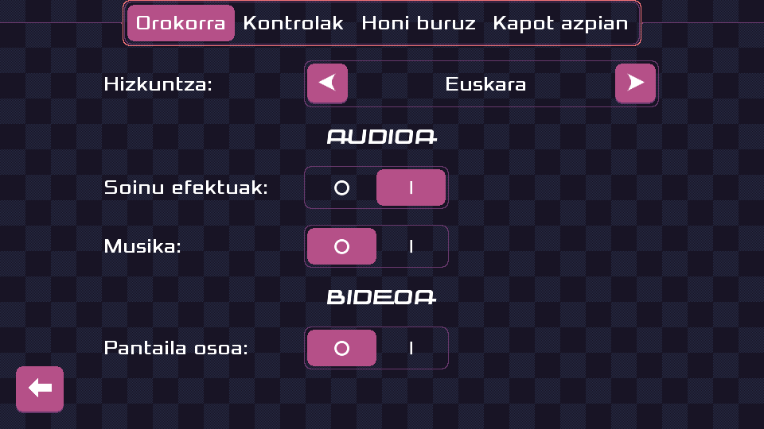

public: true
pub_date: 2022-02-25 18:42:08 +01:00
tags: [pixelwheels]
title: Pixel Wheels now speaks Basque!

Thanks to Josu Igoa, Pixel Wheels has been translated to Basque.

It might not be the most widespread language, but I find it wonderful that people go out of their way to keep their language alive and relevant, so I am super happy with this new translation!

The translation has been merged in master: you can give it a try from the [master builds](https://builds.agateau.com/pixelwheels).
