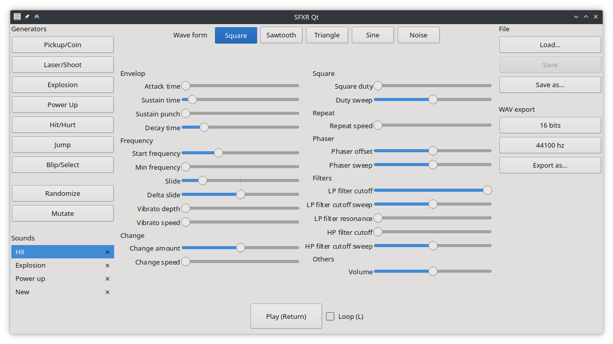

public: true
pub_date: 2022-01-14 18:47:20 +01:00
tags: [sfxr-qt, qt, pko, gamedev]
title: SFXR-Qt 1.4.0 is out!



Last release of [SFXR-Qt][] was in September 2019. I kept using it for [Pixel Wheels][], it had its quirks and bugs but I did not have the time and motivation to work on it, so the poor app was left on its own for more than two years.

Fast forward to November 2021: SFXR-Qt was added to Debian! It always feels good to see an app getting more widespread, with the minor issue that I learned about it because [tests did not pass on big-endian machines][be-bug]... Working on that bug was a bit frustrating because I do not own a big-endian machine and failed to setup a working big-endian VM to test my changes on, but after a few blind fixes I eventually got it fixed. Kudos to Alex Myczko, the bug reporter, for the responsiveness in testing my changes.

<!-- break -->

Entering Debian probably gave a bit more exposure to the app, because I then received a [bug report][crash-bug] for that crash I had known for a long time but never got to fix... Now that someone else reported it, I finally fixed it.

Then I received a nice pull request from Linus Vanas implementing command-line export. After a few iterations it got merged, so you can now export sounds from your terminal:

```prompt
$ sfxr-qt --export tests/fixtures/synthesizer/input/power-up.sfxj --help
Usage: sfxr-qt [options] sound_file

Options:
  -h, --help           Displays this help.
  -v, --version        Displays version information.
  --export             Creates a wav file from the given SFXR file and exits.
  -o, --output <path>  Specifies the path for the file created with --export.
  -b, --bits <number>  Specifies the bits per sample for the wav file created
                       with --export. Supported values are 8 and 16.
  -r, --rate <number>  Specifies the samplerate for the wav file created with
                       --export. Supported values are 22050 and 44100.

Arguments:
  sound_file           File to load.

$ sfxr-qt --export --bits 16 --rate 44100 --output power-up.wav power-up.sfxj

$ mediainfo power-up.wav
General
Complete name                            : power-up.wav
Format                                   : Wave
File size                                : 46.9 KiB
Duration                                 : 544 ms
Overall bit rate mode                    : Constant
Overall bit rate                         : 706 kb/s

Audio
Format                                   : PCM
Format settings                          : Little / Signed
Codec ID                                 : 1
Duration                                 : 544 ms
Bit rate mode                            : Constant
Bit rate                                 : 705.6 kb/s
Channel(s)                               : 1 channel
Sampling rate                            : 44.1 kHz
Bit depth                                : 16 bits
Stream size                              : 46.9 KiB (100%)
```

I also made some infrastructure improvements, mainly aligning the project structure with the way [cookiecutter-qt-app][] generates projects, so that future improvements to the cookiecutter can be applied to SFXR-Qt as well.

Finally SFXR-Qt gained a "Randomize" button, based on the same feature from the original [SFXR].

That's it for this release, [sources are available here][SFXR-Qt]. There are also deb and rpm packages on the [release page][]. I hope you enjoy creating fun retro sound effects with SFXR-Qt!

[SFXR-Qt]: https://github.com/agateau/sfxr-qt
[Pixel Wheels]: https://agateau.itch.io/pixelwheels
[be-bug]: https://github.com/agateau/sfxr-qt/issues/7
[crash-bug]: https://github.com/agateau/sfxr-qt/issues/8
[cookiecutter-qt-app]: https://github.com/agateau/cookiecutter-qt-app
[SFXR]: http://www.drpetter.se/project_sfxr.html
[release page]: https://github.com/agateau/sfxr-qt/releases/tag/1.4.0
