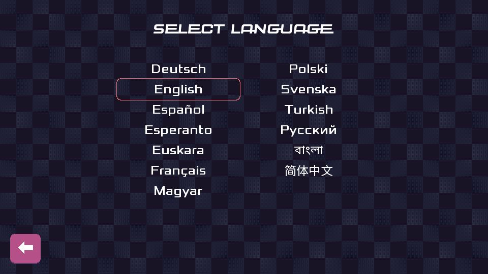

public: true
pub_date: 2023-01-09 18:44:41 +01:00
tags: [clyde, pixelwheels, monthlyupdate]
title: December 2022 monthly update

## Introduction

Happy new year! Wish you the best for 2023!

This update is not about 2023 though, but rather about the last month of 2022. It contains the usual mix of Pixel Wheels and Clyde work, and some unexpected time spent on... Yokadi!

Let's get started.

<!-- break -->

## Pixel Wheels

### 0.24.1

Last month I shipped Pixel Wheels 0.24.1, which fixed a few annoying bugs found in 0.24.0:

- On devices with a screen ratio different from 16:9 the vehicle selection screen was stretched and made the buttons non responsive ([#296](https://github.com/agateau/pixelwheels/issues/296)).

- Fix Chinese translation looking wrong because of missing glyphs in the font ([#297](https://github.com/agateau/pixelwheels/issues/297)).

- Fixed a bug in the rescue copter mechanism: on the River track, after being dropped by the rescue copter on the bridge, the rescued vehicle would sometimes go through the bridge wall and fall on the other side ([#302](https://github.com/agateau/pixelwheels/issues/302)).

### More translations

Maybe it's Christmas, but at the end of December, Pixel Wheels received 2 new translations:

- Hungarian, by Balázs Úr
- Esperanto, by Jorge Maldonado Ventura

And... (2023 spoiler alert!): nxjosephofficial followed up shortly after with a Turkish translation in January!

This is, of course, totally awesome.

I even had to make the language selection list use two columns because the language list would not fit the screen anymore!

## Yokadi

[Yokadi](https://github.com/agateau/yokadi) is a command-line tool I use to manage my TODO lists and keep notes around.

It's an old but trusty command-line tool written in Python. And when I say old I mean started-in-2008 old. From a time when I wrote mostly Qt and KDE code and haven't heard of PEP8, so it uses lowerCamelCase for functions (how embarrassing).

Anyway, it might be old, but it works fine and I still use it, so when GitHub dependabot told me some dependencies had security issues, I had to fix them. Updating them was a bit of work though.

First the project was still using Travis, which is the Schrödinger cat of CI at this point, so I switched it to GitHub actions.

Then it turned out the `pyreadline` package used to make readline work on Windows does not work anymore with recent versions of Python, so I had to switch to my Windows partition to fix these. After some back and forth, I managed to get readline support to work again using [pyreadline3][], but then I realized the task lists were looking really bad, filled with Unix ANSI terminal escape codes. I considered biting the bullet and rewriting the output using the wonderful [Rich][], but that was too invasive, so I felt back to using [Colorama][] instead.

Finally, there was a bit more breakage to sort out, like the syntax for SQL Alchemy database URL having changed, or icalendar support being so broken that I just disabled its tests for now.

It's all good now (well, except for icalendar support), CI is green again.

I should probably do a release.

[pyreadline3]: https://pypi.org/project/pyreadline3/
[Rich]: https://pypi.org/project/rich/
[Colorama]: https://pypi.org/project/colorama/

Fun fact: Yokadi has a `sync` feature branch to implement synchronization between different instances using Git. It's the branch I use. It has to be the oldest still-working non-merged feature branch of all my projects: it's multiple years old at this point! Maybe one day I'll merge it.

## Clyde

Clyde work was once again focused on improving `clydetools fetch`, the command used to fetch latest versions of supported packages.

- `clydetools fetch` can now fetch updates for projects hosted on gitlab.com.
- `clydetools fetch` learned that `osx` in a filename indicates a macOS asset. This fixed fetch not finding macOS archives for the rclone package.
- It is now possible to define a default OS and/or architecture for a package. This was required to be able to package ninja.

## Clyde store

New packages of the month are:

- [d2](https://github.com/terrastruct/d2)
- [ninja](https://ninja-build.org)
- [icoutils](https://sourceforge.net/projects/unix-utils/)
- [vault](https://www.vaultproject.io)

I also took the time to add tests command to most packages. Unfortunately, some packages cannot currently be tested because they depend on libraries not installed on the CI runners, such as libxcb or fuse. Will have to figure out something for these.

## What's coming next?

For January, I am working on Pixel Wheels. Since new translations have been added, I am probably going to release a 0.24.2 version to include them, and a few other bug fixes.

We are already January 12, there aren't that much time left, so I am not going to promise too much :)

Thanks for reading, if you want to support my FOSS work, head over to the [support page](/support). Thanks a ton!
