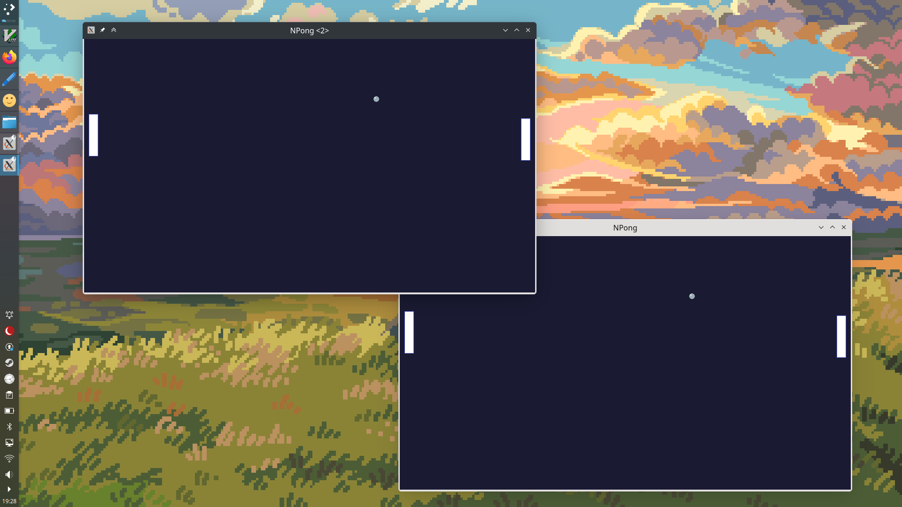
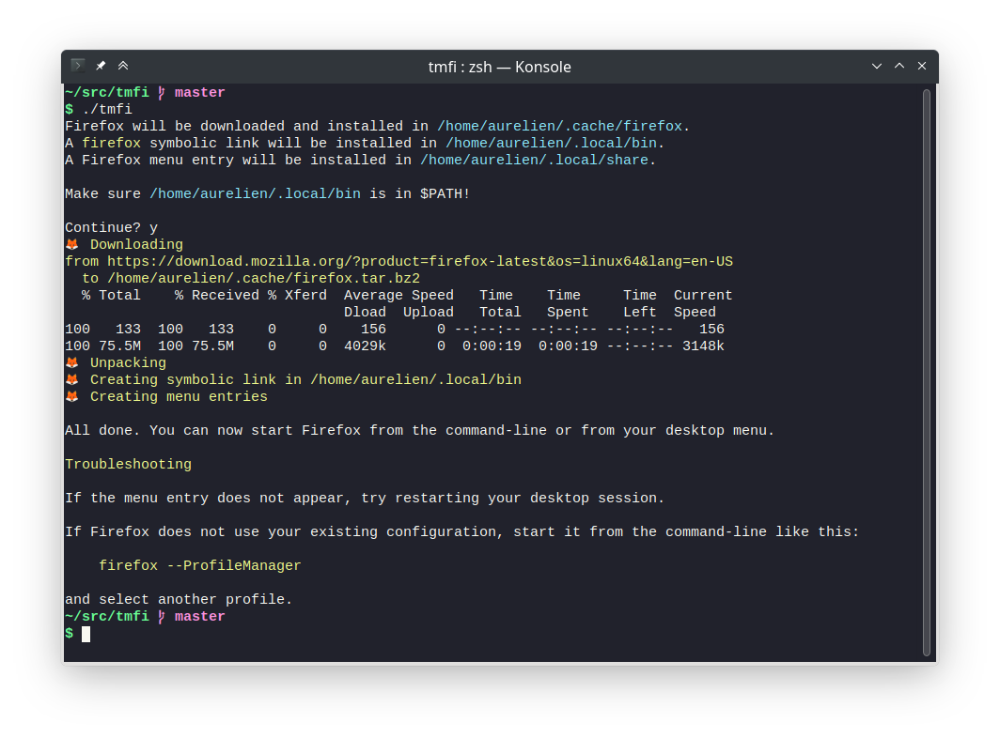
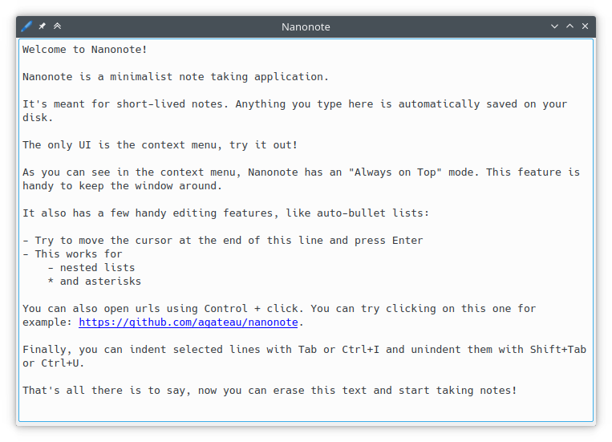

public: true
pub_date: 2023-02-07 07:49:58 +01:00
tags: [clyde, pixelwheels, nanonote, monthlyupdate, tmfi]
title: January 2023 monthly update

## Introduction

Welcome to this January 2023 monthly update! This month comes with some Pixel Wheels work, an interesting Clyde store story, an update on Nanonote(!) and a new small project: TMFI. Let's get started!

<!-- break -->

## Pixel Wheels

On [Pixel Wheels][pw] front, Hendursaga fixed mouse navigation in the language selection screen as well as the font used for Esperanto, thanks!

[pw]: /projects/pixelwheels/

On my side, I fixed a tricky bug which caused the player rank to be wrong on championships in the 2nd and 3rd race. I also fixed a potential stuttering issue. It should help keep the game smooth on screens with refresh rates higher than 60 Hz.

Finally, I have been making some R&D, trying to evaluate how much work would be required to add LAN-based multiplayer support! That's potentially a large Pandora box, so I am approaching this with caution. I actually wrote an article about [Pixel Wheels Pandora boxes][pandora].

[pandora]: ../opening-another-pandora-box/

As explained in the article, I am building a very simple network-based Pong game. Since the Pandora boxes article I managed to keep two machines synchronized reliably, so I can move to the next step: introduce Box2D in the game.

## Clyde store

Things have been calm on [Clyde][] development front, but the Clyde store gained new packages:

[Clyde]: https://github.com/agateau/clyde/

- [Delta](https://github.com/dandavison/delta)
- [GitUI](https://github.com/extrawurst/gitui)
- [Hadolint](https://github.com/hadolint/hadolint)
- [Sylver-cli](https://github.com/sylver-dev/sylver-cli)
- [Vault](https://www.vaultproject.io)

I also streamlined package updates a bit more. I am close to the point where they can be fully automated 🎉.

Something interesting happened with the Vault package. Because of CircleCI's January 3, 2023 security alert, Hashicorp [decided to rotate the certificate][hashicorp] used to sign Vault macOS binaries. They also re-signed and re-uploaded all their already released binaries.

[hashicorp]: https://support.hashicorp.com/hc/en-us/articles/13177506317203

The Clyde Store repository CI checks all packages every day. This is meant to detect if a binary goes away, or if it has been tampered with. This check worked well: the day Hashicorp re-upload Vault macOS binary, Clyde Store CI turned red. It stayed red until I dug into the problem (at first I thought Hashicorp had been breached, but it would have been surprising if it had gone undetected), found about the re-upload and updated Vault macOS checksum.

## TMFI - The Missing Firefox Installer

This is a very small project I put together as a simple way to install Firefox on the machines I maintain. Mozilla provides prebuilt Firefox binaries for all OSes, including Linux, but their Linux support is rough. It comes in the form of a plain tarball with no integration: no Firefox launcher in the desktop menu, no `firefox` binary in `$PATH`. [TMFI][] fixes that. When you run `tmfi`, it:

[TMFI]: https://github.com/agateau/tmfi/

- Downloads the latest binary
- Installs it in `~/.cache/firefox`
- Creates a desktop menu entry for it
- Creates a `firefox` symbolic link in `~/.local/bin`

Since the prebuilt binaries automatically update themselves, you never have to worry about your installation being outdated. This is the reason I ended up creating TMFI instead of adding Firefox to Clyde store: it's no good if you install a package at vN and behind Clyde back the package changes itself to vN+1, adding and removing files without Clyde knowing about it.

## Nanonote

[Nanonote][] is a minimalist note taking application I built a few years ago. I haven't worked on it for literally years, but I use it every day! This week I received a pull request from Daniel Laidig fixing keyboard shortcuts not showing in Nanonote context menu on macOS. This is all the more welcome now that I don't have a macOS machine to test Nanonote anymore. Daniel is also busy working on another interesting feature, which should hopefully land in February 🤞.

The CI was not happy with the PR. Not because of Daniel work, but because some dependencies had not been pinned so some jobs did not pass out of the box... This prompted me to refresh the CI a bit: moving the coding-style step to a separate job, updating Qt (required much wrestling with [aqtinstall][]), SingleApplication and Catch 2 to more recent versions.

I am mostly done with the fixes, but I am considering simplifying the dependency installation code, which is very messy, by using Clyde. The CI is an interesting use-case because Clyde makes it easy to install pinned versions of required tools on all platforms.

[aqtinstall]: https://github.com/miurahr/aqtinstall/
[Nanonote]: https://github.com/agateau/nanonote/

## What's coming next?

We are already in February at the time I write this, so I can confidently say I am going to release Pixel Wheels 0.24.2, since it's already been released 2 days ago :) Apart from this, I plan to continue working on the network Pong game, and spend some time helping Daniel land his new feature in Nanonote!
