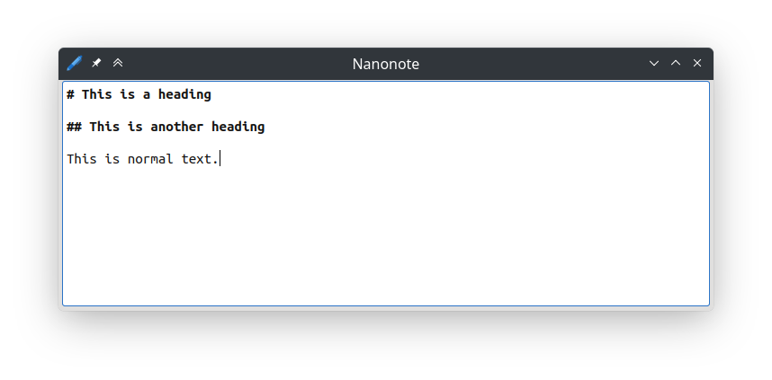

public: true
pub_date: 2023-03-31 08:29:57 +01:00
tags: [monthlyupdate, tmfi, nanonote, clyde, pixelwheels]
title: March 2023 monthly update

## Introduction

Welcome to this monthly update! This month Pixel Wheels did not receive much work, but I made an important decision. I worked on Clyde, Nanonote and TMFI.

## Pixel Wheels

I spent more time on NPong, but I eventually decided against [opening the Pandora box of network play](../opening-another-pandora-box). I want to get Pixel Wheels 1.0 out in 2023, and I don't see this happening if I try to get network play in. Instead I am going to resurrect the old split-screen multiplayer mode, and extend it to 4 players.

Depending on how the game evolves after 1.0, I may revisit this idea of network play, but right now I just want to be done with it.

<!-- break -->

## Clyde

I released [version 0.5.0 of Clyde](https://github.com/agateau/clyde/releases/0.5.0). The main changes in this release are:

- Support for Bash and Zsh completion. This is quite nice, even if it's not widely supported for now (I should really add completion to Clyde itself 😅).

- A package can now be reinstalled with `clyde install --reinstall <package>`. This is useful for completion, see below.

- Some network improvements: first, `clyde setup` now creates a shallow clone of the store, making initial setup faster. Second, when a download times out, Clyde now retries 2 times before giving up.

- More work on making it possible to automatically find new releases for packages not hosted on GitHub: gitlab.com is now supported and there is work in progress to add a more generic "fetcher" to support other hosts.

Under the hood, I drastically improved the functional test suite. It used to consist of a bunch of shell scripts. I rewrote it using [pytest](https://pytest.org). This makes it easier to add new tests.

If you already use Clyde (awesome!) and want to make completion work you need to:

- Update Clyde activation script with `clyde setup -u`;
- Reinstall the package for which you want to use completion with `clyde install --reinstall <package>` (see next section for the list of packages supporting it).

I planned to make a more formal announcement about this new version, but while writing it I realized the "new user experience" was not good enough to make for a good demo. Blog Driven Development strikes again 😅. I shelved the announcement for now. Next version should be good enough!

## Clyde Store

4 new packages have been added this month:

- [clang-format](https://github.com/muttleyxd/clang-tools-static-binaries)
- [docker-compose](https://docs.docker.com/compose/)
- [dprint](https://dprint.dev)
- [helm](https://helm.sh/)

The Helm package made me particularly happy: not because I use Helm, but because it is the first package created by someone else, thank you [xaocon](https://github.com/xaocon) for your contribution!

The following packages now support completion:

- bat
- fd
- fzf
- gum
- ripgrep
- xh

## Nanonote

I experimented with highlighting Markdown-like headings in [Nanonote](https://github.com/agateau/nanonote) and ended up liking it, so I merged the changes in. It looks like this:

In other news, Nanonote should get a Flatpak package soon! The work was started in [#44](https://github.com/agateau/nanonote/issues/44) by Justin Zobel (Thanks a lot!), and I continued it. Nanonote should therefore be available on Flathub in April 🤞.

I also fixed some minor bugs:

- The close button of the search bar used an unusual cross character which was not available in all fonts. I changed it to a more common character.
- When holding Control over the text to click on links, the cursor no longer changes to a pointing-hand until the cursor is actually over a link.

I expected to release a new version of Nanonote this month, but I ended up releasing only a pre-version, so I'd say March objective is half done...

## TMFI

A couple minor changes went into [TMFI](https://github.com/agateau/tmfi), The Missing Firefox Installer.

First, it no longer tries to resume interrupted downloads. Resuming downloads was not reliable because Firefox archive filename does not change between versions, so a download could have been started for version N and continued with version N+1.

Second, the categories in the .desktop file have been fixed, so the launcher icon now correctly appears in the desktop menu.

## What's next?

In April, I want to:

- finally release version 1.4.0 of Nanonote, with a Flatpak package;
- continue working on Clyde, improving the new-user experience, so that I can publish that announcement article I postponed this month;
- resume work on Pixel Wheels, notably resurrect the split mode.
