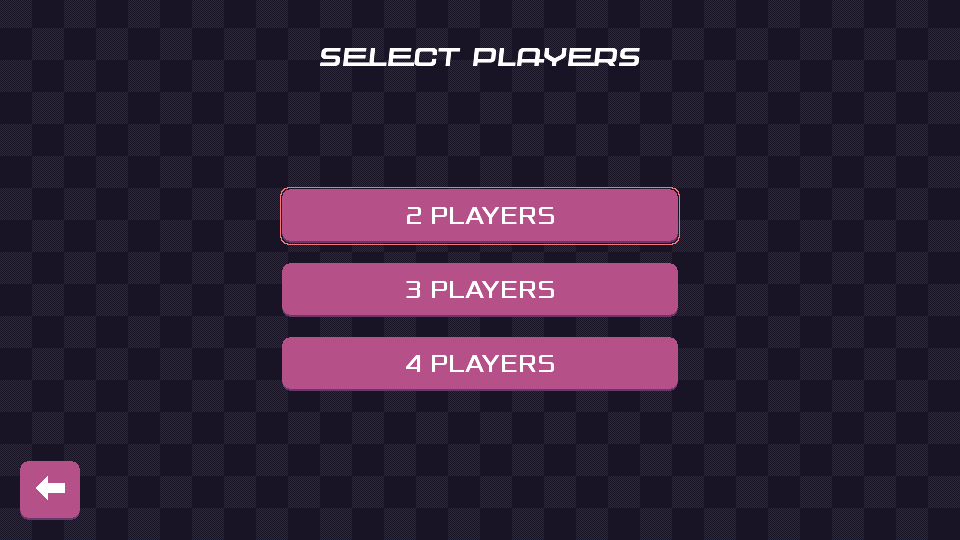
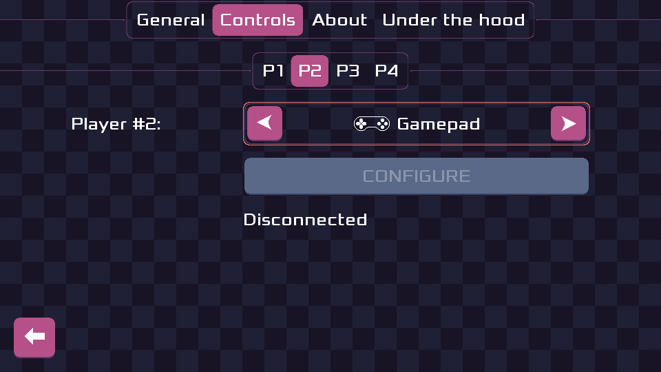
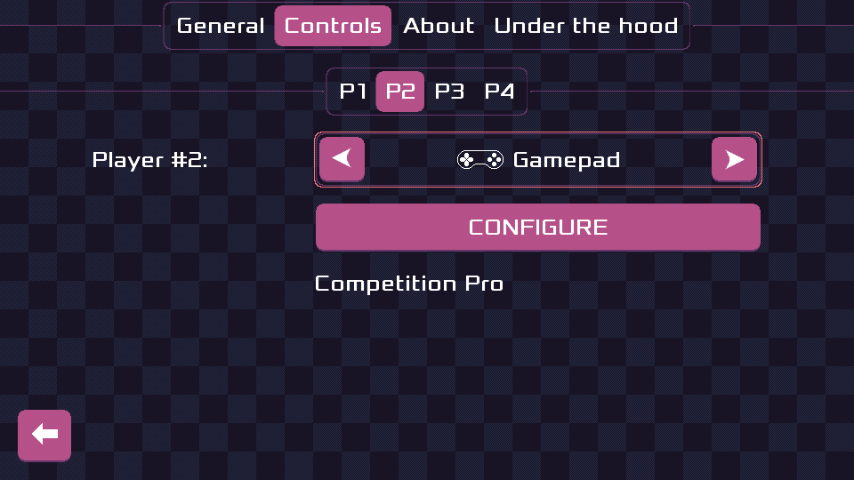

public: true
pub_date: 2023-06-03 16:31:05 +01:00
tags: [monthlyupdate, pixelwheels, burgerparty]
title: May 2023 monthly update

## Introduction

Welcome to this May 2023 update. This month was almost entirely game-related, with some progress on Pixel Wheels and a Burger Party release!

## Pixel Wheels

It's now fully possible for 4 persons to play Pixel Wheels at once, on the same screen! The engine was already capable of splitting the screen in 4, but the UI part was missing. This month I finished the UI part, making it possible to select the number of players and to configure the input method for each player.

On top of this, Pixel Wheels learned to speak Dutch, thanks to Heimen Stoffels!

Finally, thanks to bug reporter extraordinaire Marek Szumny, a number of bugs have been fixed:

- Holes in "Flood" and "Up, up, up and down" tracks ([#336][], [#337][], [#345][], [#346][])
- Translation bugs ([#339][], [#344][])

[#336]: https://github.com/agateau/pixelwheels/issues/336
[#337]: https://github.com/agateau/pixelwheels/issues/337
[#339]: https://github.com/agateau/pixelwheels/issues/339
[#344]: https://github.com/agateau/pixelwheels/issues/344
[#345]: https://github.com/agateau/pixelwheels/issues/345
[#346]: https://github.com/agateau/pixelwheels/issues/346

Marek also refreshed the Polish translation, which was a bit outdated.

<!-- break -->

## Burger Party

As promised last month, I finally released Burger Party 1.4! Read the [announcement](../return-of-the-burger/) for more details. I am very happy with this refresh and the new release of the game. Now I need to look into publishing it on F-Droid.

Marek (yes, him again :)) contributed a Polish translation, which is great, but getting Polish texts to show correctly required quite a bit of digging to figure the steps I used to follow to prepare fonts for the game 😅. I refreshed my knowledge of libgGDX [Hiero][] tool and even ended up making a minor change to it. Need to file a PR for this.

[Hiero]: https://libgdx.com/wiki/tools/hiero

## Clyde store

Things were quiet in Clyde land this month, but I added two new packages:

- [bitwarden-cli](https://bitwarden.com)
- [dufs](https://github.com/sigoden/dufs)

## What's next?

In June I want to release a new Pixel Wheels, as I want more people to test the multi-player support and tell me if it is solid and more importantly, fun! I also plan to get Burger Party published on F-Droid.
