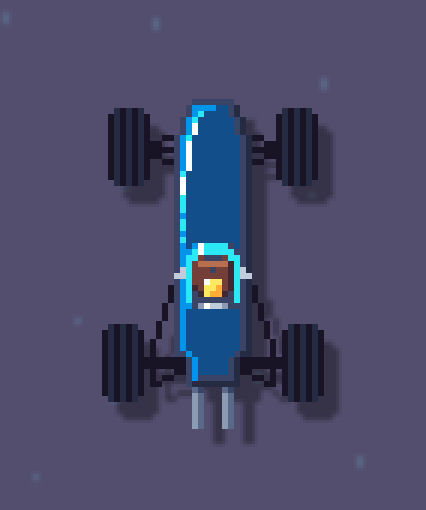

public: true
pub_date: 2023-07-11 08:05:30 +01:00
tags: [monthlyupdate, pixelwheels, burgerparty]
title: June 2023 monthly update

## Introduction

In June, real-life got in the way and I did not get as much done as I wanted. Still some good things happened for Pixel Wheels and Burger Party. Let's look at them.

## Pixel Wheels

I started a new vehicle! This time it's an old Formula 1 car, inspired from the Lotus 25. It currently looks like this:

<!-- break -->

It's not in the master branch yet, as I still have to figure out a nice name for it. It's currently called "Old F1", which I think could use some improvements... Suggestions are welcome :)

Working on this car triggered a few minor changes to the game:

I introduced a new tire size: "thin". These F1 did not have the super large tires we see now.

I reduced the shadow offset for the vehicles so that they look less like they are floating. This was very visible with the thin tires.

## Burger Party

I made some minor cleanups to Burger Party build system since the [1.4.1 release](../return-of-the-burger/), which made it possible to publish Burger Party on [F-Droid](https://f-droid.org/packages/com.agateau.burgerparty/)!

This took a bit longer than expected because Burger Party CI was... There was no CI 😅. Setting this up was nevertheless worth the price: the great thing about publishing on F-Droid is it brings contributors (and bug reports)! Since the release I received Spanish and Basque translations, as well as an interesting bug report about the game not being optimized for the large phone screens most people carry nowadays. Going to look at this and probably release a 1.5.0 version.

## Clyde Store

Not much happened on Clyde Store, I only added one package: [oxipng](https://github.com/shssoichiro/oxipng).

## What's next?

I wanted to release a new Pixel Wheels in June, but this did not happen. We'll see if I can get the new release out in July, but I have some family holidays planned, so I don't expect it to be a very active... We'll see!
