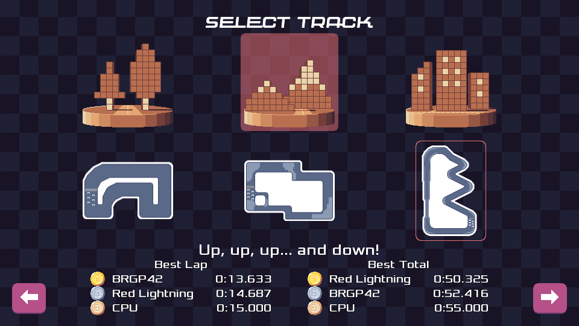

## Introduction

Welcome to this September 2023 update! I had Burger Party and Nanonote releases planned for this month, but that did not happen. I did however release version 0.25.1 of Pixel Wheels.

## Pixel Wheels

0.25.0 had a bug where it would complain about a missing controller when started on Android ([#398][]). I released 0.25.1 to fix that. The release also includes updated translations and a fix for the score table not always fitting in the screen ([#397][]).

[#397]: https://github.com/agateau/pixelwheels/issues/397
[#398]: https://github.com/agateau/pixelwheels/issues/398

Beside this release, has announced in my previous monthly update, I reworked the track selector to fit another track, so that I can add a 3rd track to the "Pixel Cities" championship. It looks like this now:

The first row shows all championships. The second row shows the tracks within the selected championship.

<!-- break -->

I also worked on user-interface navigation: I removed the feature where moving the mouse cursor over a menu item gave it focus. I never really liked that feature and it was getting in the way for  the design of the new track selector.

Finally, I improved keyboard navigation: it is now possible to move the focus all the way down to the back and forward buttons using the up and down keyboard keys.

## Clyde

Only one small fix on Clyde this month. I recently added a `.pre-commit.yaml` file to the clyde-store repository and it turns out it broke `clyde search` because the command tried to load the `.pre-commit.yaml` file as a package… embarrassing. I fixed that.

## Conclusion

That's all for this month, not as much work as planned, but progress nevertheless. Next month I shall finally do the Burger Party and Nanonote releases. I scheduled a day-off from work to make sure the releases really happen this time!

On Pixel Wheels, I am going to start work on the new track. I am looking forward to it, as this is one of the major blockers I defined before releasing Pixel Wheels 1.0.0!
