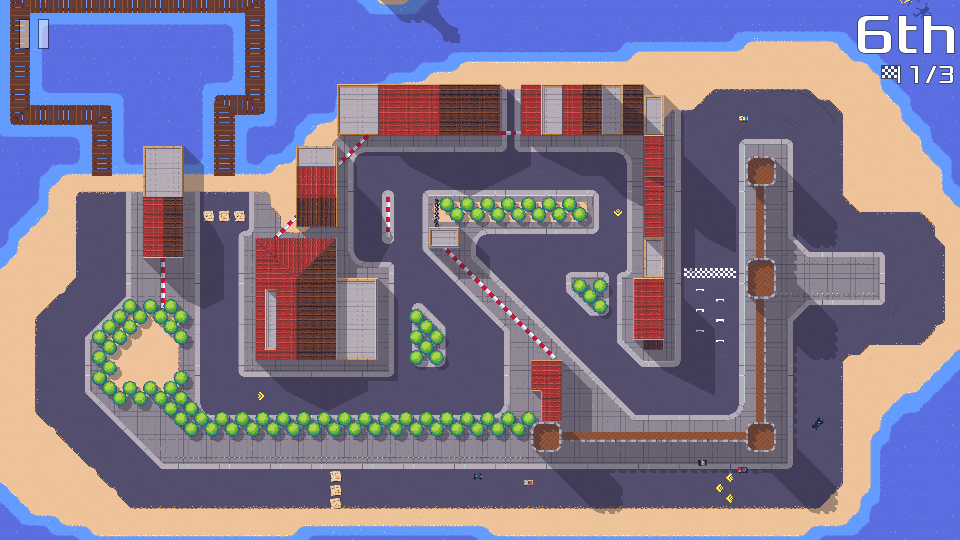
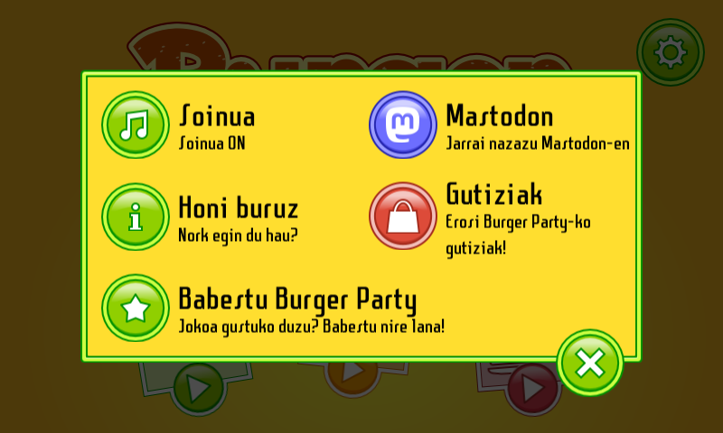
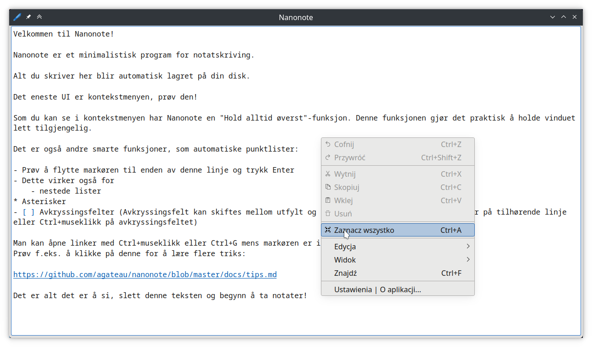
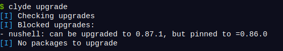

## Introduction

Another double monthly update. Turns out moving to a new house is a voracious time eater… (who knew?). Here is what I still managed to get done when I was not busy emptying one house, filling another one, trying to give/trash as much crap as possible in the (still ongoing!) process.

## Pixel Wheels

On Pixel Wheels, I worked on the third track for the "Pixel Cities" championship. It's mostly ready and now has a name: "The island".

This new track was the opportunity to make some improvements on the tile engine. Creating obstacles requires less manual work now, making it faster to iterate and experiment.

<!-- break -->

I also made a user interface change: the focus indicator now glows, making it more explicit that it is the element controlled by the player. This is useful on the new track selection screen, to remove the ambiguity with the background of the selected championship.

On Tiny-sur-Mer, the lighthouse shadow now looks nicer.

Finally I worked on the AI pilot: it now tries to avoid other vehicles.

## Burger Party

At the end of October, I released version 1.4.3 of Burger Party.

This was a translation release:

- Burger party now speaks Basque, thanks to Josu Igoa
- Spanish translation has been updated, thanks to Victor Hck

## Nanonote

I was a bit late on this one but I'll count it as November. At the very very end of November (as in, around November 31th 😉), I released version 1.4.1 of Nanonote.

This one was also a translation release. Nanonote learned to speak:

- Danish, thanks to Morgenkaff,
- Dutch, thanks to Heimen Stoffels,
- Polish, thanks to Marek Szumny,
- Norwegian, thanks to Vidar Karlsen.

## Clyde

I made a small change to `clyde upgrade`: it now lists blocked upgrades. Blocked upgrades are upgrades which can't be installed because you pinned a version number. This is helpful in case you pinned to version N because N+1 had a bug. Now that N+2 is out, listing the blocked upgrade can remind you to unpin and try this new version.

## Clyde Store

The CI of the Clyde store has an auto-update mechanism to automatically fetch new versions and update the packages. I improved this auto-update mechanism to overwrite the update branch if it exists. It is now one step closer to being runnable automatically on a regular basis.

## What's next

I had this optimistic hope of releasing Pixel Wheels 1.0 for Christmas, but seeing how most of my leisure time is taken by getting the new house in shape, it's not going to happen. I am going to continue working on the new Pixel Wheels track, though, and the related game engine work (in particular it's triggering some bugs in rescue helicopters). On Clyde front, it's been too long since the last release, so Santa may bring you may a new Clyde version! 🎁
