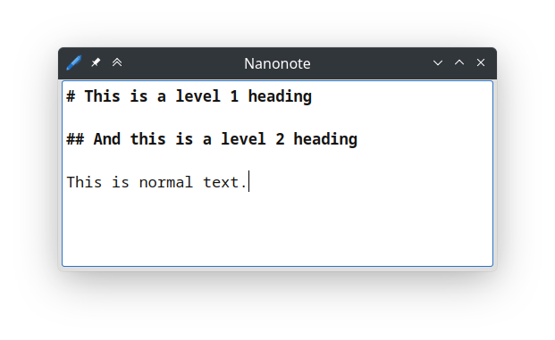

public: true
pub_date: 2023-04-11 22:42:47 +01:00
tags: [nanonote, qt, pko]
title: Nanonote 1.4.0!

After a very long pause, I am happy to announce the release of [Nanonote 1.4.0][release].

Nanonote is a minimalist note-taking application. It consists of a text area, a context menu and... that's about it!

It's handy to jot down short term notes, as a temporary place to collect copy'n'paste blocks, to draft a long response for an instant messaging app without having to fear pressing Enter too soon or any other use you can come up with!

## TODO lists

Nanonote can also be used to write TODO lists. This is even better now in 1.4.0 thanks to the new task feature from Daniel Laidig, which lets you quickly create and toggle checkable tasks with Ctrl+Enter.

<video controls>
    <source src="tasks.webm">
</video>
_[tasks.webm](tasks.webm)_

<!-- break -->

## Markdown-like headings

Nanonote is *not* a Markdown editor, but I often found myself separating notes with Markdown-like headings. Issue [#43](https://github.com/agateau/nanonote/issues/43), convinced me to add some light styling for headings:

## More changes

For a complete list of changes, have a look at the [CHANGELOG][].

## Get it!

You can find .deb, .rpm, macOS dmg and Windows installers on the [release page][release].

For Linux users, Nanonote is now also available on [Flathub][].

[release]: https://github.com/agateau/nanonote/releases/1.4.0
[CHANGELOG]: https://github.com/agateau/nanonote/blob/1.4.0/CHANGELOG.md
[Flathub]: https://flathub.org/apps/details/com.agateau.nanonote
