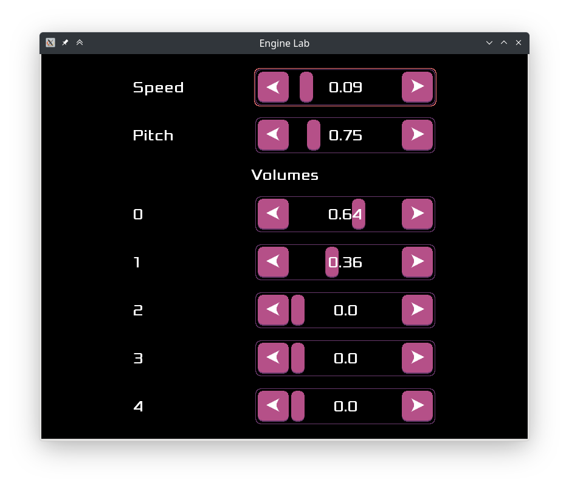

public: true
pub_date: 2023-01-24 20:15:18 +01:00
tags: [pixelwheels]
title: Opening another Pandora box?

I have been working on Pixel Wheels for a long time now. Granted it has not been continuous: I started and continue to work on other projects in between. But still, I would like to get this game "done", as much as such a thing is possible.

Until recently my "Definition of Done" was that the game would have at least 3 championships, with 3 tracks in each. That's not a lot, but it takes a long time to create interesting tracks, and I am having a hard time not "repeating myself" when creating a new track.

<!-- break -->

## Pandora box #1, turning an arcade game into a race game

Pixel Wheels started as a vertically scrolling arcade game: a single car, randomly spawned enemy vehicles arriving from the top, kind of like the old [Spy Hunter][spyhunter] game. Then I opened my first large Pandora box when I thought: "Wouldn't it be cool to turn this into a *racing* game?"

This took quite a looong time, because a racing games means less dumb enemies, they would have to follow a track, learn to use bonuses. It also meant being able to compute the player rank in the race, which proved to be surprisingly tricky given the way tracks are defined.

Oh and inside this "racing game" Pandora box was another one: "Let's use Box2D to get more realistic behaviors". I don't regret opening this box (2d, ahah): it really made the game much better. What I did not anticipate though, was that I would have to wrestle with the engine to make it do two things:

The first thing I needed to change was to make collisions less realistic. It might be surprising, but this was required to improve the gameplay. In the beginning, collisions would change the direction of the vehicle. This makes total sense, but is also very annoying to play, so when vehicles collide they now stay pointed in the same direction. Similarly, when hitting a mine, the vehicle makes a perfect 360° turn, so the player is slowed down, but can carry on.

The second thing I tried to change, and unfortunately failed to, was to make the vehicles drift in a satisfying way. I tweaked knobs as much as I could, but never obtained the behavior I wanted. Too bad.

## Pandora box #2: engine sounds

I wanted the vehicles to sound like their engines would roar. My reference is [this demo][engine-demo] which *generates* the engine sound live.

 I spent a lot of time trying to get a convincing engine sound, hunting for sound effects, mixing and tweaking. There is even an "Engine Lab" in Pixel Wheels to test the engine sound at various speeds.

Fun fact, the engine demo is from the wonderful DrPetter, creator of [SFXR][], an 8-bit like sound effect generator which is the basis of [SFXR-Qt][] (SFXR-Qt is probably Pandora box #2.5 I guess). All Pixel Wheels sound effects except the engine and tire sounds have been created with SFXR-Qt.

## Pandora box #3: translations

The more I worked on Pixel Wheels, the more I felt bad for making the game English-only. It felt wrong to exclude others because they do not speak English. Thanks to past experience, I know many of the caveats of translating applications, such as plural handling or not concatenating strings. I did not expect some of them nevertheless.

### Fonts

Unlike an application, a game usually does not use the system fonts: it comes with its own fonts. And... many of the pretty fonts around here are not complete. A huge thank you has to go to Severin Meyer for creating [Xolonium][], the font Pixel Wheels used for all its body text. Xolonium looks great and supports Latin, Greek, and Cyrillic scripts. That's a lot! Kwajong, Pixel Wheels title font, is more limited, and I ended up adding missing glyphs to support languages like Polish. This means learning to edit fonts... [FontForge][] is great, but it takes a while to get used to 😅.

Still even Xolonium was not enough to support languages like Bengali and Chinese. For these I had to switch to [Noto][], a set of fonts by Google covering *all* scripts. This brings another complexity: depending on the language, Pixel Wheels has to switch fonts.

Another important aspect is file sizes: since the Noto fonts cover all scripts, they are quite large. NotoSansCJK-Regular, the Chinese-Japan-Korean part of Noto, is 20MB (16MB gz-compressed). This was around the size of Pixel Wheels .apk file when Chinese was added to it. As I did not want to double the size of the .apk because of the new language, Pixel Wheels only ships a subset of the font. In these days of mobile games weighting hundreds of MB, one might think it does not matter, but I think it's a mistake. I am proud that Pixel Wheels .apk is 27MB with its NotoSansCJK subset, and want to keep it as small as possible.

### Translatable content defined outside of the code

Pixel Wheels uses xgettext to extract translatable content from the code and put it in .po files, but many elements of the game are defined in XML (yes, I like using XML in some situations). This includes most of the screens, the championships, the tracks, the vehicles. Translating these meant teaching `xgettext` how to extract reference English messages from the files. This is when I learned about [ITS rules][].

## The last Pandora box

There is one last Pandora box left. It's not completely open yet, I have just half-opened the lid to peek inside. I am still wondering whether I should open it or not.

Pixel Wheels game-play is similar to games like Mario Kart and... these games are a lot more fun when played with friends.

Right now the game has a very limited multiplayer mode: on desktop machines, two players can play together. It used to be done using split-screen, but split-screen is annoying for a top-down 2D game because it severely limits how far you can view the road ahead. A 3D game is in a different situation: what's ahead is always in the middle of the player view. In an attempt to solve that, I changed to a different behavior a few releases ago: now the game only uses a single screen and it zooms out to ensure all players are visible. It's not that good though: if the track is large enough it requires too much zoom out, making the game unplayable... this in turn limits how large a track can be.

So what alternative approach could solve this, and also make it possible to play with friends from your mobile? You might have guessed:

*Network play*

I am currently toying with this. I have very little knowledge on low-latency networking, so I am very much in the learning phase. So far I work on a separate "research" game, to evaluate if I can/want to do it.

My plan is the following:

1. Create a basic Pong game
2. Get the game to work well over the network with two players
3. Introduce Box2D in the game, to match more closely with Pixel Wheels
4. Add more players
5. Use the accumulated knowledge to implement network play in Pixel Wheels

What's the status? step 1 is done. I am at step 2: the game works correctly for a few minutes, and then the two machines loose synchronization. It is tedious to debug 😭.

My current implementation shares inputs using a locked step algorithm. But if I can't get this to work reliably, maybe I'll switch to sharing state instead. Or decide I don't want to implement network play after all. We'll see.

[spyhunter]: https://www.arcade-museum.com/game_detail.php?game_id=9742
[engine-demo]: https://www.youtube.com/watch?v=Ic750lQPWMo
[SFXR]: http://www.drpetter.se/project_sfxr.html
[SFXR-Qt]: https://github.com/agateau/sfxr-qt
[Xolonium]: https://www.dafont.com/fr/xolonium.font
[FontForge]: https://fontforge.org/
[Noto]: https://fonts.google.com/noto
[ITS rules]: https://www.gnu.org/software/gettext/manual/html_node/Preparing-ITS-Rules.html
