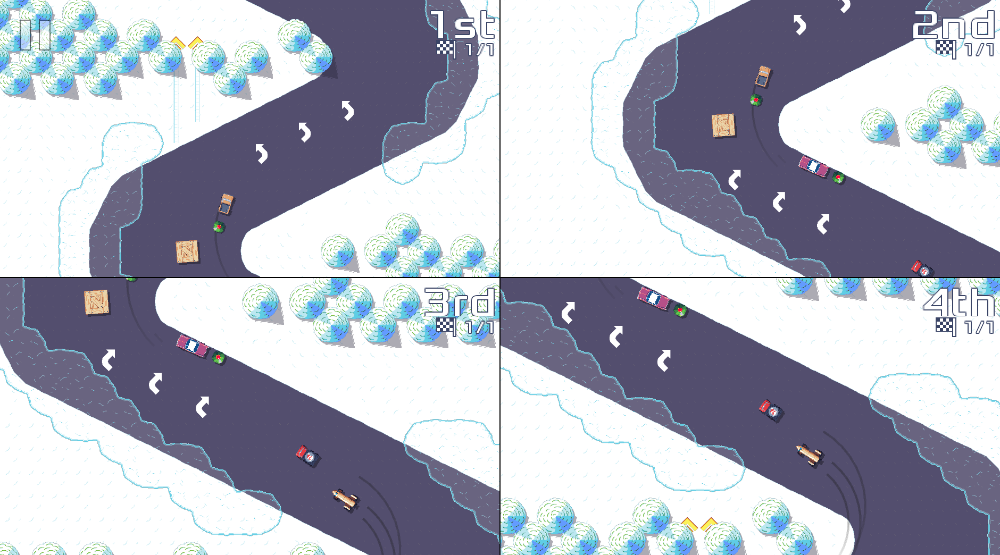

Finally, after way too long, here is version 0.25.0 of [Pixel Wheels][pw]!

Let's see what's in the box.

[pw]: /projects/pixelwheels/

## Split-screen multi-player

This has been requested for a long time. Pixel Wheels multi-player support was limited to 2 players sharing a single screen, the game would zoom out to ensure all players were visible. This was not a good approach because it imposed a constraint on the track size: in cases where two players were at opposite corners of the track, the game had to zoom out to show the full track on the screen. This could make the game unreadable if the track was too wide. Going back to split-screen solves this, at the price of limiting the player fields of view, as is often the case with split-screens.

So split-screen is back, but it actually got better: it now supports up to 4 players!

<!-- break -->

## A new vehicle

Pixel Wheels lets you visit the 60s with the BRGP42!

Read more about the inspiration behind this car on the [vehicles](/projects/pixelwheels/vehicles).

## More translations!

Pixel Wheels now speak Italian, thanks to Dario Canossi, and Dutch, thanks to Heimen Stoffels. In other translation news, Marek Szumny took over the polish translation, so Polish is in a good shape again.

## Bug fixes, many of them

Version 0.25.0 comes with many bug fixes, too many to list them all here, but it's worth pointing out all the fixes plugging holes in the tracks, where a missing tree or building made it possible to cut large parts of some tracks. I hope you did not rely on those to establish records 😉. Thanks to Marek Szumny for reporting them.

If you want to learn more about the changes, have a look at the [release notes][].

## Get it!

As usual, you can get the game from [itch.io][], [Flathub][], [F-Droid][] or [Google Play][gplay].

[release notes]: https://github.com/agateau/pixelwheels/releases/tag/0.25.0
[itch.io]: https://agateau.itch.io/pixelwheels
[Flathub]: https://flathub.org/apps/details/com.agateau.PixelWheels
[F-Droid]: https://f-droid.org/packages/com.agateau.tinywheels.android/
[gplay]: https://play.google.com/apps/testing/com.agateau.tinywheels.android
